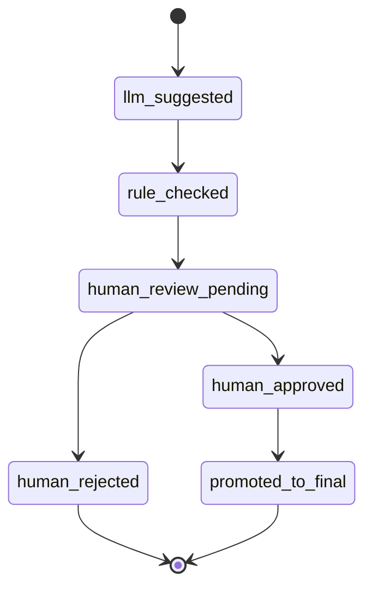

# Mirror KG and Final Promotion Design

> **文档类型**：Mirror KG 镜像层与 Final KG 晋升设计  
> **版本**：2026-06-15  
> **状态**：规划文档（本轮仅文档，不新增 migration、不实现代码）

---

## 1. What is Mirror KG?

**Mirror KG / 正式库镜像层** is a structured, workbench-visible layer that **mirrors the shape of the official NeuroGraphIQ_KG_V3 schema** but holds **non-final, reviewable knowledge**.

| Aspect | Mirror KG | Final KG (NeuroGraphIQ_KG_V3) |
|--------|-----------|-------------------------------|
| Truth status | draft / suggested / under review | approved official fact |
| LLM may create rows | yes (candidates) | **no** (promotion only) |
| Workbench display | yes — primary viewer for connections / circuits / functions | yes — read-only query + export |
| Downstream consumption | must not treat as final | authoritative |
| Rollback | easy — reject / supersede mirror rows | audited archive / deprecation |

**Canonical term**: **Mirror KG** (中文：**正式库镜像层**).

Do **not** confuse with:

- legacy CLI `--mirror-kg` (historical sync to `kg_*` — deprecated for new development);
- `candidate_brain_regions` (region candidate table — upstream of Mirror KG for regions);
- `candidate_llm_extractions` (advisory JSON — may feed Mirror KG but is not the mirror itself).

---

## 2. Why LLM Cannot Write Final Directly

1. LLM outputs are probabilistic and may hallucinate connections or functions.
2. Same-granularity and cross-granularity boundaries require deterministic validation.
3. Regulatory and scientific use requires human accountability (`reviewer_id`).
4. Promotion audit must be reconstructable from mirror → final mapping.
5. Existing MVP 1 governance already restricts `final_*` writes to Promotion module only.

**Rule**: LLM → Mirror KG only. Human Review → Promotion → Final KG.

---

## 3. Mirror KG vs Candidate Tables

| Layer | Table family (examples) | Content |
|-------|-------------------------|---------|
| Raw | `raw_aal3_region_labels`, `raw_macro96_*` | Parser output, not entities |
| Region Candidate | `candidate_brain_regions` | Region entities awaiting validation/review |
| LLM Advisory | `candidate_llm_extractions` | Region field suggestions (current MVP 2 Step 1) |
| **Mirror KG** | `mirror_region_connections`, etc. | Structured connection / circuit / function / triple candidates |
| Final KG | `final_brain_regions`, `final_region_connections`, etc. | Approved official graph |

Flow:

```
candidate_brain_regions
  → LLM same-granularity tasks
  → mirror_* rows (llm_suggested)
  → rule validation
  → human review
  → promotion
  → final_*
```

Region candidates can promote to `final_brain_regions` **without** Mirror KG (existing MVP 1). Connection / circuit / function / triple knowledge **must** use Mirror KG in the target architecture.

---

## 4. Mirror KG vs Final KG vs Legacy kg_*

| Store | Prefix | Status |
|-------|--------|--------|
| Mirror KG | `mirror_*` | **Target** pre-final layer |
| Final KG | `final_*` | **Current** official write path (regions implemented) |
| Legacy KG | `kg_*` | Legacy compatibility only — not default for new features |
| Coarse formal (parallel track) | `final_coarse_*` | Legacy parallel coarse schema in some migrations — integrate via explicit promotion mapping, do not conflate with MVP 1 `final_brain_regions` without documentation |

Official name for the production knowledge graph: **NeuroGraphIQ_KG_V3**.

**Physical deployment (user-confirmed, 2026-06-15)**:

- **Final KG** = PostgreSQL **database** `NeuroGraphIQ_KG_V3` (exact name, case as in DBeaver).
- Granularity is isolated by **schema** inside that database:
  - `macro_clinical`, `meso_anatomical`, `sub_connectivity`, `fine_cyto`, `molecular_attr`, `public`.
- Workbench / E2E databases (`neurographiq_kg_v3_mvp1_e2e`, `neurographiq_kg_v3_wb`, etc.) hold pipeline tables (`candidate_*`, `mirror_*`, `import_*`) and are **not** the official Final KG.
- MVP 1 `final_brain_regions` in the E2E DB is a **development co-location**; target Promotion writes to `NeuroGraphIQ_KG_V3.{schema}`.

**Candidate / mirror databases (same PostgreSQL instance, not final)**:

| Database | Typical role |
|----------|----------------|
| `NeuroGraphIQ_KG_Candidate` / `neurographiq_kg_v3_candidate` | Region candidates, CLI mirror |
| `NeuroGraphIQ_KG_Unverified` | Unverified / mirror KG candidates (naming aligns with Mirror KG layer) |
| `NeuroGraphIQ_Workbench` / `neurographiq_kg_v3_wb` | Workbench operations |
| `neurographiq_kg_v3_mvp1_e2e` | MVP E2E integration tests |

---

## 5. Mirror KG Status Machine

### 5.1 Mirror object statuses

| Status | Meaning |
|--------|---------|
| `mirror_candidate` | Created manually or imported, not yet LLM-enriched |
| `llm_suggested` | Produced or updated by LLM extraction run |
| `rule_checked` | Passed or flagged by rule validation |
| `human_review_pending` | Awaiting reviewer action |
| `human_approved` | Reviewer approved — eligible for promotion |
| `human_rejected` | Reviewer rejected — terminal for promotion |
| `promoted_to_final` | Successfully copied to Final KG |
| `superseded` | Replaced by newer mirror row |

### 5.2 Happy path



Alternate entry: `mirror_candidate → rule_checked` (manual curation without LLM).

---

## 6. Human Review Flow (Mirror objects)

1. Reviewer opens Mirror Review Queue (Workbench).
2. Sees connection / circuit / function / triple with evidence, confidence, lineage.
3. Actions: **approve**, **reject**, **edit** (creates new mirror version or edit proposal — implementation choice in Phase G).
4. Review writes `mirror_review_records` with `reviewer_id`, `reason`, snapshot.
5. Only `human_approved` rows appear in Promotion eligible list.

Mirror review is **separate** from Region Candidate review (`candidate_review_records`) but uses the same governance principle.

---

## 7. Promotion Flow

### 7.1 Region promotion (existing MVP 1)

```
manual_approved candidate_brain_regions
  → PromotionService
  → final_brain_regions + promotion_records
  → candidate_status = promoted_to_final
```

### 7.2 Mirror knowledge promotion (target)

```
human_approved mirror_region_connections (etc.)
  → PromotionService (extended)
  → final_region_connections (etc.)
  → promotion_records + mirror status = promoted_to_final
```

Promotion must:

- copy lineage fields (resource_id, batch_id, llm_run_id, review_record_id, …);
- enforce idempotency (same mirror id → one final row);
- never promote `human_rejected` or `llm_suggested` without review;
- write audit row.

---

## 8. Rollback and Audit

| Action | Effect |
|--------|--------|
| Reject mirror row | status → human_rejected; no final write |
| Supersede mirror row | old row → superseded; new row enters review |
| Rollback promotion | **Final KG deprecation** + audit record; mirror may return to human_approved or superseded — requires dedicated rollback design in Phase H |
| Audit query | join mirror_llm_run_links + mirror_review_records + promotion_records |

All promotion and rejection events must be traceable in Workbench and exportable for stage-level audit reports.

---

## 9. Planned Mirror Tables (documentation only — no migration this round)

### 9.1 Mirror KG tables

| Table | Purpose |
|-------|---------|
| `mirror_region_facts` | Region-level mirror facts (descriptions, aliases beyond candidate) |
| `mirror_region_connections` | Connection candidates |
| `mirror_region_circuits` | Circuit candidates |
| `mirror_region_functions` | Function candidates |
| `mirror_kg_triples` | Normalized triple candidates |
| `mirror_evidence_records` | Evidence snippets linked to mirror objects |
| `mirror_llm_run_links` | Many-to-many mirror object ↔ llm_run |
| `mirror_review_records` | Human review audit for mirror objects |

Common columns (all mirror fact tables):

- `id`, `status`, `source_granularity`, `source_atlas`, `source_version`
- `resource_id`, `import_batch_id`, `candidate_region_id`, `final_region_id`
- `llm_run_id`, `confidence`, `uncertainty_reason`, `evidence_text`
- `review_record_id`, `promotion_record_id`
- `created_at`, `updated_at`

### 9.2 Final KG tables (target, beyond existing regions)

| Table | Status |
|-------|--------|
| `final_brain_regions` | ✅ implemented (MVP 1) |
| `final_region_connections` | ⏳ planned |
| `final_region_circuits` | ⏳ planned |
| `final_region_functions` | ⏳ planned |
| `final_kg_triples` | ⏳ planned |
| `final_evidence_records` | ⏳ planned (partial overlap with `final_coarse` evidence migrations) |
| `final_mapping_records` | ⏳ planned |

### 9.3 LLM run tables (target extension)

| Table | Purpose |
|-------|---------|
| `llm_extraction_runs` | Run-level metadata (may evolve from run_id grouping in `candidate_llm_extractions`) |
| `llm_extraction_items` | One row per structured output item → mirror link |

---

## 10. Workbench Requirements

Mirror KG must be **directly visible** in the Workbench:

- connection list / mini graph centered on selected region;
- circuit participant table;
- function panel;
- triple table with predicates;
- review queue with filters by status, atlas, batch, llm_run.

Users must never need to read raw LLM text blobs as the primary UI.

---

## 11. Phase Mapping

| Phase | Deliverable |
|-------|-------------|
| A | This document + architecture docs |
| C | Mirror KG DDL migrations |
| F | Rule validation on mirror rows |
| G | mirror_review_records + review UI |
| H | Promotion mirror → final_* |

---

## 13. Macro Clinical Promotion（Step 8.15）

- API：`POST /api/final-macro-clinical/promotion/run`
- Confirm：`PROMOTE HUMAN APPROVED MIRROR TO FINAL`
- dry_run 不写 final_*；real run 写 `final_macro_clinical_promotion_runs/records`
- dependency promotion、duplicate 幂等、risk flags（cross/dual 仅 metadata）
- 不写 kg_* / 外部正式库

---

## 14. Final KG Browser（Step 8.16）

- **promotion 后如何浏览 final facts**：LlmExtractionPage → **Final KG Browser** tab；或 API `/api/final-macro-clinical/browser/*`
- **final object 与 mirror source 溯源**：每条 final 记录保留 `source_mirror_id`、`promotion_run_id`；detail API 返回 `promotion_record` 与 validation/review/cross/dual summaries
- **final browser 不做外部同步** — 只读 SELECT，不连接 NeuroGraphIQ_KG_V3 物理库
- **与 export/sync 的边界**：Browser = 查询展示；Export/Sync Preparation = 后续 Step（JSONL/CSV/Neo4j 导出，仍不直接写外部库）

---

## 15. Final KG Export（Step 8.17）

- **promotion 后 export**：`/api/final-macro-clinical/export/run` 从 final_* 只读生成 `data/exports/final_kg/<export_id>/`
- **final browser 与 export 边界**：Browser 只读查询；Export 只读 DB + 写本地文件
- **export 与 external sync 边界**：Export 不连接 Neo4j / 外部 NeuroGraphIQ_KG_V3；manifest + README 记录 boundaries
- **manifest / Neo4j CSV 约定**：见 `docs/FINAL_KG_EXPORT_FORMAT.md`

---

## 12. Terminology Reminders

- **Mirror KG** ≠ **Final KG**
- **Connection Candidate** in Mirror KG ≠ **Explicit Mapping**
- **LLM result** ≠ **approved fact**
- **Promotion** is the only write path to Final KG for mirror-derived knowledge

---

*维护说明：Mirror 表 DDL 落地时在本文件追加「已实现 migration 编号」节，并更新 `GPT_SESSION_SYNC.md`。*
