# NeuroGraphIQ KG V3 Target Architecture

> **文档类型**：目标架构 / 数据治理设计  
> **版本**：2026-06-15  
> **状态**：规划与治理文档（本轮仅文档，不实现代码）  
> **关联文档**：`NEUROGRAPHIQ_VIBE_CODING_GUIDE.md`、`LLM_SAME_GRANULARITY_COMPLETION_DESIGN.md`、`MIRROR_KG_AND_FINAL_PROMOTION_DESIGN.md`、`TRIPLE_MODEL_AND_ONTOLOGY_DESIGN.md`

---

## 1. Project Goal

NeuroGraphIQ KG V3 aims to construct a **multi-granularity brain knowledge graph**. It starts from curated brain region resources (AAL3, Macro96, Brainnetome, Julich, Allen, etc.) but **does not stop at region entities**.

The system must use:

- deterministic parsing and rule validation;
- LLM-assisted same-granularity completion (DeepSeek, Kimi, or future providers);
- Mirror KG as the pre-final staging layer;
- human review as the only gate to the official Final KG;
- explicit mapping for cross-granularity relations.

**Official knowledge graph (Final KG)**:

| 层级 | 标识 | 说明 |
|------|------|------|
| 逻辑名称 | **NeuroGraphIQ_KG_V3** | 正式知识图谱；人工审核 + Promotion 后的唯一事实库 |
| **物理库名（PostgreSQL）** | **`NeuroGraphIQ_KG_V3`** | DBeaver / 生产环境中的正式库数据库名（与用户环境一致） |
| 粒度隔离 | **schema 分域** | 正式库内按粒度/schema 组织，而非单表混存 |

**`NeuroGraphIQ_KG_V3` 库内 schema（用户环境，2026-06-15 确认）**：

| Schema | 对应粒度族 | 典型内容 |
|--------|-----------|----------|
| `macro_clinical` | 宏观临床层 | AAL3、Macro96 等区域、连接、功能、回路（目标） |
| `meso_anatomical` | 中观解剖层 | HCP-MMP、Desikan 等 |
| `sub_connectivity` | 亚区连接层 | Brainnetome 等连接网络 |
| `fine_cyto` | 细胞构筑层 | Julich 等 |
| `molecular_attr` | 分子属性层 | Allen 等 |
| `public` | 公共 / 跨 schema 元数据 | 共享配置、审计入口等（按实际表结构为准） |

> **重要**：工作台开发库（如 `neurographiq_kg_v3_mvp1_e2e`、`neurographiq_kg_v3_wb`）用于导入、候选、Mirror KG、人审流水线；**不是**正式库。MVP 1 在 E2E 库内实现的 `final_brain_regions` 是**开发期同库模拟**；目标架构下 Promotion 应写入物理库 **`NeuroGraphIQ_KG_V3`** 对应 schema。

**同实例其它库（参考，非正式库）**：

| 物理库名 | 角色 |
|----------|------|
| `NeuroGraphIQ_KG_Candidate` / `neurographiq_kg_v3_candidate` | 候选侧 / CLI 镜像 |
| `NeuroGraphIQ_KG_Unverified` | 待验证 / 镜像候选（命名语义；与 Mirror KG 目标层对齐，具体表结构以实现为准） |
| `NeuroGraphIQ_Workbench` / `neurographiq_kg_v3_wb` | 工作台操作库 |
| `neurographiq_kg_v3_mvp1_e2e` | MVP 端到端测试库（含 candidate + 临时 final_* 表） |

**What the project is NOT**:

- not a chat-only agent;
- not “import atlas labels and stop”;
- not “LLM writes facts directly”;
- not “merge different atlases by string similarity”.

---

## 2. Knowledge Layers

Brain region ontology is the foundation layer, not the complete graph.

| Layer | English | Purpose |
|-------|---------|---------|
| Region Layer | 脑区实体层 | Atlas-specific region entities at a fixed granularity |
| Connection Layer | 连接层 | Same-granularity structural / functional / effective connectivity |
| Circuit Layer | 回路层 | Multi-region circuits composed of regions and connections |
| Function Layer | 功能层 | Functions associated with regions or circuits |
| Evidence Layer | 证据层 | Literature, atlas notes, LLM runs, human review, provenance |
| Triple Layer | 三元组层 | Unified subject–predicate–object query surface |
| Mapping Layer | 映射层 | Explicit cross-atlas / cross-granularity mappings |

### 2.1 Region Layer

- **Region Candidate**：解析与候选生成后的脑区实体（如 `candidate_brain_regions`）。
- **Final Region**：人工审核并 promotion 后的正式脑区（如 `final_brain_regions`）。
- Regions are scoped by `source_granularity`, `source_atlas`, `source_version`, `resource_id`.

### 2.2 Connection Layer

- Connections exist **within the same granularity first**.
- Examples: Macro96↔Macro96, AAL3↔AAL3, Brainnetome↔Brainnetome.
- Connection types include structural, functional, effective, projection, association, coactivation, uncertain.

### 2.3 Circuit Layer

- Circuits aggregate multiple regions and optional ordered chains.
- Circuit types include sensory, motor, limbic, cognitive control, default-mode-related, salience-related, memory-related, uncertain.

### 2.4 Function Layer

- Functions attach to regions and/or circuits.
- Categories include motor, sensory, visual, auditory, language, memory, emotion, executive control, attention, autonomic, default mode, salience, reward, unknown.

### 2.5 Evidence Layer

- Every non-trivial claim should trace to evidence text, source document, LLM run, or human review note.
- Evidence is not optional decoration; it is required for promotion decisions.

### 2.6 Triple Layer

- Triples unify regions, connections, circuits, functions, and mappings into one query model.
- See `TRIPLE_MODEL_AND_ONTOLOGY_DESIGN.md`.

### 2.7 Mapping Layer

- Cross-granularity relations **must** use Explicit Mapping.
- Example: Macro96:left hippocampus → AAL3:Hippocampus_L is a mapping candidate, not an automatic merge.

---

## 3. Data Governance Chain

```mermaid
flowchart LR
    Resource[Brain Atlas / Region Resource]
    Raw[Raw Parsing]
    Candidate[Region Candidate]
    LLM[LLM Same-granularity Completion]
    Mirror[Mirror KG]
    Rule[Rule Validation]
    Review[Human Review]
    Promote[Promotion]
    Final[Final NeuroGraphIQ_KG_V3]

    Resource --> Raw
    Raw --> Candidate
    Candidate --> LLM
    LLM --> Mirror
    Mirror --> Rule
    Rule --> Review
    Review --> Promote
    Promote --> Final
```



**Text equivalent**:

```
Raw Resource
  → Raw Parsing
  → Candidate Region
  → LLM-assisted Mirror Knowledge
  → Rule Validation
  → Human Review
  → Promotion
  → Final NeuroGraphIQ_KG_V3
```

**Hard boundaries**:

| Stage | May write | Must NOT write |
|-------|-----------|----------------|
| Raw Parsing | raw tables, intermediate artifacts | final_*, Mirror KG as approved fact |
| Candidate Generation | candidate_brain_regions | final_* |
| LLM Extraction | Mirror KG candidates, llm run records | final_*, auto-approve, auto-promote |
| Rule Validation | validation results, mirror status flags | final_* |
| Human Review | review records, mirror edit proposals | final_* (direct) |
| Promotion | final_* + promotion audit | bypass review, write kg_* as default new path |

---

## 4. Same-granularity First Principle

LLM completion must operate **inside one granularity family first**.

| Atlas / Resource | Same-granularity scope |
|------------------|------------------------|
| Macro96 | Macro96 connections / circuits / functions |
| AAL3 | AAL3 connections / circuits / functions |
| Brainnetome | Brainnetome subregion-level relations |
| Julich | Cytoarchitectonic-level relations |
| Allen | Molecular / cell-level relations |

**Forbidden without Explicit Mapping**:

- treating Macro96 region and AAL3 ROI as the same node;
- mixing macro clinical regions with micro cell types in one layer;
- merging entities because names look similar;
- generating cross-granularity factual edges without a mapping record.

Cross-granularity work belongs in the **Mapping Layer**, not in Connection Layer shortcuts.

---

## 5. Mirror KG Before Final KG

**Mirror KG / 正式库镜像层** is the mandatory pre-final layer for LLM-enriched knowledge.

| Property | Mirror KG | Final KG |
|----------|-----------|----------|
| Purpose | Workbench-visible draft mirror of official schema | Official NeuroGraphIQ_KG_V3 facts |
| Status | mirror_candidate, llm_suggested, rule_checked, human_review_pending, human_approved, human_rejected, promoted_to_final, superseded | active / archived final entities |
| Consumer | reviewers, curators, pipeline operators | downstream KG apps, export, query |
| LLM may write | yes (structured candidates only) | **no** |
| Human review required before promotion | yes | n/a |

Mirror KG schema should mirror Final KG shape closely enough for UI preview, diff, and promotion mapping.

See `MIRROR_KG_AND_FINAL_PROMOTION_DESIGN.md`.

---

## 6. LLM Boundary

LLM providers (DeepSeek, Kimi, others) may:

- generate candidates;
- complete descriptions, aliases, translations;
- propose same-granularity connections, circuits, functions;
- generate triple candidates;
- attach confidence, uncertainty, evidence suggestions;
- flag items for human review.

LLM providers may **NOT**:

- write `final_*` directly;
- write official NeuroGraphIQ_KG_V3 as approved fact;
- auto approve;
- auto promote;
- override human review;
- merge different resources or granularities automatically;
- cross-granularity merge by name similarity.

Current implementation note (2026-06-15): MVP 2 Step 1 only implements **Region Candidate field completion** into `candidate_llm_extractions`. Connection / circuit / function / triple / Mirror KG flows are **planned**, not yet implemented.

---

## 7. Human Review Boundary

Human Review is the **only gate** from Mirror KG to Final KG.

Required path for connection / circuit / function / triple knowledge:

```
LLM run → mirror candidate → rule validation → human review → promotion → final official KG
```

Without human approval, no LLM-enriched connection / circuit / function / triple may enter Final KG.

Region Candidate review (existing MVP 1) remains separate but follows the same governance spirit: `manual_approved` ≠ automatic final fact until Promotion.

---

## 8. Resource Positioning

| Resource | Granularity | Current MVP status | Target role |
|----------|-------------|-------------------|-------------|
| AAL3 | macro atlas ROI (~166) | raw + candidate + final region flow implemented | Region + same-granularity knowledge base |
| Macro96 (`Brain volume list.xlsx`) | macro clinical 96 pool | raw macro96 + macro_region_table intermediate | Standard pool + same-granularity knowledge base |
| Brainnetome | meso / subregion | planned | Subregion connections and functions |
| Julich-Brain | cytoarchitectonic | planned | Micro-architecture functions and mappings |
| Allen | molecular / cell | planned | Molecular relations and mappings |
| HCP-MMP, Desikan, etc. | meso | planned | Additional atlas layers with explicit mapping |

---

## 9. MVP Roadmap

### MVP 1 — Region import and candidate/final region flow ✅ (implemented)

- Resource Registry, Files, Import Batches
- Raw AAL3 / Macro96 parsing
- Candidate generation
- Rule Validation
- Human Review (region candidates)
- Promotion → `final_brain_regions`
- Final Regions read-only query

### MVP 2 — LLM-assisted same-granularity mirror candidates ⏳ (partial)

- ✅ Region field completion workbench (`candidate_llm_extractions`, DeepSeek)
- ⏳ Provider abstraction (DeepSeek + Kimi)
- ⏳ Mirror KG schema for connections / circuits / functions / triples
- ⏳ Same-granularity completion APIs and workbench tabs

### MVP 3 — Human-reviewed triple promotion ⏳ (planned)

- Mirror review queues for connection / circuit / function / triple
- Promotion to `final_region_connections`, `final_region_circuits`, `final_region_functions`, `final_kg_triples`

### MVP 4 — Cross-granularity mapping and multi-resource integration ⏳ (planned)

- Explicit mapping tables and review
- Multi-atlas graph integration without implicit merges

### MVP 5 — Query, visualization, downstream KG applications ⏳ (planned)

- Graph view, connection matrix, circuit diagram, function panel, triple query
- Export RDF / CSV / JSONL

---

## 10. Recommended Implementation Phases

| Phase | Name | Goal |
|-------|------|------|
| **A** | Documentation & schema design | **This round** — architecture docs, JSON schemas, governance rules |
| **B** | LLM Provider Abstraction | DeepSeek / Kimi config, prompt templates, run records, raw + parsed response |
| **C** | Mirror KG Schema | mirror_* tables, llm_extraction_runs, llm_extraction_items |
| **D** | Same-granularity Completion API | region-connections, region-circuits, region-functions, triples |
| **E** | Workbench UI | LLM page tabs: Region / Connections / Circuits / Functions / Triples / Mirror Review Queue |
| **F** | Rule Validation for Mirror KG | schema, granularity, duplicate, evidence, cross-granularity checks |
| **G** | Human Review | connection / circuit / function / triple review with history |
| **H** | Promotion to Final KG | mirror → final with audit |
| **I** | Visualization & Query | graph views and export |

---

## 11. Terminology (canonical)

| Term | 中文 | Meaning |
|------|------|---------|
| Region Candidate | 候选脑区 | Parsed / generated region before final promotion |
| Mirror KG | 正式库镜像层 | Pre-final structured mirror of official KG |
| Final KG | 正式知识图谱 | **`NeuroGraphIQ_KG_V3` 物理库**中已审核事实（schema 分粒度） |
| Same-granularity Completion | 同颗粒度补全 | LLM completion inside one atlas/granularity |
| Connection Candidate | 连接候选 | Proposed edge between same-granularity regions |
| Circuit Candidate | 回路候选 | Proposed multi-region circuit |
| Function Candidate | 功能候选 | Proposed function association |
| Triple Candidate | 三元组候选 | Proposed subject–predicate–object fact |
| LLM Extraction Run | LLM 提取运行 | One provider invocation batch or single task |
| Human Review | 人工审核 | Human approve / reject / edit gate |
| Promotion | 晋升 | Approved mirror → final write |
| Explicit Mapping | 显式映射 | Cross-granularity mapping record, not implicit merge |
| NeuroGraphIQ_KG_V3 | 正式库 | PostgreSQL 数据库名；内建 `macro_clinical` 等 schema |

**Avoid**:

- calling Mirror KG “final”;
- calling candidate tables “final”;
- calling workbench / E2E DB (`neurographiq_kg_v3_mvp1_e2e`) “official Final KG”;
- calling LLM output “approved fact”;
- stuffing connection / circuit / function into region scalar fields;
- treating mapping as connection.

---

## 12. Physical Database Topology（正式库确认）

用户环境（DBeaver，`localhost:5432`）中，**正式库 = 数据库 `NeuroGraphIQ_KG_V3`**。

```
PostgreSQL (localhost:5432)
├── NeuroGraphIQ_KG_V3          ← Final KG（正式库）★
│   ├── macro_clinical
│   ├── meso_anatomical
│   ├── sub_connectivity
│   ├── fine_cyto
│   ├── molecular_attr
│   └── public
├── NeuroGraphIQ_KG_Candidate   ← 候选侧
├── NeuroGraphIQ_KG_Unverified  ← 待验证 / Mirror 候选（命名语义）
├── NeuroGraphIQ_Workbench      ← 工作台
├── neurographiq_kg_v3_mvp1_e2e ← MVP E2E 测试
└── neurographiq_kg_v3_wb       ← 工作台（config 默认）
```

**Promotion 目标**：`human_approved` → 写入 **`NeuroGraphIQ_KG_V3.{granularity_family_schema}`**（如 Macro96 → `macro_clinical`）。

---

*维护说明：目标架构变更时同步更新 `GPT_SESSION_SYNC.md` § 进度与 `NEUROGRAPHIQ_VIBE_CODING_GUIDE.md` 工程原则。*
