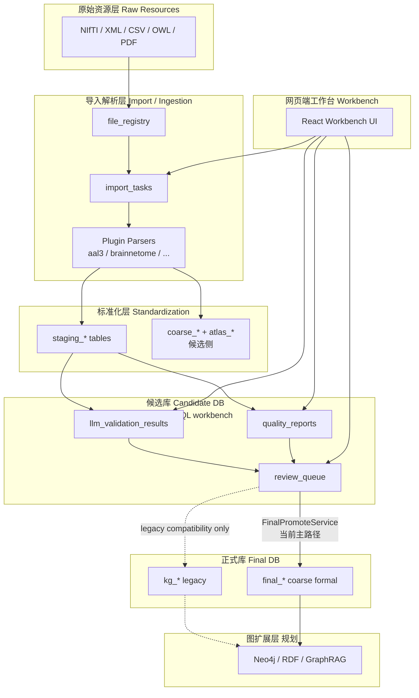
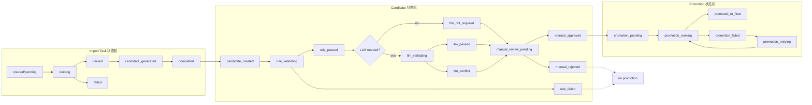
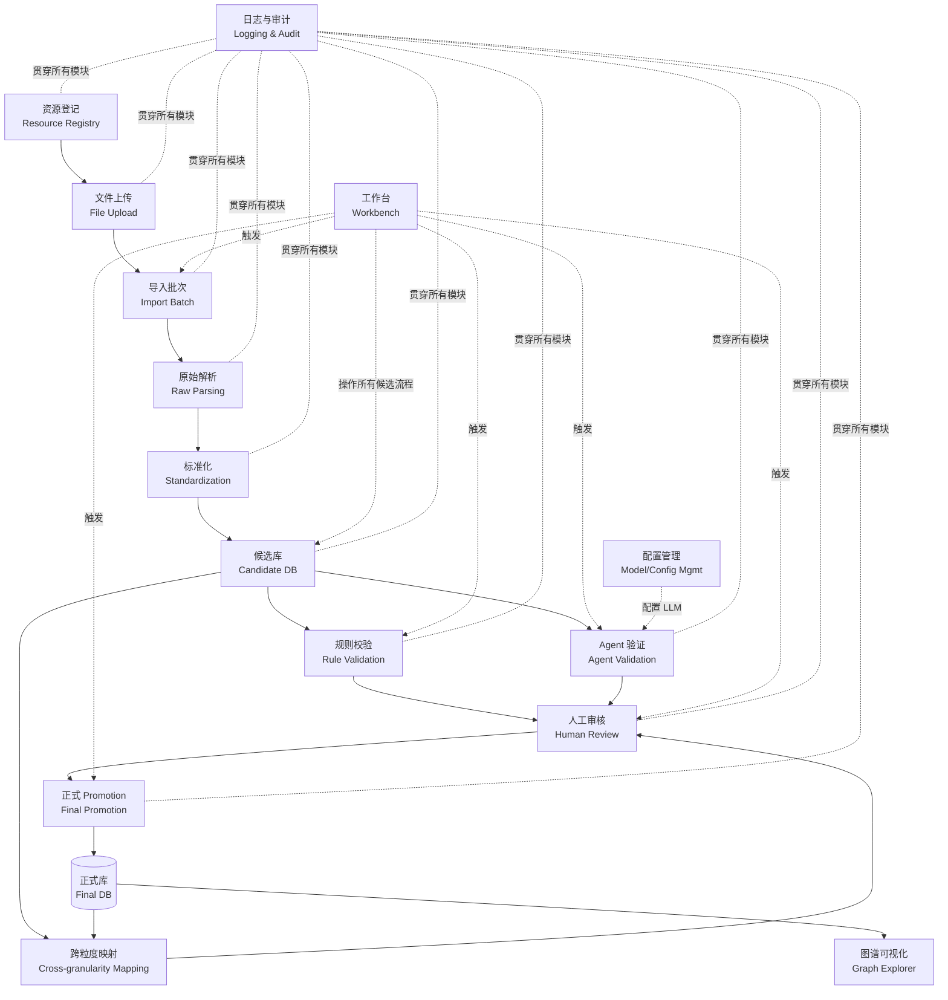

# NeuroGraphIQ 脑区知识图谱系统 Vibe Coding 指南

> **文档受众**：Cursor、Codex 及其他 AI 编程模型。  
> **文档目的**：在接到开发任务时，快速建立对本项目的系统级理解，避免破坏候选库/正式库边界与数据治理流程。  
> **版本基准**：基于仓库 `NeuroGraphIQ_KG_V3_1`（后端 v3.1.0）实际扫描结果编写；未在代码中确认的能力一律标注为「规划目标」或「建议约束」。

---

## 1. 项目定位

### 1.1 核心目标

本项目用于构建**多粒度脑区知识图谱（Multi-granularity Brain Region Knowledge Graph）**。它**不是**单纯的聊天 Agent，**也不是**单纯的图数据库项目，而是一个综合系统：

```
脑区资源导入 + 候选库治理 + Agent/LLM 辅助验证 + 人工审核 + 正式知识图谱 + 网页端工作台（Workbench）
```

系统关注的数据来源包括但不限于：

| 类别 | 示例资源 |
|------|----------|
| 宏观临床图谱 Atlas | AAL3、96 脑区表 |
| 中观解剖分区 | HCP-MMP、Desikan / Destrieux（FreeSurfer） |
| 亚区连接 | Brainnetome Atlas |
| 细胞构筑 | Julich-Brain（siibra）、BigBrain |
| 分子属性 | Allen Human Brain Atlas |
| 术语 / 本体 | InterLex、BrainInfo |
| 其它 | 文献、连接矩阵、功能注释、OWL/RDF ontology 文件等 |

### 1.2 当前实现焦点（仓库实况，2026-06-15 同步）

> **快速快照**：见 `docs/GPT_SESSION_SYNC.md` **§0 当前实现快照**。

- **MVP 1 已落地**：Resource → Files → Import Batch → Raw AAL3 → Candidate → Rule Validation → Human Review → Promotion → Final Query；工作台 **15 页** UI 闭环。
- **Macro96 已落地**：Excel 中间态 `macro_region_table_v1` → `parse-macro96` → `raw_macro96_region_rows`（96）→ `generate-macro96-candidates`；与 AAL3 **分路**，禁止混用 `generate-candidates`。
- **MVP 2 Step 1 已落地**：LLM Extraction Infrastructure — Provider 抽象（DeepSeek/Kimi）、`llm_extraction_runs` / `llm_extraction_items`、Region 字段补全 run/item 记录 + legacy `candidate_llm_extractions` 兼容；**未**实现 connection/circuit/function / Mirror KG。
- **Import Pipeline 已落地**：工作区 overview、rollback、run-history、阶段数据跳转。
- **正式库物理库名**：PostgreSQL **`NeuroGraphIQ_KG_V3`**（schema 分粒度）；当前 Promotion 仍写 dev/E2E 库内 `final_brain_regions`，对齐正式库为后续 Phase H。
- **当前正式库主路径（代码）**：`final_*` 表族；`kg_*` 仅 legacy。
- **并行 coarse-grain 模型**：`coarse_*` / `final_coarse_*` 存在于历史 migration，新 MVP 路径不默认依赖。
- **其它粒度**（meso / micro / molecular / term）：前端路由与 DB enum 已预留，工作台标记 Coming Soon。

---

## 2. 核心设计原则

以下原则是**硬性约束**，任何 AI 编程模型在改代码前必须内化：

| # | 原则 | 说明 |
|---|------|------|
| 1 | **Agent 不能直接写入正式库** | LLM/Parser/Import 逻辑只能写 `staging_*`、`coarse_*`（候选侧）；新功能写正式库必须经 `FinalPromoteService` 写 `final_*`，`kg_*` 仅 legacy |
| 2 | **所有外部资源必须先进入候选库** | 经 `file_registry` → `import_tasks` → `staging_*` 或 `atlas_*` 候选表；禁止跳过 |
| 3 | **候选数据必须经过规则校验和人工审核，LLM 按风险启用** | 规则校验与人工审核必需；LLM 用于翻译、冲突解释、mapping 候选等高风险/语义不确定任务 |
| 4 | **正式库只接收通过审核的数据** | 当前新功能正式入库主路径为 `final_*`；legacy `PromotionService` 写 `kg_*` 仅兼容旧链路 |
| 5 | **所有数据必须可追溯** | 需保留 `source_atlas`、`source_version`、`source_file`（或 `file_registry` 关联）、`import_batch_id` / `task_id` |
| 6 | **不同粒度脑区系统相对独立** | DB enum `granularity_level` + 前端 `/:granularity/:source/*` 路由隔离；禁止混成一张万能脑区表 |
| 7 | **跨粒度映射必须显式建模** | 使用 `staging_mappings`、`coarse_region_atlas_mappings` 等专用 mapping 表；禁止在单字段 `map_to` 中隐式合并 |
| 8 | **LLM 补全字段必须标记来源和审核状态** | `llm_validation_results.raw_response` 保存原始输出；候选写入 `review_queue`，不得直接成为正式事实 |
| 9 | **导入、验证、审核、promotion 必须记录日志** | `quality_reports`、`promotion_log`、`import_task_versions`、Python `logger` |
| 10 | **优先保护数据一致性与可回滚性** | 任务版本快照、promotion 日志、语义 ID 迁移脚本；破坏性 DDL 需单独 migration |

---

## 3. 总体架构

### 3.1 分层说明

| 层级 | 英文 | 职责 | 仓库对应（已实现） |
|------|------|------|-------------------|
| 原始资源层 | Raw Resources | NIfTI、XML、CSV、PDF、OWL 等物理文件 | `backend/data/`、`file_registry`、`upload_dir` |
| 导入解析层 | Import / Ingestion | 识别文件类型、调度 Parser、创建任务 | `ImportTaskService`、`parsers/*`、`routers/tasks.py` |
| 标准化层 | Standardization | 统一命名、左右侧、别名、粒度 | Parser 输出 + `atlas_persist_service`（AAL3） |
| 候选库 | Candidate DB | staging、coarse、review、LLM 结果 | `DATABASE_URL` 指向的工作台库 |
| 规则校验 | Rule Validation | 空名、重复、缺失 source_id 等 | `ValidationService` → `quality_reports` |
| LLM / Agent 验证层 | LLM / Agent Validation | 粗校验、候选中文名/映射建议 | `LLMValidationService` → `llm_validation_results` |
| 网页端工作台 | Workbench | 人工操作入口、流程编排 UI | `frontend/` React + Ant Design |
| 人工审核 | Human Review | 通过/修改/拒绝 | `review_queue`、`ReviewService` |
| 正式库 | Final DB | 已审核脑区、连接、映射 | `final_*` 为当前主路径；`kg_*` 仅 legacy 兼容层 |
| 图扩展层 | Graph / RDF / GraphRAG | Neo4j、RDF、向量检索 | **当前未发现明确实现**（规划目标） |

### 3.2 架构图（Mermaid）



### 3.3 双库 / 多库配置（重要）

`backend/app/config.py` 定义多套 URL：

- `DATABASE_URL`：工作台主库（候选 + import + mirror 流水线；当前 dev 常用 `neurographiq_kg_v3_mvp1_e2e` 或 `neurographiq_kg_v3_wb`）
- `CANDIDATE_DATABASE_URL`：CLI 镜像候选库（`scripts/aal3_import.py`）
- `FINAL_DATABASE_URL`：正式库连接（**目标**应指向物理库 **`NeuroGraphIQ_KG_V3`**）

**正式库（用户确认，2026-06-15）**：

| 项 | 值 |
|----|-----|
| 物理 PostgreSQL 库名 | **`NeuroGraphIQ_KG_V3`** |
| 粒度隔离 | 库内 schema：`macro_clinical`、`meso_anatomical`、`sub_connectivity`、`fine_cyto`、`molecular_attr`、`public` |
| 逻辑名称 | Final KG / NeuroGraphIQ_KG_V3 正式知识图谱 |
| Promotion 写入目标 | `NeuroGraphIQ_KG_V3.{granularity_family_schema}` |

**非正式库（同实例，仅流水线 / 测试）**：`NeuroGraphIQ_KG_Candidate`、`NeuroGraphIQ_KG_Unverified`、`NeuroGraphIQ_Workbench`、`neurographiq_kg_v3_mvp1_e2e`、`neurographiq_kg_v3_wb` 等。

**当前 MVP 实现偏差**：`.env.example` 中 `FINAL_DATABASE_URL` 仍默认指向 `neurographiq_kg_v3_candidate`；MVP 1 Promotion 在 E2E 测试库内写 `final_brain_regions` 表，与正式库 **`NeuroGraphIQ_KG_V3`** 物理分离。后续 Phase H 应对齐 Promotion 至正式库 schema。

**注意**：`backend/.env` 注释已提醒勿将工作台 migration 混入已有 **`NeuroGraphIQ_KG_V3`** 业务表。工作台表族与正式库 schema 分库部署，降低误写风险。跨库 Promotion 不天然具备单库事务原子性，须按第 6.5 节幂等与 reconciliation 约束设计。

---

## 4. 多粒度脑区系统设计

### 4.1 粒度层定义

本项目**不是**单粒度脑区表，而是面向多套独立粒度系统：

| 粒度层 Granularity | 示例资源 | 主要用途 | 仓库状态 |
|-------------------|----------|----------|----------|
| 宏观临床层 Macro Clinical | AAL3 / 96 区 | 临床解释、病例标注、症状关联 | **enabled**（`frontend/src/constants/granularity.ts`） |
| 中观解剖层 Meso Anatomical | HCP-MMP / Desikan / Destrieux | 解剖分区、皮层区域研究 | enum + parser 已有，UI disabled |
| 亚区连接层 Subregion Connectivity | Brainnetome | 连接网络、亚区功能 | parser 已有，UI disabled |
| 细胞构筑层 Cytoarchitectonic | Julich-Brain / BigBrain | 细胞构筑、概率图谱 | siibra_parser 已有 |
| 分子属性层 Molecular | Allen Human Brain Atlas | 基因表达、分子属性 | allen_parser 已有 |
| 术语层 Term | InterLex / BrainInfo | 本体术语 | terminology_parser 已有 |

DB enum（`init_schema.sql`）：`macro | meso | micro | molecular | term`。  
前端 `micro` 对应文档中的「亚区/细粒度」概念，与 meso 并列存在。

仅靠 `granularity_level` 不足以表达 Brainnetome、Julich-Brain、BigBrain、Allen Human Brain Atlas 的语义差异。后续建议增加二级字段 `granularity_family`、`system_layer` 或 `atlas_system_type`。

| granularity_level | granularity_family / system_layer | 示例资源 | 说明 |
|---|---|---|---|
| `macro` | `macro_clinical` | AAL3 / 96 区 | 临床解释、病例标注、症状关联 |
| `meso` | `meso_anatomical` | HCP-MMP / Desikan / Destrieux | 皮层/解剖分区研究 |
| `micro` | `subregion_connectivity` | Brainnetome | 亚区连接网络与功能 |
| `micro` | `cytoarchitectonic` | Julich-Brain | 细胞构筑概率图谱 |
| `micro` | `histological` | BigBrain | 高分辨组织学资源 |
| `molecular` | `molecular` | Allen Human Brain Atlas | 基因表达与分子属性 |
| `term` | `terminology` | InterLex / BrainInfo | 术语、本体、定义 |

约束：

- 不同 family 的 `micro` 资源不能混成同一语义。
- Brainnetome 的亚区连接系统不能等同于 Julich-Brain 的细胞构筑系统。
- BigBrain 的高分辨组织学资源不能简单等同于 Allen 的分子属性。
- 跨粒度映射必须同时记录 `source_granularity`、`target_granularity`、`source_family`、`target_family`。

### 4.2 独立性要求

- 每个粒度系统可独立查询（路由 `/:granularity/:source/*`）。
- 每个粒度系统有自己的脑区、连接、功能、证据表族（staging 分表 + 未来按粒度扩展 coarse/final）。
- 不同粒度之间通过 **mapping 表**连接，禁止跨粒度直接 UPDATE 合并。

### 4.3 跨粒度映射 Cross-granularity Mapping

mapping 关系必须区分类型，**禁止**简单用一个 `map_to` 字段混淆：

| mapping_type | 含义 |
|--------------|------|
| `exact_match` | 严格等价；只能用于语义与空间均高度一致的情况 |
| `close_match` | 近似对应，需标注置信度和不确定性 |
| `part_of` | 源实体是目标实体的一部分 |
| `has_part` | 源实体包含目标实体 |
| `overlaps` | 空间或语义重叠，但非包含关系 |
| `contains` | 包含关系，强调空间/集合包含 |
| `spatial_intersection` | 基于体素、表面或概率图谱交集 |
| `functional_related` | 功能相关，非解剖等价 |
| `merge_to_one` | 多个源实体合并到一个目标实体 |
| `split_from_one` | 一个源实体拆分到多个目标实体 |
| `uncertain_match` | 不确定匹配，需要人工审核 |
| `no_match` | 经审核无法建立映射 |

当前代码中的 legacy 值：`unmapped` 已在 `coarse_region_atlas_mappings` CHECK 和 `FinalPromoteService.PROMOTABLE_MAPPING_TYPES` 中出现，可作为内部状态或 legacy 值兼容；**不推荐作为新的主 mapping_type**。新增类型必须同步 migration、Pydantic schema、前端枚举和 promotion 白名单。

#### mapping_type 与 mapping_status 的区别

- `mapping_type` 描述两个实体之间**是什么关系**。
- `mapping_status` / `review_status` 描述这条 mapping 记录**是否已审核、是否有效、是否被驳回**。

建议 `mapping_status`：

- `candidate_created`
- `rule_passed`
- `llm_suggested`
- `manual_approved`
- `manual_rejected`
- `archived`

约束：

- 名称相似不能自动 `exact_match`。
- AAL3 宏观区与 Brainnetome 亚区通常更可能是 `contains` / `has_part` / `overlaps`。
- Julich-Brain 与 AAL3 常见为 `spatial_intersection` / `overlaps` / `part_of`，不应强行 `exact_match`。
- `uncertain_match` 是合法结果，不应被自动提升为 `exact_match`。
- `mapping_type` 和 `review_status` 不得混用；mapping 必须记录 `evidence_type`、`confidence`、`source_atlas_pair`、`review_status`。

---

## 5. 数据流转状态机

本项目必须拆分三套状态机：**Import Task 状态机**、**Candidate 状态机**、**Promotion 状态机**。三者不能混用。

### 5.1 Import Task 状态机

Import Task 描述一次导入任务，不代表每条 candidate 的审核状态，也不代表数据已经进入正式库。

| 状态 | 含义 | 当前仓库近似值 |
|---|---|---|
| `created` | 任务记录已创建 | `pending` |
| `queued` | 已进入异步队列（规划） | 当前未发现明确实现 |
| `running` | Parser 执行中 | `running` |
| `parsed` | 文件解析完成，staging 写入 | `parsed` |
| `candidate_generated` | 候选实体/映射已生成 | 由 staging/coarse 写入体现 |
| `validation_dispatched` | 已触发规则校验或 LLM 辅助 | `validating` / `llm_reviewing` |
| `completed` | 导入流程结束 | `completed` |
| `failed` | 导入失败，可查看 `error_message` | `failed` |
| `cancelled` | 任务取消（建议） | 当前 enum 未发现 |

`import task completed` 只表示导入流程结束；**不表示候选数据已经人工审核，也不表示数据已进入正式库**。

### 5.2 Candidate 状态机

Candidate 状态机描述候选实体、候选关系、候选 mapping 的生命周期。

| 状态 | 含义 | 是否可 promotion |
|---|---|---|
| `candidate_created` | 候选数据创建 | 否 |
| `rule_validating` | 规则校验中 | 否 |
| `rule_passed` | 规则通过 | 仍需人工审核 |
| `rule_failed` | 规则失败 | 否 |
| `llm_not_required` | 该数据类型不需要 LLM | 可进入人工审核 |
| `llm_validating` | LLM 辅助验证中 | 否 |
| `llm_passed` | LLM 未发现明显问题 | 否，仍需人工审核 |
| `llm_conflict` | LLM 发现冲突或不确定 | 否 |
| `manual_review_pending` | 等待人工审核 | 否 |
| `manual_approved` | 人工审核通过 | 是，满足 promotion 前置条件 |
| `manual_rejected` | 人工拒绝 | 否 |
| `archived` | 归档 | 否 |

`rule_passed` 不等于 `manual_approved`。`llm_passed` 也不等于 `manual_approved`。

### 5.3 Promotion 状态机

Promotion 状态机描述 candidate 到 final 的正式入库过程。

| 状态 | 含义 |
|---|---|
| `promotion_pending` | 已满足 promotion 前置条件，等待执行 |
| `promotion_running` | 正在写入 `final_*` |
| `promoted_to_final` | 成功写入 `final_*` |
| `promotion_failed` | 写入失败，需记录错误 |
| `promotion_retrying` | 重试中 |
| `promotion_archived` | promotion 事件归档 |

Promotion 是受控提升，不是普通 insert。必须写 `promotion_event` / `promotion_log` 与 `audit_log`（若当前仓库未实现统一 `audit_log`，需作为后续建议设计）。

### 5.4 三套状态机关系图



### 5.5 允许进入正式库的条件（代码级）

1. Candidate 必须 `manual_approved`；legacy `review_queue.status` 的 `approved` / `modified` 只表示旧链路近似。
2. 规则校验不能为 blocking error；`rule_failed` 禁止 promotion。
3. LLM 可按风险跳过并标记 `llm_not_required`；`llm_passed` 不能替代人工审核。
4. Coarse 正式 promotion 应使用 `FinalPromoteService` 写 `final_*`；legacy `PromotionService` 写 `kg_*` 不作为新功能默认路径。
5. **禁止** Parser、LLM 服务、Import 任务直接 INSERT 到 `final_*` 或 legacy `kg_*`。

---

## 6. 候选库与正式库边界

### 6.1 候选库 Candidate DB 保存内容

| 内容 | 表/位置 |
|------|---------|
| 原始字段 | `staging_*`、`file_registry.intermediate_json` |
| 标准化字段 | `staging_regions.full_name`、`coarse_brain_regions.*` |
| Agent / LLM 输出 | `llm_validation_results`（含 `raw_response`） |
| 规则校验结果 | `quality_reports` |
| 冲突 / 审核信息 | `review_queue` |
| 原始文件来源 | `file_registry`、`resource_registry` |
| 导入批次 | `import_tasks.id`（即 import batch 语义）、`import_task_versions` |

Legacy 候选镜像：历史 CLI 中存在 `--mirror-kg`，可将 staging 同步到 legacy `kg_*`。该参数必须默认关闭，只能作为历史兼容能力；新开发不得推荐或主动启用 `--mirror-kg`。

### 6.2 正式库 Final DB 保存内容

#### 正式库边界：`final_*` 为当前主路径，`kg_*` 为 legacy 兼容层

当前阶段，新的正式数据写入主路径应为 `final_*` 表族。`kg_*` 表族只作为历史兼容层或旧版遗留正式库，不作为新功能默认写入目标。

| 表族 / 层级 | 定位 | 是否允许新功能默认写入 | 说明 |
|---|---|---|---|
| `staging_*` | 原始/中间数据 | 允许，候选侧 | Parser 输出，不代表正式事实 |
| `coarse_*` / `atlas_*` | 工作台或候选支撑数据 | 视当前实现而定 | 必须标注来源、状态、review_status |
| `candidate_*` | 候选库（建议统一命名） | 允许 | 当前仓库以 `staging_*`、`coarse_*`、`review_queue` 承担候选职责 |
| `final_*` | 当前正式库主路径 | 允许，受控写入 | 只能由 promotion 写入，当前 coarse 正式 API 位于 `/api/v1/final/coarse/*` |
| `kg_*` | legacy 兼容层 | 默认禁止 | 仅旧链路兼容；不作为新开发主路径 |

硬性约束：

1. 新增功能不得默认写 `kg_*`。
2. 新增功能不得同时把 `final_*` 和 `kg_*` 当成两个平级正式库。
3. `--mirror-kg` 只能作为历史兼容能力，必须默认关闭。
4. AI 编程模型不得为了“同步方便”主动启用 `--mirror-kg`。
5. 任何从 candidate 到 final 的 promotion，都必须以 `final_*` 为目标。
6. 若确需兼容 `kg_*`，必须在任务说明中明确风险、用途、回滚策略和验证方案。

| 内容 | 表/位置 |
|------|---------|
| 已审核脑区 | `final_coarse_brain_regions`（主路径）；`kg_regions` 仅 legacy |
| 已审核连接 | `final_coarse_region_connections`（主路径）；`kg_connections` 仅 legacy |
| 已审核回路 | `final_coarse_circuits`（coarse 族） |
| 已审核功能 | `final_coarse_region_function_annotations`（主路径）；`kg_functions` 仅 legacy |
| 已审核跨粒度映射 | `final_coarse_region_atlas_mappings`（主路径）；`kg_mappings` 仅 legacy |
| 已确认来源证据 | `evidence_sources`、`evidence_items` / `final_evidence_*` |
| promotion 记录 | `promotion_log`、`promoted_at` / `promoted_by` 字段 |

### 6.3 明确禁止

- 禁止 Import Agent / Parser **直接写正式库**。
- 禁止 LLM 输出**绕过** `review_queue` 进入 `final_*` 或 legacy `kg_*`。
- 禁止没有 `source` / `version` / `evidence` 的实体进入正式库。
- 禁止把不同 atlas 的**同名脑区直接合并**为一个 `final_*` 或 legacy `kg_*` 行。
- 禁止混淆 `left` / `right` / `bilateral` / `midline`（coarse 表有 CHECK 约束）。

### 6.4 LLM 验证策略：按风险启用

规则校验和人工审核是必需的；LLM 验证按风险等级启用，不应对所有确定性结构化数据一刀切。

| 数据/任务类型 | LLM 是否必需 | 推荐策略 |
|---|---|---|
| AAL3 label 确定性解析 | 否 | rule validation + human review |
| NIfTI label id 对齐 | 否 | deterministic check |
| 中文名/描述补全 | 可选 | LLM 生成后人工审核，标记 `llm_generated` 或等价字段 |
| 跨 atlas mapping | 建议 | LLM 候选 + 证据审核 |
| 文献证据摘要 | 建议 | LLM 摘要 + source trace |
| promotion 到 final | 否 | 不允许 LLM 决定 promotion |
| 冲突解释 | 建议 | LLM 辅助说明，不做最终裁决 |

约束：

- LLM 输出不能直接成为正式事实。
- LLM 生成字段必须标记 `llm_generated = true` 或等价字段。
- LLM 原始输出必须保存（当前为 `llm_validation_results.raw_response`；新路径为 `llm_extraction_items.raw_response_text`）。
- LLM 结果必须进入人工审核或标记为 `llm_not_required`。
- `llm_passed` 不等于 `manual_approved`。

**LLM Extraction Infrastructure（Step 1 起）附加原则：**

1. **所有 LLM 调用必须生成 run** — 写入 `llm_extraction_runs`（provider / model / task_type / prompt / status / usage）。
2. **所有 LLM 输出必须生成 item** — 每条候选/输入对应 `llm_extraction_items`（input / prompt / raw / parsed / normalized / error）。
3. **Provider 必须可替换** — 通过 `get_llm_provider()` 统一 DeepSeek / Kimi；业务层不得硬编码 HTTP 客户端。
4. **测试必须 mock provider** — 单元/集成测试不得访问真实 DeepSeek / Kimi 外网。
5. **API key 不得进入前端响应** — Settings 与 `/api/llm-extraction/providers` 仅返回 configured 布尔值。
6. **LLM output 不得直接写 final_*** — 候选侧 run/item（及 legacy `candidate_llm_extractions`）为上限。
7. **Mirror KG 写入必须独立步骤** — Step 2 起由专门 service 从 item 写入 mirror 表；LLM service 不直写 mirror / final / kg_*。

**Mirror KG 原则（Step 2 起）：**

1. **Mirror KG 是 final 前置层** — 正式库镜像，不是 `final_*`。
2. **Mirror KG 不是正式事实** — 工作台可展示，但不得当作已审核事实。
3. **connection / function / circuit / triple 必须独立建模** — 不塞进 brain region 字段。
4. **Mirror KG 必须保存 LLM run/item 溯源** — `llm_run_id`、`llm_item_id`、resource/batch/granularity/source_atlas。
5. **Mirror KG 不得自动 promotion** — promotion 必须后续 Human Review + Promotion 步骤。
6. **Mirror KG 表创建不等于 LLM extraction 已实现** — schema 与展示先行，提取任务分步落地。
7. **Human Review 和 Promotion 必须后续单独实现** — 本轮仅 create/list/get。

**Connection Extraction 原则（Step 3 起）：**

1. **Connection extraction 必须 same-granularity** — 同 source_atlas、granularity_level、granularity_family。
2. **Connection extraction 必须保存 run/item** — 一次 prompt 一个 item，raw/parsed/normalized 全保留。
3. **Connection extraction 输出进入 Mirror KG** — 默认写 connections；可选 triples / evidence。
4. **Connection extraction 不等于 final fact** — 默认 `llm_suggested` / `pending` / `not_promoted`。
5. **低 confidence 或无 evidence 的 connection 后续必须 warning** — rule validation 步骤处理。
6. **无向连接必须处理 A-B/B-A 重复** — canonical pair + DB 去重。
7. **不允许跨 atlas / cross granularity 自动生成连接** — 后端 400 拒绝混合候选。

**Function Extraction 原则（Step 4 起）：**

1. **Function extraction 必须 same-granularity** — 同 source_atlas、granularity_level、granularity_family。
2. **Function extraction 必须保存 run/item** — 一次 prompt 一个 item，raw/parsed/normalized 全保留。
3. **Function extraction 输出进入 Mirror KG** — 默认写 functions；可选 triples / evidence。
4. **Function extraction 不等于 final fact** — 默认 `llm_suggested` / `pending` / `not_promoted`。
5. **无 evidence 或低 confidence 的 function 后续必须 warning** — rule validation 步骤处理。
6. **不允许跨 atlas / cross granularity 自动生成功能** — 后端 400 拒绝混合候选。
7. **function_term 去重必须按 normalized key 处理** — lower-case trim 后比对，保留原始 function_term。

**Circuit Extraction 原则（Step 5 起）：**

1. **Circuit extraction 必须 same-granularity** — 同 source_atlas、granularity_level、granularity_family。
2. **Circuit extraction 必须保存 run/item** — 一次 prompt 一个 item，raw/parsed/normalized 全保留。
3. **Circuit extraction 输出进入 Mirror KG** — 默认写 circuits + circuit_regions；可选 triples / evidence。
4. **Circuit extraction 不等于 final fact** — 默认 `llm_suggested` / `pending` / `not_promoted`。
5. **Circuit 可以使用 connection/function 作为上下文，但不得跨 atlas/granularity** — 显式非法 ID 400；自动加载过滤。
6. **无 evidence 或低 confidence 的 circuit 后续必须 warning** — rule validation 步骤处理。
7. **不允许跨 atlas / cross granularity 自动生成回路** — 后端 400 拒绝混合候选。
8. **mirror_circuit_regions 是回路组成关系，不是 final graph 事实** — 仅 Mirror KG 候选层。

**Triple Consolidation 原则（Step 6 起）：**

1. **Triple consolidation 是确定性转换，不是 LLM generation** — 不调用 DeepSeek/Kimi 或任何 provider。
2. **Triple consolidation 只写 mirror_kg_triples** — 不写 `final_*` / `kg_*`。
3. **Triple consolidation 必须可 dry_run** — 预览 planned triples，不写数据库。
4. **Triple consolidation 必须去重** — canonical key + DB 已存在 + session 内重复均跳过。
5. **Triple 必须保留 source mirror object** — `source_mirror_connection_id` / `source_mirror_function_id` / `source_mirror_circuit_id`。
6. **Triple 不是 final fact** — 默认 `llm_suggested` / `pending` / `not_promoted`。
7. **Triple review / promotion 必须后续单独实现** — consolidation 不自动 approve / promote。

**Mirror Rule Validation 原则（Step 7 起）：**

1. **Mirror validation 是确定性规则校验，不是 LLM** — 不调用 DeepSeek/Kimi 或任何 provider。
2. **Mirror validation 结果必须独立记录** — `mirror_rule_validation_runs/results`，不复用 candidate validation 表。
3. **rule_checked 不等于人工审核通过** — 仅表示通过确定性规则校验。
4. **blocker/error 不得进入人工审核队列** — 必须在 validation results 中可见。
5. **warning 可进入人工审核，但必须显示** — 不将 warning 当作 blocker。
6. **validation 不写 final** — 不写 `final_*` / `kg_*`。
7. **validation 不自动 promote** — 不修改 `promotion_status`。
8. **validation 必须支持 dry_run** — 预览 results，不写 runs/results 或状态。

**Mirror Human Review 原则（Step 8 起）：**

1. **Mirror Review 是人工审核，不是 promotion** — 不调用 LLM；不写 `final_*` / `kg_*`。
2. **approve 只更新 Mirror KG 审核状态** — `human_approved` + `review_status=approved`。
3. **human_approved 不等于 final fact** — 须后续 Promotion 步骤。
4. **reject / needs_revision 必须写 reviewer note** — 完整 audit trail。
5. **edit 必须保留 before/after** — 白名单字段 only；edit 后需重新 validation。
6. **provenance 字段不可编辑** — resource/batch/llm_run/region ids 等。
7. **blocker/error 不得 approve** — 须先修复并重新 rule validation。
8. **review 不写 final** — promotion 单独实现。

**Macro Clinical Human Review 原则（Step 8.14 起）：**

1. **human review 是 Mirror → Final 的最后人工门禁** — macro_clinical 对象必须经过 validation 后进入 review。
2. **validation signal / dual-model signal 只能辅助人工判断** — 不得自动 approve/reject 领域对象。
3. **signal object 不等于事实对象** — cross_validation_result / dual_model_verification_result 是审核信号。
4. **accept_signal 不等于 approve domain object** — 信号采纳不修改 linked object review_status。
5. **human_approved 仍不等于 final** — final 只能通过 promotion 生成。
6. **review 不得写 final/kg** — 所有状态变化来自明确人工 action。

**Final macro_clinical Promotion 原则（Step 8.15 起）：**

1. **final_* 是系统内部正式知识层** — 不是外部物理正式库。
2. **human_approved 不是 final** — promotion 后才是 final。
3. **promotion 必须显式触发** — dry_run preview + confirm_text 强确认。
4. **promotion 必须保留 mirror provenance** — source_mirror_id、promotion_run_id、validation/review/cross/dual summaries。
5. **signal object 不能作为 final fact** — cross/dual 只是 risk/provenance。
6. **不写 kg_*** — 外部正式库同步必须另做独立步骤。

**Final KG Browser 原则（Step 8.16 起）：**

1. **Final Browser 是只读查询层** — 不得写 final_* / mirror_* / kg_*。
2. **查询不得写数据库** — 所有 browser API 仅 SELECT。
3. **Final Browser ≠ 外部正式库同步** — 浏览不等于 export/sync。
4. **graph JSON 只是展示数据** — 不可写回数据库。
5. **provenance 必须可见** — source_mirror_id、promotion_run_id、validation/review/cross/dual summaries。
6. **所有 final 知识必须可追溯** — final_uid + promotion_run_id。
7. **不允许在 Browser 中编辑 final fact** — 无 edit/delete/promote 按钮。
8. **不允许在 Browser 中执行 promotion** — promotion 仅在 Final Promotion tab。

**Final KG Export 原则（Step 8.17 起）：**

1. **Export 是外部同步前的离线文件准备** — 不等于 Sync。
2. **Export 不得写 kg_*** — 仅写 `data/exports/final_kg/` 本地文件。
3. **Export 不得连接 Neo4j** — 只生成 compatible CSV，不执行 import。
4. **Export 不得自动导入外部库** — README 明确用户手动审查后导入。
5. **Export 必须保留 provenance** — source_mirror_id、promotion_run_id、validation/review summaries。
6. **Export 必须可重复** — deterministic node_id / edge_id。
7. **Export 必须有 manifest** — 每次 export 目录含 manifest.json。
8. **Export 路径必须安全** — export_id 白名单、filename 白名单、禁止 path traversal。

**Mirror Promotion 原则（Step 9 起）：**

1. **Promotion 是 Mirror KG 到 Final KG 的唯一写入通道** — 确定性 DB 操作，不调用 LLM。
2. **human_approved 不等于 final** — 必须经 promotion 强确认后写 `final_*`。
3. **promotion 必须强确认** — `PROMOTE MIRROR KG TO FINAL: {types} COUNT {n}` 精确匹配。
4. **promotion 必须 audit** — `mirror_promotion_runs` + `mirror_promotion_records`。
5. **只允许无 blocker/error 的 approved 对象** — warning 不阻止但须显示。
6. **promotion 写 final_*，不写 kg_*** — 不对接外部物理正式库。
7. **不做跨颗粒度 mapping、不同名合并** — 同 scope duplicate key 跳过。
8. **final_* 仍不等于外部物理正式库同步完成** — 须后续 Browser/Export/Sync 步骤。

**Macro Clinical Schema 对齐原则（Step 8.5 起）：**

1. **正式 macro_clinical schema 优先** — region → circuit → circuit_step → projection → function 为主链路。
2. **connection 在正式库中应作为 projection 语义** — `mirror_region_connections` 映射 projection，非独立 connection 实体族。
3. **circuit_step 是回路结构的关键中间层** — `mirror_circuit_regions` 仅为早期不完整形式。
4. **function 必须区分 region_function / circuit_function / projection_function** — 不可混为一谈。
5. **circuit_projection_membership 是回路-连接包含关系的关键表** — 表达 circuit contains projection 与 projection belongs_to circuit。
6. **circuit → projection 与 projection → circuit 必须双向交叉验证** — 两条路径结果对比后才进入高置信 Mirror 层。
7. **DeepSeek/Kimi 双模型验证不能替代人工审核** — 一致仅提高 Mirror KG 置信度，不能自动 final。
8. **双模型一致只能提高 Mirror KG 置信度，不能自动 promote** — conflict 保留 conflict record 并进入 human review。
9. **prompt template 必须先于 API 实现** — 无 schema 契约禁止 LLM 自由文本输出。
10. **promotion 前必须完成 Mirror KG 与正式库 schema mapping** — Step 9 promotion 暂缓扩展直至 step/projection_function/membership/dual_model 补齐。

**Macro Clinical Schema Foundation 原则（Step 8.6 起）：**

1. **circuit_step 是 circuit 结构的核心对象** — 优先于 `mirror_circuit_regions` 早期组成关系。
2. **projection_function 必须独立于 region_function** — 绑定 `mirror_region_connections`（projection 语义）。
3. **circuit_projection_membership 是 circuit 与 projection 的包含关系** — circuit contains projection / projection belongs_to circuit。
4. **mirror_region_connections 在 macro_clinical 中按 projection 语义处理** — 表名暂不重命名。
5. **dual_model_verification 只能辅助提高或降低 Mirror 置信度** — 不能自动审核或 promote。
6. **schema foundation 不等于 extraction implemented** — planned prompt/task types 仍为 `implemented=false`。
7. **新对象仍必须经过 validation / review / promotion** — 与现有 Mirror KG 对象相同门禁。

**Circuit-to-Steps Extraction 原则（Step 8.7 起）：**

1. **circuit_to_steps 是 macro_clinical 主链路的第一步真实 extraction** — 从已有 mirror circuit 拆解 ordered steps。
2. **step_order 是 circuit structure 的关键字段** — 必须连续、可 audit；duplicate step_order 不覆盖已有记录。
3. **circuit_step 仍是 Mirror candidate，不是 final** — 默认 `mirror_status=llm_suggested`、`review_status=pending`、`promotion_status=not_promoted`。
4. **circuit_step 后续必须进入 validation / review / promotion** — 与 connection/function/circuit 相同门禁。
5. **circuit_to_steps 不得生成 projection** — 不写 `mirror_region_connections`、不写 membership。
6. **circuit_to_steps 不得写 final / kg** — 仅 mirror + llm run/item。

**Circuit-Steps-to-Projections Extraction 原则（Step 8.8 起）：**

1. **circuit_steps_to_projections 是 macro_clinical 主链路中的 projection extraction** — 从 ordered steps 推导 projection。
2. **mirror_region_connections 在此链路中按 projection 语义使用** — normalized_payload_json 标记 `macro_clinical_semantic_type=projection`。
3. **circuit_projection_membership 是表达 circuit contains projection 的关键对象** — 必须绑定 source_step_id / target_step_id。
4. **projection extraction 不等于 final fact** — 默认 pending / not_promoted。
5. **membership 仍需 validation / review / promotion** — 与 connection/circuit 相同门禁。
6. **不得写 final / kg** — 仅 mirror + llm run/item；可选 mirror_kg_triples / mirror_evidence_records。

**Projection-to-Functions Extraction 原则（Step 8.9 起）：**

1. **projection_to_functions 是 macro_clinical 主链路中的 projection_function extraction** — 从 projection 推导 function。
2. **projection_function 必须独立于 region_function** — 绑定 `projection_id`，不得混写 region_function。
3. **projection_function 仍是 Mirror candidate** — 默认 `llm_suggested` / `pending` / `not_promoted`。
4. **projection_function 后续必须进入 validation / review / promotion** — 与 region_function 相同门禁。
5. **projection_to_functions 不得写 final / kg** — 仅 mirror + llm run/item；可选 mirror_kg_triples。
6. **projection_to_functions 不得自动审核** — 无 auto approve / promote。

**Projections-to-Circuits Reverse Extraction 原则（Step 8.10 起）：**

1. **projections_to_circuits 是 macro_clinical 反向链路** — 从 projection graph 反向推断 circuit candidates。
2. **reverse extraction 只能基于输入 projection graph** — 不得凭空生成无 projection 支持的 circuit。
3. **reverse extraction 不得新增 projection 或 region** — 输入 `mirror_region_connections` 必须同 atlas、同 granularity。
4. **projection_supported 不等于 bidirectionally_supported** — membership 仅表示 projection 侧支持，需后续 cross validation。
5. **inferred circuit 仍是 Mirror candidate** — 默认 `llm_suggested` / `pending` / `not_promoted`。
6. **inferred circuit 后续必须进入 cross validation / rule validation / human review** — 不得自动 promote。
7. **不得写 final / kg** — 仅 mirror + llm run/item；可选 mirror_kg_triples / mirror_evidence_records。

**Circuit-Projection Cross Validation 原则（Step 8.11 起）：**

1. **cross validation 是确定性比较，不是 LLM** — 不调用 DeepSeek/Kimi，不写 llm_extraction_runs/items。
2. **bidirectionally_supported 只是 Mirror 内部一致性增强** — 不等于 human_approved。
3. **conflict 必须进入人工审核** — 不得自动 reject；model_conflict 仅为一致性信号。
4. **cross validation 不改 review_status / promotion_status** — 仅可选更新 membership.verification_status。
5. **cross validation 不写 final/kg** — 只写 cross validation runs/results。
6. **cross validation 后仍需 rule validation / human review / promotion** — 完整门禁不变。

**Dual-Model Verification 原则（Step 8.12 起）：**

1. **双模型验证是 Mirror 信号，不是人工审核** — consensus 不能自动 approve。
2. **两个模型必须独立验证** — Kimi 不得看到 DeepSeek 原始输出，反之亦然。
3. **模型输出比较必须确定性** — 不得使用第三次 LLM 做 comparison。
4. **conflict 不能自动 reject** — model_conflict 必须进入人工审核队列。
5. **双模型验证结果必须进入 human review** — 不得自动修改 review_status / promotion_status。
6. **不得写 final/kg** — 只写 dual-model verification runs/results 与 llm trace。

**Macro Clinical Rule Validation 原则（Step 8.13 起）：**

1. **rule validation 是审核前门禁** — blocker/error 用于结构/引用错误；warning 允许进入 human review。
2. **conflict 类信号进入高优先级人工审核** — cross validation conflict、dual model model_conflict、consensus_rejected 不自动 reject。
3. **consensus_supported / bidirectionally_supported 不等于人工通过** — 不自动 approve。
4. **validation 不能修改 review_status / promotion_status** — 仅可选更新 mirror_status=rule_checked。
5. **validation 不能写 final/kg** — 不调用 LLM。
6. **macro_clinical 新对象必须经过 validation → human review → promotion** 链路。

### 6.5 Promotion 一致性与幂等性约束

如果 Candidate DB 和 Final DB 是两个物理数据库，promotion 不天然具备单库事务原子性。当前 `FinalPromoteService` 使用 `FinalSessionLocal` 写 `final_*`，因此新功能必须显式设计幂等与补偿。

| 约束 | 要求 |
|---|---|
| promotion 前置条件 | candidate 必须 `manual_approved`，规则校验无 blocking error，source trace 完整 |
| promotion 幂等键 | 建议使用 `candidate_id + target_table + target_id`；final 表已有 `source_candidate_id` 时应作为幂等锚点 |
| promotion_event | 必须记录 `candidate_id`、`target_table`、`target_id`、`promoted_by`、`promoted_at` |
| audit_log | 建议所有 high-risk promotion 写统一 `audit_log`；当前未实现则写为后续必补项 |
| 失败重试 | promotion 失败必须可重试；不得因重复执行产生重复 final 行 |
| reconciliation | final 写入成功但 candidate 状态更新失败时，必须能通过 `source_candidate_id` / mapping id 反查并修复 |
| 禁止项 | 禁止跨库半成功静默失败；禁止 Agent/Parser 为图省事直接写 `final_*` |

当前 MVP 阶段，如果没有强烈物理分库需求，优先建议同一个 PostgreSQL 中用 schema 或表族隔离 candidate 和 final，降低一致性复杂度。

---

## 7. Agent 角色划分

当前仓库**未使用 LangGraph**；Agent 职责由 **Service + Parser 插件** 实现。以下为逻辑角色划分（含建议约束）：

### 7.1 导入 Agent Import Agent

| 项 | 说明 |
|----|------|
| **实现** | `ImportTaskService`、`parsers/registry.py`、各 `*_parser.py` |
| **输入** | `import_tasks`、文件路径、`resource_type` |
| **输出** | `ParseResult` → `staging_*`；AAL3 额外写 `atlas_resources` / `atlas_labels` |
| **禁止** | 写 `kg_*`、`final_*`；跳过 `file_registry`  dedup |

### 7.2 标准化 Agent Standardization Agent

| 项 | 说明 |
|----|------|
| **实现** | Parser 内字段规范化 + `atlas_persist_service` + `coarse_seed_service` |
| **输入** | 原始 parse 记录 |
| **输出** | 统一 `hemisphere`/`laterality`、别名、语义 ID（`semantic_id.py`） |
| **禁止** | 静默覆盖已审核正式库字段 |

### 7.3 粒度识别 Agent Granularity Agent

| 项 | 说明 |
|----|------|
| **实现** | Parser `resource_info.granularity`、前端 `GranularityPageGate` |
| **输入** | `resource_type`、文件 manifest |
| **输出** | `granularity_level` enum |
| **禁止** | 将 macro 数据写入 micro 表族 |

### 7.4 映射 Agent Mapping Agent

| 项 | 说明 |
|----|------|
| **实现** | `atlas_persist_service` 生成 `coarse_region_atlas_mappings`；`staging_mappings` |
| **输入** | Atlas label、96 脑区池 |
| **输出** | mapping 候选 + `review_status=candidate` |
| **禁止** | 自动 promotion mapping 到 `final_*` |

### 7.5 验证 Agent Validation Agent

| 项 | 说明 |
|----|------|
| **实现** | `ValidationService`（规则）、`LLMValidationService`（LLM） |
| **输入** | `staging_*` 按 `task_id` |
| **输出** | `quality_reports`、`llm_validation_results`、`review_queue` 条目 |
| **禁止** | 将 LLM JSON 直接当正式字段 commit |

### 7.6 入库 Agent Promotion Agent

| 项 | 说明 |
|----|------|
| **实现** | `PromotionService`（legacy kg）、`FinalPromoteService`（coarse final） |
| **输入** | 已审核 `review_queue` 或 verified coarse 实体 |
| **输出** | 新功能输出到 `final_*` + `promotion_log`；legacy 路径可输出到 `kg_*` |
| **禁止** | 自由生成未在候选库出现的数据；绕过审核状态检查 |

---

## 8. 网页端工作台设计

Workbench 是**系统核心**，不是纯展示页。它驱动导入—校验—审核—promotion 全流程。

### 8.1 已实现页面（路由：`/:granularity/:source/<section>`）

| # | 页面 | 用途 | 主要数据来源 | 关键操作 | 需保护的约束 |
|---|------|------|--------------|----------|--------------|
| 1 | **文件中心** FileCenter | 上传与登记源文件 | `GET/POST /api/v1/files` | 上传、查看 SHA256 | 同 SHA256 不可重复污染 registry |
| 2 | **导入任务** ImportTasks | 创建/运行解析任务 | `/api/v1/tasks` | 创建任务、执行 run | 必须选已注册 parser；记录 `source_key` |
| 3 | **解析结果** ParseResults | 浏览 staging 输出 | `/api/v1/staging/{task_id}` | 查看 regions/terms | 只读 staging，不改正式库 |
| 4 | **质量检查** QualityReport | 规则校验结果 | `/api/v1/validation/{task_id}/quality` | 触发校验 | 覆盖前删除旧 `quality_reports` |
| 5 | **LLM 粗校验** LLMValidation | LLM 候选与冲突 | `/api/v1/validation/{task_id}/llm` | 按风险触发 LLM | 如启用 LLM 必须配置模型并保留 `raw_response` |
| 6 | **候选审核** ReviewQueue | 人工审核 | `/api/v1/review/*` | 通过/修改/拒绝 | 仅 approved/modified 可 promotion |
| 7 | **晋级正式库** Promotion | promotion 与统计 | `/api/v1/promotion/*` | promote_task | **不可跳过 review** |
| 8 | **系统设置** Settings | 全局 LLM 配置 | `/api/v1/settings/llm` | 增删测 LLM | API Key 不得写前端硬编码 |

历史宏观层数据源曾出现 `aal3` / `aal96` 视图切换说明；当前文档约束以 `docs/MACRO_96_REGION_POOL.md` 为准：Macro 96 Pool 必须来自权威 Excel 或显式标准池导入，**不得**用 AAL3 `label_index 1-96` 视图过滤替代。

### 8.2 规划页面（当前未发现明确实现）

| 页面 | 说明 |
|------|------|
| Dashboard 首页总览 | 跨任务/跨粒度 KPI |
| Granularity Systems 粒度管理 | 启用/禁用粒度、资源 catalog |
| Mapping Workspace 跨粒度映射 | 可视化编辑 mapping |
| Graph Explorer 图谱可视化 | 需 Neo4j/React Flow 等 |
| Ontology & Rules 本体与规则 | OWL/SHACL 管理 |
| Agent Center Agent 配置与调用记录 | 统一 Agent  trace |

---

## Workbench 页面演进原则

早期 Workbench 页面按后端模块拆分，是开发调试需要；后续页面应按用户任务组织，从“表级页面”演进为“工作流页面”。页面整合只能改善信息架构与操作体验，不能改变后端状态机、写权限边界或数据治理顺序。

### 推荐演进方向

1. **Import Pipeline Workspace 以 `batch_id` 为中心**：聚合 Import Batches、Raw Parsing、Candidates、Rule Validation 的只读信息和状态驱动操作入口，帮助用户理解一个 batch 的当前位置和下一步允许动作。
2. **Candidate Governance Workspace 以 `candidate_id` 为中心**：聚合 candidate detail、raw source、rule validation result、LLM suggestions、Human Review records、Promotion records、final region trace，用于人工治理单条 candidate。
3. **Resource Detail Workspace 以 `resource_id` 为中心**：聚合资源元数据、关联文件、关联批次、候选数量、final 概览与 provenance 总览。
4. **Files 页面只管文件级管理和预览**：上传、CRUD、下载、metadata、preview 属于 Files；业务解析属于 Import Pipeline / Raw Parsing，不应把 parsed labels 作为 Files 页面主要职责。

### Raw Parsing 与 LLM Extraction 分离

Raw Parsing 与 LLM Extraction 必须分离：

- Raw Parsing 是确定性解析文件内容的入口，读取已登记文件并写 raw/candidate 侧结构化数据。
- LLM Extraction 是候选侧建议提取，读取已有 candidate 字段，输出建议性 JSON 供人工审核参考。
- DeepSeek 不直接读取原始上传文件作为主解析入口，不写 raw 表，不写 `final_*`，不写 legacy `kg_*`。
- LLM result 不能替代 Rule Validation，不能替代 Human Review，`llm_passed` 不等于 `manual_approved`。

### 前端聚合边界

前端可以聚合操作入口，但不能绕过后端状态机。Import Pipeline 可以显示“下一步可执行动作”，但动作仍必须调用原有后端 API，并由后端校验 batch/candidate 状态。

不允许：

- 一键全自动黑箱流水线。
- LLM 自动写 `final_*`。
- LLM 自动 approve。
- LLM 自动 promote。
- `rule_passed` 直接写 final。
- `manual_approved` 自动写 final。
- 批量无审查 promote。
- 候选库与正式库混写。

Promotion 仍是唯一写 `final_*` 的模块。任何页面整合都不得引入绕过 Human Review 或 Promotion 的捷径。

### 聚合 API 原则

后续可新增 Workbench 聚合 API，但应优先只读：

- 聚合 API 只聚合 resource、file、batch、raw、candidate、validation、LLM、review、promotion、final 的现有信息。
- 聚合 API 不改变状态。
- 聚合 API 不写 `final_*`。
- 聚合 API 不写 legacy `kg_*`。
- 聚合 API 不调用 LLM。
- 聚合 API 的 `next_allowed_actions` 只能反映后端状态机允许的动作，不得自行放宽状态约束。

### Macro 96 与跨粒度 mapping 边界

AAL3 166 ROI 不等于 Macro 96 Pool。Macro 96 Pool 必须由权威 Excel 或显式标准池导入，不能用 AAL3 `label_index 1-96` 过滤替代。AAL3 ↔ Macro 96、Brainnetome / Julich / Allen 等跨粒度 mapping 必须显式建模，记录 `mapping_type`、证据和审核状态，不允许同名自动合并。

**Resource Registry 原则（Macro 层）：**

- Macro 层可以包含多个**并列**资源系统（例如 AAL3 宏观图谱与 Macro96 标准池）。
- AAL3 与 Macro96 是**并列资源**，不是同一个资源；Macro96 标准池**不得**登记为 AAL3（`source_atlas=Macro96`，非 AAL3）。
- Brain volume list.xlsx（96 脑区标准池）**不走** `aal3_xml` parser；后续应使用 `macro96_xlsx`（parser 尚未实现时可先登记资源并上传文件）。
- AAL3 与 Macro96 必须通过 `mapping_type` **显式关联**；不允许同名自动合并。

---

## 9. 推荐技术栈

### 9.1 仓库已采用（以代码为准）

| 层次 | 技术 | 证据 |
|------|------|------|
| 后端 | Python 3、FastAPI、SQLAlchemy 2.0 async、Pydantic v2 | `backend/requirements.txt`、`app/main.py` |
| 数据库 | PostgreSQL、jsonb、pg_trgm | `init_schema.sql` |
| 前端 | **React 18 + Vite + TypeScript + Ant Design 5**（非 Next.js） | `frontend/package.json` |
| LLM | DeepSeek、Kimi（OpenAI 兼容 `openai` SDK） | `llm_client.py`、`llm_configs` |
| 影像/Atlas | NiBabel、NiLearn、NumPy、pandas | `requirements.txt`、`aal3_parser.py` |
| 迁移 | 手写 SQL 文件 + 启动时可选 apply | `backend/migrations/*.sql`、`main.py lifespan` |

### 9.2 依赖已声明但未接线

| 技术 | 状态 |
|------|------|
| Celery + Redis | `requirements.txt` + `.env.example` 有配置；**app 内未发现 worker/task 定义** |
| Alembic | 依赖存在；**主要用 SQL 文件而非 alembic revision 链** |

### 9.3 规划目标技术栈

| 层次 | 建议 |
|------|------|
| 前端增强 | TanStack Table、React Flow、ECharts；或迁移 Next.js（非必须） |
| Agent 编排 | LangGraph 或自定义任务状态机；prompt version 管理 |
| 图谱扩展 | Neo4j、RDFLib、Owlready2、SHACL/pySHACL、Apache Jena Fuseki |
| 向量 | pgvector（可选） |
| 任务队列 | 将 Celery 接入 Import/LLM 长任务 |

---

## 10. 数据库设计约束

以下为**设计原则**（非具体 SQL）：

1. **双 ID**：语义 ID（human-readable，如 `semantic_id.py` 生成的 `BR_*`）+ 内部主键 UUID/string；外键稳定依赖内部主键。
2. **实体基础字段**：`cn_name`、`en_name`（或 `name_cn`/`name_en`）、`description`、`remark`（coarse 族已部分落地）。
3. **溯源字段**：`source_atlas`、`source_version`、`source_file` / `file_registry_id`、`import_batch_id`（≈ `task_id`）。
4. **LLM 字段标记**：`llm_validation_results` 存原始输出；正式表字段若来自 LLM 应在 `extra_metadata` 或专用 flag 标记（**建议约束**：统一 `llm_generated` boolean）。
5. **审核动作**：`review_queue.status`、`reviewed_by`、`reviewed_at`。
6. **正式入库动作**：`promotion_log` + `promoted_at` / `promoted_by`（final 表）。
7. **批量任务日志**：`import_tasks` 状态机 + `import_task_versions.snapshot`。
8. **候选库保留噪声**：`staging_*`、`extra_attrs`、`raw_payload` jsonb（`intermediate_json`）。
9. **正式库字段稳定**：禁止把未验证原始字符串直接 promote。
10. **非破坏性迁移**：新表用 `CREATE TABLE IF NOT EXISTS`（见 coarse migration 注释）。

核心表族：

- **注册层**：`resource_registry`、`file_registry`
- **任务层**：`import_tasks`、`llm_configs`、`import_task_versions`
- **Staging 候选**：`staging_regions|connections|functions|molecular|terms|mappings`
- **校验审核**：`quality_reports`、`llm_validation_results`、`review_queue`、`promotion_log`
- **Legacy 正式 KG**：`kg_regions|connections|functions|molecular|terms|mappings`
- **Coarse 候选**：`coarse_brain_regions`、`atlas_resources`、`atlas_labels`、`coarse_region_atlas_mappings`、`evidence_*`
- **Coarse 正式**：`final_coarse_*`、`final_atlas_*`、`final_evidence_*`

---

## 11. 文件导入约束

| 文件类型 | 处理方式 | 注意事项 |
|----------|----------|----------|
| **NIfTI** (`.nii`) | 空间 label volume；AAL3 与 XML **配对** | 整数 label 必须和 label 表对应；**禁止**把灰度值当连续强度 |
| **XML / TXT / CSV / Excel** | Label 字典、坐标、名称 | AAL3 优先 XML（FSL/SPM `<label index=...>`）；TXT 为降级并写 warning |
| **PDF** | 说明文档与证据 | **不应**直接作为结构化真值 |
| **OWL / RDF** | 本体或外部语义资源 | 规划：导入 ontology 表，不直接 merge 进 kg_regions |
| **JSON** | 中间格式 / manifest | `intermediate_json`、`import_run_manifest.json` |
| **文献** | 拆分为 evidence 片段 | 经 `evidence_sources` / `evidence_items`，不直接变正式关系 |

### AAL3 特别约束（已实现）

- NIfTI 负责注册与版本检测；**元数据真值来自 XML**。
- `_L` / `_R` / `_Bi` 后缀解析为 hemisphere。
- `label_index` 1–96 用于宏观 96 池视图；完整 AAL3 约 166–170 ROI。
- CLI：`python -m scripts.aal3_import --write-db`。历史参数 `--mirror-kg` 默认禁用，不推荐新任务使用；如确需使用，必须说明 legacy 兼容原因、风险与回滚策略。

---

## 12. 开发规范：给 AI 编程模型的硬性要求

1. **修改前必须先读**相关 router、service、model、migration 与前端 page/hook。
2. **禁止凭空猜测**路径、表名、API 前缀（统一 `/api/v1`）。
3. **禁止大范围重构**与任务无关的模块。
4. **优先最小改动**（minimal diff）。
5. **新增接口保持向后兼容**；Breaking change 需版本说明。
6. **新增字段必须提供 migration**（SQL 文件或 Alembic revision）。
7. **影响数据流转的逻辑必须写日志**（Python logging + DB 日志表）。
8. **正式库写入必须检查审核状态**（新功能复用 `FinalPromoteService` 写 `final_*`，不复制粘贴 SQL）。
9. **Agent/LLM 输出必须保存原始输出**（`raw_response`）。
10. **导入任务必须失败可追踪**（`error_message`、`import_log.csv`、task status `failed`）。
11. **不要删除已有功能**（尤其 staging/review/promotion 链路）。
12. **不要绕过候选库**。
13. **不要让 LLM 直接决定最终事实**。
14. **不要把不同粒度脑区强制合并**。
15. **不要把同名脑区默认认为是同一实体**（必须 atlas + laterality + label_index 联合判断）。

### 12.1 关键代码入口（修改前必读）

|  Concern | 路径 |
|----------|------|
| API 入口 | `backend/app/main.py` |
| 导入 | `backend/app/services/import_task_service.py` |
| 规则校验 | `backend/app/services/validation_service.py` |
| LLM 校验 | `backend/app/services/llm_validation_service.py` |
| Legacy promotion | `backend/app/services/promotion_service.py` |
| Final promotion | `backend/app/services/final_promote_service.py` |
| AAL3 持久化 | `backend/app/services/atlas_persist_service.py` |
| 前端路由 | `frontend/src/App.tsx`、`layouts/GranularityWorkbenchLayout.tsx` |
| 粒度/数据源 | `frontend/src/constants/granularity.ts`、`sources/macroSourceRegistry.ts` |

---

## 13. 新增 atlas 的标准流程

以新增 **Brainnetome** 或 **Julich-Brain** 为例：

1. **登记 atlas_resource**：`resource_registry` 或 coarse 族 `atlas_resources`（`atlas_code` 唯一）。
2. **上传 source_file**：`POST /api/v1/files` → `file_registry`（SHA256 dedup）。
3. **创建 import_batch**：`POST /api/v1/tasks`（`resource_type` = `brainnetome` / `julich_brain`）。
4. **解析原始文件**：`POST /api/v1/tasks/{id}/run` → 已有 parser 或扩展 `brainnetome_parser.py` / `siibra_parser.py`。
5. **生成 raw_resource / raw_payload**：Parser → `staging_*` + 可选 `intermediate_json`。
6. **标准化为 candidate_entity**：补全 `hemisphere`、`source_id`、语义 ID。
7. **判断 granularity_level**：Parser `resource_info.granularity` + 前端 registry。
8. **执行规则校验**：`ValidationService.run_checks`。
9. **执行 Agent 辅助验证**：`LLMValidationService.run_validation`。
10. **Workbench 人工审核**：ReviewQueue 页面。
11. **promotion 到正式库**：新功能以 `FinalPromoteService` → `final_*` 为主路径；`PromotionService` → `kg_*` 仅 legacy。
12. **生成 mapping 候选**：写入 `staging_mappings` 或 `coarse_region_atlas_mappings`。
13. **审核 mapping**：更新 `review_status` → `verified`。
14. **同步图数据库 / RDF 层**（规划）：`kg_export_service` / `final_kg_export_service` 已可导出 JSON bundle。

---

## 14. Vibe Coding 使用方式

### 14.1 给人类操作者的原则

- 每次任务明确 **只改哪些文件**。
- 要求模型 **先读代码再改**。
- 要求 **保留现有导入—审核—promotion 流程**。
- 附带 **验收清单**（API、DB 行数、UI 路径）。
- 复杂任务 **分 step**（parser → API → UI）。
- 数据库任务 **先出 migration 方案**。
- 工作台 UI **先说明页面状态与接口**。
- Agent 任务 **先说明输入输出 schema**。
- 导入任务 **先说明失败回滚策略**（task 标记 failed、不 partial promote）。

### 14.2 标准 Cursor 任务模板

```markdown
【任务目标】
（一句话描述要达成的行为，例如：为 Brainnetome 连接关系增加 staging 质量规则）

【必须先阅读】
- backend/app/services/validation_service.py
- backend/app/models/staging.py
- backend/migrations/init_schema.sql（staging_connections 段）
- （其它相关文件）

【允许修改】
- backend/app/services/validation_service.py
- backend/tests/test_validation_*.py（若存在）

【禁止修改】
- backend/app/services/promotion_service.py
- backend/app/services/final_promote_service.py
- frontend/**（若无 UI 需求）
- 任何 .env / 密钥文件

【实现要求】
1. 最小 diff，遵循现有 ValidationService 模式
2. 新规则写入 quality_reports，severity 使用 SeverityLevel enum
3. 不改变 import_tasks 状态机语义

【日志要求】
- 新 check_type 命名需 snake_case
- 异常路径写 logger.warning

【验收标准】
- [ ] POST /api/v1/validation/{task_id}/quality 返回新 check_type
- [ ] 现有 AAL3 任务回归通过
- [ ] 未写入 kg_* / final_*

【最终汇报格式】
- 改动文件列表
- 新增 check_type 说明
- 手工验证步骤与结果
- 是否触及正式库：否
```

---

## 15. 当前仓库实现情况摘要

> 本节**仅基于实际扫描**，未确认项不写成「已实现」。

### 15.1 后端 `backend/`

| 目录/文件 | 职责 |
|-----------|------|
| `app/main.py` | FastAPI 入口；注册 10 组 router；启动时可选 apply coarse/final/semantic_id migration |
| `app/config.py` | 三库 URL、LLM、CORS、上传目录 |
| `app/database.py` | 异步引擎；`AsyncSessionLocal`（工作台）、`FinalSessionLocal`（正式 coarse） |
| `app/models/` | `registry`、`task`、`staging`、`review`、`knowledge`（kg_*）、`coarse`、`final_coarse` |
| `app/schemas/` | Pydantic 出入参 |
| `app/services/` | 导入、校验、LLM、审核、promotion、coarse 查询、语义 ID 迁移、文件/registry、KG export 等 |
| `app/parsers/` | 插件式 7 类 parser + `registry.py` |
| `app/routers/` | `files`、`tasks`、`staging`、`validation`、`review`、`promotion`、`settings`、`resources`、`coarse`、`final_coarse` |
| `app/utils/` | `llm_client.py`、`semantic_id.py`、`hash_utils.py` |
| `migrations/` | `init_schema.sql` + 增量 SQL（coarse、final_coarse、semantic_id、task_version 等） |
| `scripts/aal3_import.py` | CLI 导入候选镜像库 |
| `tests/test_aal3_xml.py` | AAL3 XML 解析单测 |

**未发现**：独立 `agents/` 目录、Celery worker、Neo4j/RDF 同步代码、Alembic versions 目录。

### 15.2 前端 `frontend/`

| 目录/文件 | 职责 |
|-----------|------|
| `src/App.tsx` | 路由：`/:granularity/:source/*` + `/settings` |
| `src/layouts/GranularityWorkbenchLayout.tsx` | 侧栏导航 + 粒度/数据源切换 |
| `src/pages/` | FileCenter、ImportTasks、ParseResults、QualityReport、LLMValidation、ReviewQueue、Promotion、Settings |
| `src/context/WorkbenchContext.tsx` | 粒度与 source 作用域 |
| `src/sources/` | `sourceRegistry`、`macroSourceRegistry`（aal3/aal96） |
| `src/hooks/workbench/` | 按作用域过滤 files/tasks/regions |
| `src/api/` | axios 封装 |

**技术栈实况**：Vite + React + Ant Design；**非** Next.js、Tailwind、shadcn、React Flow。

### 15.3 数据库与脚本

- 主 DDL：`backend/migrations/init_schema.sql`
- Coarse 扩展：`20260520_coarse_grain_schema.sql`、`20260520_final_coarse_grain_schema.sql`
- 初始化脚本：`scripts/init-workbench-database.ps1`、`scripts/init-candidate-mirror-database.ps1`
- Docker：根目录存在历史 `docker-compose.yml`，当前阶段不作为开发或验证路径，AI 不得修改或依赖

### 15.4 文档

- `README.md`：启动、AAL3 CLI、API 一览
- `docs/dbeaver_postgres_connection.md`、`docs/network_troubleshooting.md`

### 15.5 工作流程已实现程度

| 阶段 | 状态 |
|------|------|
| 文件上传 + registry | 已实现 |
| 导入任务 + Parser | 已实现（macro/AAL3 最完整） |
| staging 持久化 | 已实现 |
| 规则质量检查 | 已实现 |
| LLM 粗校验 | 已实现（需配置 API Key） |
| 人工审核队列 | 已实现 |
| Legacy promotion → kg_* | 已实现，但仅旧链路兼容，不作为新功能主路径 |
| Coarse atlas + 96 池 + mapping | 已实现（AAL3 路径） |
| Final coarse promotion | 已实现（独立 API `/api/v1/final/coarse/*`），当前正式库主路径 |
| 跨粒度 Workbench | 前端 gating，后端 parser 部分就绪 |
| Graph Explorer / GraphRAG | **当前未发现明确实现** |

---

## 16. 后续开发优先级建议

早期不要先做复杂多 Agent、自主决策、GraphRAG 或 Docker 化。当前最重要的是打通稳定、可审计、可回滚的数据治理闭环。

### MVP 1：确定性导入闭环

- Resource Registry
- File Upload
- Import Batch
- AAL3 label parsing
- Candidate DB
- Rule Validation
- Candidate Browser
- Human Review
- Promotion to `final_*`
- Final DB Query

### MVP 2：工作台增强

- Candidate Detail
- Validation Report
- Task Center
- Audit Log Viewer
- Review Queue
- Promotion Event Viewer

### MVP 3：多 atlas 扩展

- Brainnetome
- Julich-Brain
- Allen
- BigBrain
- HCP-MMP
- Granularity family / system layer

### MVP 4：跨粒度映射

- Mapping Candidate
- Mapping Review
- Mapping Workspace
- Mapping Evidence
- Mapping Conflict Resolution

### MVP 5：图谱与问答

- Graph Explorer
- Neo4j / RDF optional sync（后续可选，不影响 MVP）
- GraphRAG
- Evidence QA
- Multi-model validation

---

## 17. 术语表

| 术语 | 英文 | 说明 |
|------|------|------|
| 图谱 | Atlas | 脑区分区资源及其版本，如 AAL3、Brainnetome |
| 脑区 | Brain Region | 具有解剖语义的分区实体，含 laterality |
| 粒度 | Granularity | macro / meso / micro / molecular / term 分层 |
| 候选库 | Candidate DB | 导入后、审核前的 PostgreSQL 表族（staging + coarse 候选） |
| 正式库 | Final DB | 审核通过后的 `final_*` 表族；`kg_*` 仅 legacy 兼容 |
| 导入批次 | Import Batch | 一次导入任务，对应 `import_tasks.id` |
| 晋级 | Promotion | 从候选到正式库的原子操作，写 `promotion_log` |
| 证据 | Evidence | 文献/表格/图注等支撑片段（`evidence_items`） |
| 溯源 | Provenance | source_atlas、version、file、task 链路 |
| 偏侧性 | Laterality | left / right / bilateral / midline / unknown |
| 映射 | Mapping | 跨 atlas 或跨粒度对应关系，带 mapping_type |
| 智能体 | Agent | 本项目中指 Parser + Validation/Promotion Service 逻辑角色 |
| 工作台 | Workbench | React 前端 + FastAPI 驱动的操作流程 UI |
| 图谱检索增强 | GraphRAG | 基于 KG 的 RAG（规划目标） |
| 本体 | Ontology | OWL/RDF 形式的结构化语义（规划导入） |
| SHACL | SHACL | RDF 形状约束验证（规划目标） |

---

## 附录 A：API 快速索引

| 方法 | 路径 | 说明 |
|------|------|------|
| POST | `/api/v1/files` | 上传文件 |
| POST | `/api/v1/tasks` | 创建导入任务 |
| POST | `/api/v1/tasks/{id}/run` | 执行解析 |
| GET | `/api/v1/staging/{task_id}/summary` | Staging 汇总 |
| POST | `/api/v1/validation/{task_id}/quality` | 规则质量检查 |
| POST | `/api/v1/validation/{task_id}/llm` | LLM 粗校验 |
| PATCH | `/api/v1/review/{item_id}` | 审核决策 |
| POST | `/api/v1/promotion/{task_id}` | Legacy 晋级 `kg_*`（旧链路兼容，不推荐新功能默认使用） |
| GET | `/api/v1/coarse/regions` | Coarse 候选脑区列表 |
| POST | `/api/v1/final/coarse/promote` | Coarse 晋级 `final_*`（当前正式库主路径） |
| GET | `/api/health/db` | 数据库与 schema 健康检查 |

完整列表见 `README.md` 与 Swagger `/api/docs`。

---

*文档维护：当新增 parser、表族或 promotion 路径时，请同步更新第 15 节「实现情况摘要」与附录 API 索引。*

---

## 18. 模块级开发指南 Module-Level Development Guide

> 本章面向 AI 编程模型。每个模块提供：定位、职责、输入/输出、数据库表、接口、前端页面、状态流转、日志要求、禁止行为和验收标准。  
> **标注约定**：「当前已有」= 仓库代码确认存在；「建议」= 规划目标，当前未发现实现。

---

### 18.0 模块依赖图



---

### 18.1 资源登记模块 Resource Registry Module

#### 1. 模块定位

资源登记是**所有数据的语义入口**，它记录一个 atlas/数据集的元信息，后续所有文件、任务、候选实体都必须能追溯到一条 `resource_registry` 记录。  
**资源登记不等于文件上传**：登记操作是声明"系统认识这个 atlas"，上传才是物理存储文件。

#### 2. 核心职责

- 登记 atlas/数据集的名称、类型、版本、来源 URL、论文、粒度层级
- 维护 `resource_type` enum（aal3 / brainnetome / allen / hcp_mmp / julich_brain 等）
- 为后续所有文件、任务、候选实体提供 `resource_id` 外键锚点
- 支持列表查询、单条查询、更新（不支持无检查的删除）

#### 3. 输入数据

- `resource_name`：资源名称（如 "AAL3"）
- `resource_type`：ResourceType enum
- `version`：版本字符串（如 "AAL3v1"）
- `source_url`、`source_paper`：来源地址和论文引用
- `granularity`：GranularityLevel enum
- `data_type`：DataType enum（atlas / connectivity / gene_expression 等）
- `description`：文字说明

#### 4. 输出数据

- `resource_registry` 记录（含 `id` UUID 主键）
- 可被 `file_registry`、`import_tasks` 引用的 `resource_id`

#### 5. 数据库表

- **`resource_registry`**（当前已有）：主表，字段含 `resource_name`、`resource_type`、`version`、`source_url`、`source_paper`、`granularity`、`data_type`、`local_path`、`import_status`、`description`
- **`file_registry`**（当前已有）：通过 `resource_id` FK 关联多个文件
- 建议补充字段：`species`（human/mouse）、`template_space`（MNI152 / Talairach）——当前 `resource_registry` 未发现这两个字段，需 migration 新增

#### 6. 后端接口

- `POST /api/v1/resources`（当前已有）：创建资源登记
- `GET /api/v1/resources`（当前已有）：列表
- `GET /api/v1/resources/{resource_id}`（当前已有）：单条
- `PATCH /api/v1/resources/{resource_id}`（当前已有）：更新
- `DELETE /api/v1/resources/{resource_id}`（当前已有，慎用）

#### 7. 前端页面或组件

- 建议：Resource Catalog 页面（列出所有已登记资源）——**当前未发现明确实现**
- 建议：Resource Detail 面板（含关联文件列表、任务列表）
- 当前：FileCenter 页面上传时可选填 `resource_id`；`ImportTasks` 创建任务时绑定 `resource_id`

#### 8. 状态流转

```
created → (files attached) → (tasks run) → completed / failed
```

`resource_registry.import_status` 跟踪整体导入状态（`pending → running → parsed → ... → completed`）。

#### 9. 日志要求

- 创建/更新操作写 Python logger（当前已有 `logger.info`）
- 建议：写统一 `audit_log` 记录 `actor_type=system/human`、`entity_type=resource_registry`、`entity_id`

#### 10. 禁止行为

- 禁止不同 atlas（如 AAL3 与 Brainnetome）共用同一 `resource_registry` 行
- 禁止不填 `resource_type` 就创建资源（NOT NULL 约束）
- 禁止资源登记时直接写候选或正式库任何脑区实体
- 禁止删除已有关联任务或文件的资源登记（级联删除会丢失追溯链）

**资源删除 / 归档 / 重建原则（V3 Workbench，2026-06）：**

- 普通业务流程**不得**级联删除下游数据（files / batches / raw / candidates / review / validation / promotion / final）
- 工作台默认「归档」= **archive**（`status=archived` + `deleted_at`）；不删除下游；`resource_code` 仍占用
- **Resource Destructive Delete** 是**管理员维护动作**：必须先 `GET delete-preview`，再 `POST destructive-delete`
- 操作员必须填写 `confirmation_text`（严格等于 `DELETE {resource_code}`）、`operator`、`reason`；不允许静默或无确认删除
- 即使存在下游依赖，强确认后允许**级联彻底删除**该 resource 下全部关联记录（单 DB 事务）
- 删除成功后 `atlas_resources` 行不存在，`resource_code` **释放**，可重新 create 同名 code
- 默认 `delete_physical_files=false`；为 true 时仅删除该 resource upload 目录内物理文件（防路径穿越；不删 workspace 公共文件）
- 删除必须写入 `destructive_resource_delete_records` 审计（migration 013；表不存在时降级日志）
- 保留 `POST /purge` 供无依赖场景；有依赖时前端走 destructive delete
- 不允许关闭 `resource_code` 唯一约束；不允许两个 active 资源共用同一 code

#### 11. 验收标准

- [ ] `POST /api/v1/resources` 能创建 `resource_registry` 行
- [ ] `GET /api/v1/resources/{id}` 能返回 `resource_type`、`granularity`、`version`
- [ ] 不同 atlas 对应不同行，不能合并
- [ ] `resource_id` 可被 `file_registry` 和 `import_tasks` 正确引用

#### 12. 给 Cursor/Codex 的开发提示

开发该模块时，必须先阅读：`backend/app/models/registry.py`、`backend/app/routers/resources.py`、`backend/app/schemas/registry.py`、`backend/migrations/init_schema.sql`（resource_registry 段）。只允许围绕资源登记功能最小改动，不允许修改候选库（`staging_*`）或正式库（`kg_*`、`final_*`）逻辑。新增字段需提供 migration SQL 文件。

---

### 18.2 文件上传与文件管理模块 File Upload & File Management Module

#### 1. 模块定位

负责将物理文件持久化存储、计算 SHA256 去重、记录元数据，并在上传后**可选地**执行轻量中间解析（`intermediate_json`）。**文件上传不负责直接生成任何脑区候选或正式实体**。

#### 2. 核心职责

- 接收 multipart/form-data 上传
- 计算 SHA256，检查是否重复（`UNIQUE sha256` 约束）
- 保存文件到 `upload_dir`（后归档至 `archive_dir`）
- 写 `file_registry` 记录（含 `file_name`、`file_path`、`file_type`、`sha256`、`file_size_bytes`、`source_code`、`source_version`）
- 对 XML、JSON 等可快速解析的文件执行 `FileIntermediateService.parse_and_store`（生成 `intermediate_json`）
- 提供文件列表与单条查询

#### 3. 输入数据

- 物理文件（UploadFile）
- 可选：`resource_id`、`source_code`（如 `aal3`）、`source_version`

#### 4. 输出数据

- `file_registry` 记录（含 `id`、`sha256`、`intermediate_json`）
- `intermediate_json`：XML/JSON 文件的预解析结构（轻量，非最终候选）

#### 5. 数据库表

- **`file_registry`**（当前已有）：`id`、`resource_id`、`file_name`、`file_path`、`file_type`、`sha256`（UNIQUE）、`file_size_bytes`、`source_code`、`source_version`、`uploaded_at`、`intermediate_json`、`intermediate_status`、`intermediate_error`、`intermediate_parsed_at`
- 建议补充：`is_deleted` boolean（软删除）、`mime_type`

#### 6. 后端接口

- `POST /api/v1/files`（当前已有）：上传文件
- `GET /api/v1/files`（当前已有）：列表，支持 `resource_id` / `source_code` 过滤
- `GET /api/v1/files/{file_id}`（当前已有）：单条
- `GET /api/v1/files/{file_id}/intermediate`（当前已有）：查看 intermediate_json
- `POST /api/v1/files/{file_id}/parse-intermediate`（当前已有）：手动触发中间解析
- `DELETE /api/v1/files/{file_id}`（建议）：软删除

#### 7. 前端页面或组件

- **FileCenter 页面**（当前已有，`frontend/src/pages/FileCenter.tsx`）：上传、列表、状态展示
- 建议：文件详情侧面板（展示 `intermediate_json`、`sha256`、关联任务列表）

#### 8. 状态流转

```
uploaded → intermediate_status: pending → parsing → done / error
```

`intermediate_status` 字段（`file_registry`）：`pending → done / error`

#### 9. 日志要求

- 上传时记录 `sha256`、`file_size_bytes`、`source_code`
- 重复文件应返回已有记录而非报错，并记录 logger.info `[FILE_DEDUP]`
- intermediate 解析异常写 `intermediate_error` 字段 + logger.warning

#### 10. 禁止行为

- 禁止上传后直接写 `staging_*`、`kg_*`、`final_*`
- 禁止硬删除有关联任务的文件（应先检查任务依赖）
- 禁止 NIfTI 灰度值被误当成脑区元数据处理
- 禁止同 SHA256 文件重复入库（`UNIQUE` 约束已存在，业务层不得绕过）

**resource_files 去重与 duplicate upload 原则（2026-06-15）：**

- `resource_files` 按 **`resource_id + sha256`** 去重（active 行唯一索引）；同内容文件在不同 resource 下可独立存在。
- duplicate upload 应返回 structured 409 + `existing_file`，前端引导用户使用已有文件，**不应**当作 parser/AAL3/Macro96 故障。
- duplicate **不得**创建重复 `resource_files` 行；不得覆盖/删除原文件；不得绕过 `resource_id` 溯源。
- duplicate **不自动**进入 batch / parser / candidate / promotion。
- archived/inactive 同 sha256 重复上传返回 `DUPLICATE_RESOURCE_FILE_INACTIVE`；不自动恢复，需用户显式恢复 active。
- **列表默认 active**；必须用 `status=all` 查看 archived duplicate；inactive 文件不能进入 Import Batch。
- **duplicate 命中的文件必须能被工作台定位**（409 返回 `existing_file`；前端 `status=all` 兜底查找）。
- **hidden duplicate 不允许阻断用户后续流程**（可恢复 active 或 destructive-delete 元数据后重传）。
- **IntegrityError 不得一律当作 duplicate**；CHECK/enum 约束违反应返回 422，避免「假 duplicate + 列表 0 条」。
- **resource destructive-delete 必须清理该 resource 下 resource_files 及 file_intermediate_artifacts / file_normalization_runs**。
- **Import Batch 创建必须由 resource 类型推断 parser_key**；AAL3 → `aal3_xml`，Macro96 → `macro96_xlsx`。
- **AAL3 XML 与 Macro96 Excel 是不同 parser 链路**；文件选择器必须 parser-aware。
- **Macro96 Excel 不得走 aal3_xml**；**AAL3 XML 不得走 macro96_xlsx**；batch 只能绑定 active 且 parser-compatible 文件。
- **Macro96 Excel 在 batch 内应使用 `file_role_in_batch=macro_region_pool_source`**，不得降级为 `auxiliary` 或误用 `label_dictionary`。
- **AAL3 XML 批次应使用 `file_role_in_batch=label_dictionary`**，不得使用 `macro_region_pool_source`。
- **`parser_key` 与 `file_role_in_batch` 必须语义匹配**（`macro96_xlsx` ↔ `macro_region_pool_source`；`aal3_xml` ↔ `label_dictionary`）。
- **恢复文件**仅改变 `resource_files.status` 并清除 `deleted_at`；不影响 raw/candidate/final。

#### 10.1 File Upload 自动中间态原则（MVP3 重建 · 2026-06-15）

当前实现使用 `file_normalization_runs` + `file_intermediate_artifacts`（migration `010_file_normalization.sql`），**不是** legacy `file_registry.intermediate_json`。

1. **File Upload 成功后默认自动生成 intermediate**（同步 `auto_normalize_after_upload`，`normalizer_key=auto_v1`）。
2. **自动 intermediate ≠ 自动 parse**：不创建 Import Batch，不调用 `parse-aal3`。
3. **自动 intermediate ≠ candidate**：不写 `candidate_brain_regions`。
4. **自动 intermediate 不写 final_***：仅 Promotion 可写 `final_*`。
5. **自动 intermediate 不写 kg_***：legacy `kg_*` 不再新增写入。
6. **Raw Parsing 优先消费 latest active intermediate**（`label_table`）；缺失时 fallback 原始文件并记录 warning。
7. Normalize 失败时**原始文件仍保留**；上传接口返回 201 + `intermediate_status=failed`。
8. Workspace 公共文件在 **attach-to-resource** 时触发 auto-normalize（与 resource upload 等价）。

#### 10.2 中间态语义增强原则（2026-06-15）

1. **中间态必须尽量保留语义结构**（workbook/sheets/columns/rows preview），不能只有文件级 metadata。
2. **`.xlsx` / `.xls`** → `spreadsheet_workbook`；列匹配 Macro 96 时额外生成 `macro_region_table`。
3. **Brain volume list.xlsx**（`ID #` / `Brain Structure` / `脑区中文名称`）→ `macro_region_table` 中间态候选，**不等于**正式 Macro 96 Pool 导入。
4. **`.pdf`** → `pdf_metadata`；禁止冒充 `label_table`。
5. **`binary_metadata`** 仅用于无法结构化读取的文件。
6. **中间态不是正式库**；Macro 96 中间态不写 `macro_96_pool` / candidate / final_* / kg_*。

#### 11. 验收标准

- [ ] `POST /api/v1/files` 返回含 `sha256` 的 `FileRegistryOut`
- [ ] 相同文件二次上传返回已有记录（不报错、不重复入库）
- [ ] XML 文件上传后 `intermediate_json` 非空
- [ ] 文件与 `resource_id` 正确关联

#### 12. 给 Cursor/Codex 的开发提示

必须先阅读：`backend/app/routers/files.py`、`backend/app/services/file_registry_service.py`、`backend/app/services/file_intermediate_service.py`、`backend/app/models/registry.py`（FileRegistry 部分）。只允许改文件管理相关文件，禁止修改 staging/review/promotion 服务。新增软删除功能需提供 migration（`ALTER TABLE file_registry ADD COLUMN is_deleted BOOLEAN DEFAULT FALSE`）。

---

### 18.3 导入批次模块 Import Batch Module

#### 1. 模块定位

`import_tasks` 是系统中**一次导入任务的核心追踪单位**，等同于业务语义上的 `import_batch`。每次从文件到候选库的数据流转必须绑定一个 task_id（batch_id），用于追溯数据来源、支持失败重跑和状态查询。

#### 2. 核心职责

- 创建导入任务，绑定 `resource_id`、`input_file_id`、`resource_type`、`parser_name`
- 分配 `task_id`（即 batch_id 语义）
- 执行 Parser 解析（`run` 操作）
- 更新任务状态机
- 保存任务版本快照（`import_task_versions`）
- 支持按任务 ID 查询所有下游数据（staging、validation、review、promotion）

#### 3. 输入数据

- `resource_id`：对应 `resource_registry`
- `resource_type`：ResourceType enum
- `input_file_id`：对应 `file_registry`
- `source_key`：前端数据源标识（如 `aal3`、`aal96`）
- 可选：`llm_config`（任务级 LLM 覆盖）

#### 4. 输出数据

- `import_tasks` 记录（含 `task_id`、`parser_name`、`status`）
- 触发 Parser → `staging_*` 表写入
- `import_task_versions` 快照
- 任务失败时写 `error_message`

#### 5. 数据库表

- **`import_tasks`**（当前已有）：`id`、`resource_id`、`resource_type`、`parser_name`、`input_file_id`、`input_file_path`、`source_key`、`status`（import_status enum）、`error_message`、`started_at`、`finished_at`
- **`import_task_versions`**（当前已有）：`task_id`、`version_number`、`label`、`status_at_save`、`snapshot` jsonb、`region_count`、`connection_count`、`term_count`
- **`llm_configs`**（当前已有）：任务级 LLM 覆盖配置

#### 6. 后端接口

- `POST /api/v1/tasks`（当前已有）：创建任务
- `GET /api/v1/tasks`（当前已有）：列表，支持 `resource_type`、`source_key` 过滤
- `GET /api/v1/tasks/{task_id}`（当前已有）：单条
- `POST /api/v1/tasks/{task_id}/run`（当前已有）：执行解析
- `GET /api/v1/tasks/{task_id}/versions`（建议）：查看版本快照列表

#### 7. 前端页面或组件

- **ImportTasks 页面**（当前已有，`frontend/src/pages/ImportTasks.tsx`）：创建/运行任务、查看状态
- 建议：Task Detail 面板（版本快照历史、error_message 展示）

#### 8. 状态流转

```
pending → running → parsed → validating → validated
  → llm_reviewing → llm_reviewed → reviewing → completed
  (任意阶段失败) → failed
```

对应 `import_status` enum（`backend/app/models/base.py`）。

#### 9. 日志要求

- 创建时记录 `task_id`、`parser_name`、`resource_type`（已有 `[IMPORT_TASK] created`）
- 运行时记录每个解析步骤（已有 `_log_step` in parsers）
- 失败时写 `error_message` 字段 + logger.error（含 traceback）
- 版本快照需记录 `region_count` 等统计

#### 10. 禁止行为

- 禁止创建任务时不填 `resource_type`（Parser registry 需要）
- 禁止任务失败时静默忽略（必须写 `error_message`，状态改 `failed`）
- 禁止一次 run 操作写入多个不同粒度的 staging 表（Parser 应明确 granularity）
- 禁止在任务未完成时触发 promotion

#### 10.1 MVP1 Workbench 管理原则（Import Batch CRUD，2026-06）

- Import Batch 是正式导入流程的**任务组织单元**（`import_batches` + `import_batch_files`），绑定 `resource_id` 与 `resource_files.id`。
- Batch CRUD **不得破坏状态机**：status 变更仅通过 queue / start / cancel / 下游模块合法转换，禁止 PATCH status。
- **已运行**（running / parsed / candidate_generated 等）batch 不允许随意修改绑定文件或核心字段（batch_type / parser_key）。
- **删除 = 取消 / 归档语义**：使用 `POST .../cancel`；**禁止物理 DELETE batch**，禁止级联删除 files / raw / candidate / final_*。
- **Workspace file 必须 attach-to-resource** 后才能进入 batch；`workspace_files.id` 直接传入绑定应拒绝。
- **inactive / archived file** 不得进入 batch 绑定。
- Import Batches 页 = **管理页**；parse / generate / validate 复杂流程在 Import Pipeline 执行。

#### 10.2 AAL3 Parser Compatibility 原则（2026-06）

- **`parser_key` 必须与绑定文件类型兼容**；`aal3_xml` 仅用于 AAL3 XML label dictionary（`.xml` + `label_table` / `label_dictionary`）。
- **Macro 96 Excel**（`.xlsx` / `spreadsheet` / `macro_region_table` intermediate）**不走 `aal3_xml`**；需独立 Macro 96 导入路径（规划未实现）。
- **PDF 文档**（`.pdf` / `pdf_metadata`）**不走 `aal3_xml`**；仅作证据/文档登记。
- Import Pipeline **必须提前显示 parser compatibility**（`parser_compatible_for_aal3_xml`）；不兼容时禁用 Parse AAL3 并给出 reason。
- 后端 parser **不得对明显错误文件做模糊尝试**；`parse-aal3` 返回结构化 `NO_AAL3_XML_LABEL_DICTIONARY` detail（含 filename / file_type / reason）。

#### 11. 验收标准

- [ ] `POST /api/v1/tasks` 创建记录并返回 `task_id`
- [ ] `POST /api/v1/tasks/{id}/run` 使 `staging_regions` 行数与文件 label 数一致
- [ ] 失败时 `import_tasks.status = failed`，`error_message` 非空
- [ ] `import_task_versions` 存在快照记录

#### 12. 给 Cursor/Codex 的开发提示

必须先阅读：`backend/app/services/import_task_service.py`、`backend/app/models/task.py`、`backend/app/models/task_version.py`、`backend/app/parsers/registry.py`。新增 Parser 支持时，在 `parsers/registry.py` 的 `_PARSER_MAP` 中注册，不允许直接修改现有 Parser 的 `PARSER_NAME`（会破坏已有任务记录）。

---

### 18.4 原始资源解析模块 Raw Resource Parsing Module

#### 1. 模块定位

解析层是**从物理文件提取结构化 raw_payload 的唯一入口**。Parser 负责理解文件格式并输出标准化的 `ParseResult`，然后由 `staging_persist` 写入候选 staging 表。解析层**不判断最终事实**，不合并实体，不写正式库。

#### 2. 核心职责

- 识别文件类型（NIfTI、XML、CSV、OWL 等）
- 按 `resource_type` 调度对应 Parser（插件注册表 `parsers/registry.py`）
- 提取 region、connection、function、molecular、term、mapping 候选
- 输出 `ParseResult`（含 `region_records`、`term_records`、`quality_report`、`resource_info`）
- 区分 deterministic parsing（NIfTI label index）、heuristic parsing（名称解析）、llm-assisted parsing（建议）
- LLM 辅助解析时必须保存原始 LLM 输出

#### 3. 输入数据

- `task_id`（绑定到 `import_tasks`）
- 物理文件路径（`input_file_path`）
- 可选：辅助文件（如 NIfTI 配套 XML）

#### 4. 输出数据

- `ParseResult`：`region_records`（写 `staging_regions`）、`connection_records`、`term_records`、`mapping_records`、`quality_report`、`resource_info`、`file_records`
- `staging_*` 表写入（通过 `staging_persist_async`）
- AAL3 额外写 `atlas_resources`、`atlas_labels`、`coarse_region_atlas_mappings`（通过 `atlas_persist_service`）

#### 5. 数据库表

- **`staging_regions`**（当前已有）：`task_id`、`original_name`、`abbr`、`full_name`、`hemisphere`、`granularity`、`source_id`、`label_index`、`coordinates_mni`、`extra_attrs`
- **`staging_connections`**、**`staging_functions`**、**`staging_molecular_attributes`**、**`staging_terms`**、**`staging_mappings`**（当前已有）
- **`atlas_resources`**（当前已有，AAL3 路径）
- **`atlas_labels`**（当前已有，AAL3 路径）

#### 6. 后端接口

- `POST /api/v1/tasks/{task_id}/run`（当前已有）：触发解析
- `GET /api/v1/staging/{task_id}/summary`（当前已有）：解析结果汇总
- `GET /api/v1/staging/{task_id}/regions`（当前已有）：region 列表

#### 7. 前端页面或组件

- **ParseResults 页面**（当前已有，`frontend/src/pages/ParseResults.tsx`）：展示解析后 staging 数据

#### 8. 状态流转

```
import_tasks: running → parsed → failed（解析失败）
staging_regions: 创建即 candidate 状态（通过 review_queue 流转）
```

#### 9. 日志要求

- Parser 每个步骤调用 `_log_step(step_name, message)`（已有）
- 解析完成记录 `[IMPORT_TASK] parsed region_count=N`
- NIfTI 版本检测结果记录（已有 `_detect_version`）
- XML 降级到 TXT 时写 `quality_report` warning（已有）
- 若使用 LLM 辅助解析，必须保存原始 LLM 输出到 `extra_attrs` 或专用字段

#### 10. 禁止行为

- 禁止 Parser 直接写 `kg_*`、`final_*`
- 禁止把 NIfTI 灰度值当成连续强度（应与 label 表对应）
- 禁止 PDF 直接解析为结构化脑区（只能产生 evidence candidate）
- 禁止不同 atlas 的 Parser 复用同一 `staging_regions` batch 但不区分 `task_id`
- 禁止修改已有 Parser 的 `PARSER_NAME`（会破坏历史任务记录）

#### 11. 验收标准

- [ ] AAL3 XML 解析后 `staging_regions` 行数 = XML label 数
- [ ] `hemisphere` 字段（L/R/Bi）非空（对有后缀的 region）
- [ ] `full_name` 来自 XML，非 TXT 第三列数字
- [ ] 解析失败时任务状态 = `failed`，`error_message` 有内容
- [ ] `import_task_versions` 有统计快照

#### 12. 给 Cursor/Codex 的开发提示

必须先阅读：`backend/app/parsers/base_parser.py`、具体 `*_parser.py`、`backend/app/services/staging_persist.py`、`backend/app/services/atlas_persist_service.py`。新增 Parser 时继承 `BaseParser`，实现 `parse` 方法，在 `parsers/registry.py` 注册，并为新 `resource_type` 编写单测。禁止在 Parser 中直接调用 `PromotionService`。

---

### 18.5 标准化模块 Standardization Module

#### 1. 模块定位

标准化是**将 raw_payload 转换为统一格式候选字段**的过程，发生在解析之后、规则校验之前。**标准化不是审核**，不决定实体是否进入正式库，只保证候选字段的格式一致性。

#### 2. 核心职责

- 统一 `hemisphere`/`laterality`（`_L`/`_R`/`_Bi` → left/right/bilateral）
- 统一英文名、中文名（`en_name`/`cn_name`）
- 补全别名（`aliases`）
- 生成语义 ID（`semantic_id.py`：`BR_*`、`AL_*`、`CRAM_*` 等）
- 判断 `granularity_level`
- 保留 `raw_payload`（`extra_attrs` jsonb），不丢弃原始噪声

#### 3. 输入数据

- `staging_regions`（已解析的 raw 字段）
- atlas 版本信息（`resource_info`）
- 96 脑区池（`coarse_seed_service`）

#### 4. 输出数据

- `staging_regions` 字段补全（`full_name`、`hemisphere`、`granularity`）
- `coarse_brain_regions`（96 区标准池）
- `atlas_labels`（每个 atlas label 的语义 ID）
- `coarse_region_atlas_mappings`（候选 mapping，`review_status=candidate`）

#### 5. 数据库表

- **`staging_regions`**（当前已有）：标准化后更新 `full_name`、`hemisphere`
- **`coarse_brain_regions`**（当前已有）：96 区标准池（`coarse_seed_service.ensure_coarse_96_pool`）
- **`atlas_labels`**（当前已有）：atlas label → coarse region 候选映射
- **`coarse_region_atlas_mappings`**（当前已有）：mapping 候选，`review_status = candidate`

#### 6. 后端接口

- 当前标准化内嵌在 Parser 和 `atlas_persist_service` 中，**无独立 API**
- 建议：`POST /api/v1/tasks/{task_id}/standardize`（手动触发标准化步骤）

#### 7. 前端页面或组件

- 建议：ParseResults 页面中增加标准化字段对比列（raw vs. standardized）
- 当前 ParseResults 已展示 staging 数据，但标准化字段对比为**规划功能**

#### 8. 状态流转

```
staging_regions: parsed → standardized（字段补全后）
coarse_region_atlas_mappings: created with review_status = candidate
```

#### 9. 日志要求

- 语义 ID 生成记录 `[SEMANTIC_ID]`（已有）
- 96 区种子生成记录 `[COARSE_SEED]`（已有）
- hemisphere 推断失败时记录 logger.warning

#### 10. 禁止行为

- 禁止把同名脑区自动判定为同一实体（`Left Hippocampus` ≠ `Hippocampus_L` 自动合并）
- 禁止标准化步骤直接写 `final_*`
- 禁止丢弃 `extra_attrs`（原始 payload 必须保留）
- 禁止把 `laterality=unknown` 的脑区强制分配到 left 或 right

#### 11. 验收标准

- [ ] `_L` 后缀 region 的 `hemisphere = left`
- [ ] 语义 ID 格式符合 `BR_*` 等规范
- [ ] 96 区种子池在启动时自动检查并填充
- [ ] `coarse_region_atlas_mappings` 候选 `review_status = candidate`，不自动变 `verified`

#### 12. 给 Cursor/Codex 的开发提示

必须先阅读：`backend/app/services/atlas_persist_service.py`、`backend/app/services/coarse_seed_service.py`、`backend/app/utils/semantic_id.py`。标准化逻辑分散在 Parser 内部与 `atlas_persist_service` 中，修改前务必理解两处的职责边界，不要在 Parser 中直接调用 `coarse_seed_service`（应通过服务层）。

---

### 18.6 候选库模块 Candidate DB Module

#### 1. 模块定位

候选库是**所有外部数据进入系统后的第一承载对象**，也是数据治理的核心工作空间。任何未经审核的实体都存在于候选库，不允许进入正式库。候选库包含 staging 原始表、coarse 候选表、规则报告、LLM 结果和审核队列。

#### 2. 核心职责

- 承载 `staging_*` 原始解析结果
- 承载 `coarse_brain_regions`、`atlas_labels` 等标准化候选
- 保存 `quality_reports`（规则结果）
- 保存 `llm_validation_results`（LLM 输出）
- 保存 `review_queue`（审核决策）
- 提供候选数据的查询、分页、过滤接口

#### 3. 输入数据

- Parser 的 `ParseResult`（通过 `staging_persist`）
- 标准化服务输出
- 规则校验结果
- LLM 输出 JSON

#### 4. 输出数据

- 各 staging 表 / coarse 候选表数据（供工作台展示）
- `review_queue` 条目（供人工审核）

#### 5. 数据库表

- **staging 系列**（当前已有）：`staging_regions`、`staging_connections`、`staging_functions`、`staging_molecular_attributes`、`staging_terms`、`staging_mappings`
- **coarse 候选系列**（当前已有）：`coarse_brain_regions`、`atlas_resources`、`atlas_labels`、`coarse_region_atlas_mappings`、`evidence_sources`、`evidence_items`
- **校验审核**（当前已有）：`quality_reports`、`llm_validation_results`、`review_queue`
- 建议：统一 `candidate_status` 字段，供工作台按状态过滤

#### 6. 后端接口

- `GET /api/v1/staging/{task_id}/summary`（当前已有）
- `GET /api/v1/staging/{task_id}/regions`（当前已有）
- `GET /api/v1/coarse/regions`（当前已有）
- `GET /api/v1/coarse/atlas/resources/{atlas_code}`（当前已有）
- `GET /api/v1/coarse/mappings`（当前已有）

#### 7. 前端页面或组件

- **ParseResults 页面**（当前已有）：staging 候选列表
- **ReviewQueue 页面**（当前已有）：review_queue 审核
- 建议：Candidate Browser 页面（跨任务候选数据检索）
- 建议：Candidate Detail 页面（单条候选的完整字段对比：raw vs. standard vs. LLM 建议）

#### 8. 状态流转

```
staging_regions → review_queue (pending) → approved/modified/rejected
coarse_region_atlas_mappings → review_status: candidate → verified / rejected
```

#### 9. 日志要求

- 候选写入时记录 `task_id`、`item_type`、`count`
- 审核操作写 `review_queue.reviewed_by`、`reviewed_at`（已有）
- 建议：写统一 audit_log 记录候选状态变化

#### 10. 禁止行为

- 禁止没有 `task_id` 的候选数据入库
- 禁止 `review_status` 未变更就触发 promotion
- 禁止在候选库层面直接 UPDATE `kg_*` 或 `final_*`
- 禁止不同粒度候选混入同一 staging 行（`granularity` 字段必填）

#### 11. 验收标准

- [ ] 所有 staging 行有 `task_id` 外键
- [ ] `review_queue` 按 `task_id` 可查到对应 staging 条目
- [ ] 候选浏览页刷新后数据不丢失
- [ ] `extra_attrs` jsonb 保留原始字段

#### 12. 给 Cursor/Codex 的开发提示

必须先阅读：`backend/app/models/staging.py`、`backend/app/models/coarse.py`、`backend/app/services/staging_persist.py`、`backend/app/routers/staging.py`。候选库改动最易引发 promotion 链路回归，每次改动后需验证 `POST /api/v1/promotion/{task_id}` 仍正确工作。

---

### 18.7 规则校验模块 Rule Validation Module

#### 1. 模块定位

规则校验是**确定性校验层**，不依赖 LLM，只检查数据是否满足预定义的结构和语义规则。`rule_failed` 的候选不能进入正式库。

#### 2. 核心职责

- 对 staging 数据执行批量规则检查
- 输出 `quality_reports`（每条规则一行，含 `severity`、`check_type`、`message`、`affected_id`）
- 规则类型：空名检查、重复名检查、laterality 合法性、source_id 覆盖率、连接端点完整性、基因标记完整性等
- 支持自动修复标记（`auto_fixable`）

#### 3. 输入数据

- `task_id`：按批次执行
- `staging_*` 表数据

#### 4. 输出数据

- `quality_reports` 记录列表（`check_type`、`severity`、`message`、`affected_id`、`affected_table`）

#### 5. 数据库表

- **`quality_reports`**（当前已有）：`task_id`、`check_type`、`severity`（info/warning/error/critical）、`message`、`affected_id`、`affected_table`、`affected_field`、`auto_fixable`
- 建议扩展：`rule_id`（规则唯一标识，便于版本管理）、`fix_suggestion`（修复提示）

#### 6. 后端接口

- `POST /api/v1/validation/{task_id}/quality`（当前已有）：触发规则校验
- `GET /api/v1/validation/{task_id}/quality`（建议）：查询校验报告

#### 7. 前端页面或组件

- **QualityReport 页面**（当前已有，`frontend/src/pages/QualityReport.tsx`）：展示校验结果、severity 分类

#### 8. 状态流转

```
import_tasks: validating → validated（校验完成）/ failed（校验本身异常）
quality_reports: 写入新记录，覆盖旧记录（每次重跑先 DELETE 旧报告）
```

#### 9. 日志要求

- 校验开始/完成记录 `task_id`、`check_count`、`error_count`
- 每条 error 级别报告在 logger 中输出摘要
- 任务状态变化写 logger.info

#### 10. 禁止行为

- 禁止 `severity=error` 的 staging 条目进入 promotion（Promotion Service 应前置检查）
- 禁止静默忽略校验异常（必须写 `error` 报告）
- 禁止校验服务修改 `staging_*` 内容（只读，输出 report）
- 禁止校验服务直接写 `review_queue`（由 LLM 校验服务决定是否推送 review 条目）

#### 11. 验收标准

- [ ] `POST /api/v1/validation/{task_id}/quality` 返回 `quality_reports` 列表
- [ ] 空 `original_name` 的 region 生成 `severity=error` 报告
- [ ] 重复名称生成 `severity=warning` 报告
- [ ] 重跑校验时旧报告被清除，结果幂等

#### 12. 给 Cursor/Codex 的开发提示

必须先阅读：`backend/app/services/validation_service.py`、`backend/app/models/review.py`（QualityReport 部分）、`backend/app/models/base.py`（SeverityLevel enum）。新增规则时，在 `ValidationService.run_checks` 方法中追加，使用 `_report()` helper，`check_type` 用 snake_case 字符串，severity 用 `SeverityLevel` enum。禁止在此文件修改 promotion 或 LLM 校验逻辑。

---

### 18.8 Agent 验证模块 Agent Validation Module

#### 1. 模块定位

Agent 验证层是**LLM 辅助校验**，提供候选中文名建议、跨 atlas 候选映射、冲突解释等，但**不能直接决定正式事实**。LLM 输出进入 `llm_validation_results` 和 `review_queue`，必须经人工审核才能影响正式库。

#### 2. 核心职责

- 按 `task_id` 批量调用 LLM（DeepSeek / Kimi，OpenAI 兼容接口）
- 为 staging regions / terms 生成候选中文名（`cn_name_candidates`）
- 生成跨 atlas 候选 mapping（`mapping_candidates`）
- 识别异常（`anomaly_note`）
- 保存原始 LLM 响应（`raw_response`）
- 将校验结果推送到 `review_queue`（`pending` 状态）
- 支持任务级 LLM 配置覆盖全局配置

#### 3. 输入数据

- `task_id`
- `staging_regions` / `staging_terms`
- LLM 配置（`llm_configs` 表：provider、model、api_key、temperature、max_tokens）
- prompt 模板（`llm_client.py` 中 `make_region_validation_prompt`）

#### 4. 输出数据

- `llm_validation_results`：`cn_name_candidates`、`parent_candidates`、`mapping_candidates`、`anomaly_note`、`raw_response`、`model_used`、`prompt_tokens`、`completion_tokens`
- `review_queue` 条目（`cn_name_suggestion`、`mapping_suggestion`、`confidence`）

#### 5. 数据库表

- **`llm_validation_results`**（当前已有）：`task_id`、`item_id`、`item_type`、`cn_name_candidates` jsonb、`parent_candidates` jsonb、`mapping_candidates` jsonb、`anomaly_note`、`raw_response`、`model_used`、`provider_used`、`prompt_tokens`、`completion_tokens`、`prompt_config` jsonb
- **`review_queue`**（当前已有）：LLM 产出写入 `cn_name_suggestion`、`mapping_suggestion`、`confidence`
- **`llm_configs`**（当前已有）：全局或任务级 LLM 配置

#### 6. 后端接口

- `POST /api/v1/validation/{task_id}/llm`（当前已有）：触发 LLM 批量校验
- `GET /api/v1/validation/{task_id}/llm`（建议）：查询 LLM 结果列表

#### 7. 前端页面或组件

- **LLMValidation 页面**（当前已有，`frontend/src/pages/LLMValidation.tsx`）：查看 LLM 候选名/mapping 建议
- **Settings 页面**（当前已有）：配置全局 LLM provider / model / API Key

#### 8. 状态流转

```
import_tasks: llm_reviewing → llm_reviewed
llm_validation_results: 写入新记录（raw_response 保留）
review_queue: status = pending（等待人工审核）
```

#### 9. 日志要求

- 调用开始记录 `task_id`、`provider`、`model`（建议格式：`[LLM_VALIDATION] started`）
- 每批次记录 `prompt_tokens`、`completion_tokens`（已有字段）
- 调用失败记录 logger.error + 错误信息
- 禁止 API Key 出现在日志中

#### 10. 禁止行为

- 禁止 LLM 输出直接覆盖 `staging_regions.cn_name`（只写 `llm_validation_results`）
- 禁止 LLM 输出直接写 `final_*` 或 legacy `kg_*`
- 禁止在 `uncertain_match` 置信度情况下写成 `exact_match`
- 禁止不配置 LLM 就触发（应返回 400 错误并提示配置）
- 禁止删除 `raw_response`（即使 JSON 解析失败也要保留原始文本）

#### 11. 验收标准

- [ ] `POST /api/v1/validation/{task_id}/llm` 触发后 `llm_validation_results` 有记录
- [ ] `raw_response` 字段非空
- [ ] `review_queue` 中出现对应 `cn_name_suggestion`
- [ ] 未配置 LLM 时返回可读 400 错误
- [ ] `model_used`、`provider_used` 字段有值

#### 12. 给 Cursor/Codex 的开发提示

必须先阅读：`backend/app/services/llm_validation_service.py`、`backend/app/utils/llm_client.py`、`backend/app/models/review.py`（LLMValidationResult / ReviewQueue 部分）。修改 prompt 模板时，在 `llm_client.py` 中更新 `make_region_validation_prompt`，并在 `llm_validation_results.prompt_config` 中记录 prompt 版本信息，以便审计。

---

### 18.9 人工审核模块 Human Review Module

#### 1. 模块定位

人工审核是**候选数据进入正式库前的最终闸门**。任何候选实体，无论经过多少自动化处理，都必须有人工审核记录才能 promotion。这是系统保证数据质量的核心控制点。

#### 2. 核心职责

- 展示 `review_queue` 中的候选条目（含 LLM 建议、原始名称、置信度）
- 接收审核动作：`approved`、`modified`（修改后通过）、`rejected`
- 支持批量审核（`PATCH /api/v1/review/bulk`）
- 记录审核人（`reviewed_by`）、时间（`reviewed_at`）、备注（`reviewer_note`）
- 对 `modified` 的条目保存修改后的值（`cn_name_suggestion` 可被覆盖）

#### 3. 输入数据

- `review_queue` 条目（`item_id`、`item_type`、`original_name`、`cn_name_suggestion`、`mapping_suggestion`、`confidence`）
- 审核人身份（`reviewed_by` 字符串）
- 审核动作（`approved` / `modified` / `rejected`）
- 修改内容（`cn_name_suggestion` 新值等）

#### 4. 输出数据

- `review_queue.status` 更新（`approved` / `modified` / `rejected`）
- `review_queue.reviewed_by`、`reviewed_at`、`reviewer_note` 更新

#### 5. 数据库表

- **`review_queue`**（当前已有）：`task_id`、`item_id`、`item_type`、`original_name`、`cn_name_suggestion`、`mapping_suggestion`、`evidence`、`confidence`、`status`（review_status enum）、`reviewer_note`、`reviewed_by`、`reviewed_at`
- 建议补充：`before_snapshot` jsonb、`after_snapshot` jsonb（记录修改前后快照）

#### 6. 后端接口

- `GET /api/v1/review`（当前已有）：待审核列表
- `PATCH /api/v1/review/{item_id}`（当前已有）：单条审核
- `POST /api/v1/review/bulk`（当前已有）：批量审核

#### 7. 前端页面或组件

- **ReviewQueue 页面**（当前已有，`frontend/src/pages/ReviewQueue.tsx`）：审核列表、单条审核操作
- 建议：审核详情面板（展示 raw 字段 vs. LLM 建议 vs. 最终决策的三列对比）

#### 8. 状态流转

```
review_queue: pending → approved / modified / rejected
（只有 approved / modified 的条目可以进入 Promotion）
```

#### 9. 日志要求

- 每次审核操作记录 `reviewed_by`、`decision`、`item_id`（已有字段）
- 批量审核记录 `count`、`approved_count`、`rejected_count`
- 建议写统一 audit_log（`event_type=review_decision`）

#### 10. 禁止行为

- 禁止没有审核记录（`reviewed_by` 为空）的 `review_queue` 条目进入 promotion
- 禁止直接在审核接口中写 `kg_*`、`final_*`（审核只改 `review_queue`，promotion 是独立步骤）
- 禁止 `pending` 状态的条目被 promotion 服务处理
- 禁止批量审核时不记录每条的审核人

#### 11. 验收标准

- [ ] `PATCH /api/v1/review/{item_id}` 能将 `status` 改为 `approved`
- [ ] `reviewed_by` 和 `reviewed_at` 有值
- [ ] `rejected` 条目不出现在 promotion 候选中
- [ ] 批量审核后 `review_queue` 状态全部更新

#### 12. 给 Cursor/Codex 的开发提示

必须先阅读：`backend/app/services/review_service.py`、`backend/app/models/review.py`（ReviewQueue 部分）、`backend/app/routers/review.py`。审核逻辑与 promotion 强耦合，修改任一须同时回归另一。不允许在审核接口中调用 `PromotionService`（职责分离）。

---

### 18.10 正式库 Promotion 模块 Final Promotion Module

#### 1. 模块定位

Promotion 是**受控的数据提升过程**，将审核通过的候选实体从候选库写入正式库。这不是简单 INSERT，而是包含前置检查、原子写入、promotion 事件记录的完整事务。

#### 2. 核心职责

- 前置检查：`review_queue.status ∈ {approved, modified}`
- 前置检查：`source_version`、`source_atlas` 等 provenance 字段完整
- 前置检查：laterality 合法性
- 原子写入 `final_*`（当前主路径）；legacy `kg_*` 仅旧链路兼容
- 写 `promotion_log` 记录
- 更新候选状态
- Coarse promotion 额外通过 `FinalPromoteService` 跨库写入 `final_*`

#### 3. 输入数据

- `task_id`（legacy promotion）或 coarse 候选 region/mapping id
- `promoted_by`（操作人）
- 已通过审核的 `review_queue` 条目

#### 4. 输出数据

- `kg_regions`、`kg_connections` 等（legacy）
- `final_coarse_brain_regions`、`final_coarse_region_atlas_mappings` 等（coarse）
- `promotion_log` 记录（`item_id`、`item_type`、`target_table`、`promoted_by`、`promoted_at`）

#### 5. 数据库表

- **Legacy 正式库**（当前已有）：`kg_regions`、`kg_connections`、`kg_functions`、`kg_molecular`、`kg_terms`、`kg_mappings`
- **Coarse 正式库**（当前已有）：`final_coarse_brain_regions`、`final_coarse_region_atlas_mappings`、`final_coarse_region_connections`、`final_coarse_circuits`、`final_coarse_region_function_annotations`、`final_evidence_*`
- **`promotion_log`**（当前已有）：`item_id`、`item_type`、`task_id`、`target_table`、`target_id`、`promoted_at`、`promoted_by`

#### 6. 后端接口

- `POST /api/v1/promotion/{task_id}`（当前已有）：Legacy promotion
- `GET /api/v1/promotion/logs`（当前已有）：promotion 日志
- `GET /api/v1/promotion/kg/stats`（当前已有）：正式库统计
- `POST /api/v1/final/coarse/promote`（当前已有）：Coarse 正式 promotion

#### 7. 前端页面或组件

- **Promotion 页面**（当前已有，`frontend/src/pages/Promotion.tsx`）：触发 promotion、查看统计

#### 8. 状态流转

```
review_queue: approved/modified → (promotion) → import_tasks: completed
promotion_log: 写入 promoted_at
final_*: 新行插入或 upsert（FinalPromoteService 支持 upsert by region_code）
```

#### 9. 日志要求

- 每次 promotion 操作记录 `task_id`、`promoted_by`、各实体类型 count
- 写 `promotion_log` 表（已有）
- Coarse promotion 记录 `[FINAL_PROMOTE]` 前缀日志
- 失败回滚必须记录 logger.error + 事务回滚原因

#### 10. 禁止行为

- 禁止跳过 `review_queue` 直接写正式库
- 禁止 `review_status = pending / rejected` 的条目参与 promotion
- 禁止没有 `source_version` 的实体进入 `final_*`
- 禁止把不同 atlas 的同名脑区合并为一条 `kg_regions` 行
- 禁止 promotion 部分成功（必须全成功或全回滚）

#### 11. 验收标准

- [ ] `POST /api/v1/promotion/{task_id}` 后 `kg_regions` 行数 = approved 条目数
- [ ] `promotion_log` 有对应记录
- [ ] `import_tasks.status = completed`
- [ ] 含 `rejected` 条目的任务不影响 `approved` 条目的 promotion
- [ ] 重复 promotion 不产生重复 `kg_regions` 行（upsert 语义）

#### 12. 给 Cursor/Codex 的开发提示

必须先阅读：`backend/app/services/promotion_service.py`、`backend/app/services/final_promote_service.py`、`backend/app/models/knowledge.py`、`backend/app/models/final_coarse.py`。这是系统中**最高风险**的模块，任何改动都可能影响正式库数据完整性。必须在候选库环境测试通过后再验证正式库写入。禁止在此服务中添加任何直接读取 staging 的快捷路径。

---

### 18.11 跨粒度映射模块 Cross-granularity Mapping Module

#### 1. 模块定位

跨粒度映射是**本项目的核心科学模块**，也是最容易被错误简化的部分。它负责建立不同 atlas、不同粒度脑区系统之间的显式对应关系，不能用简单外键或 `map_to` 字段替代。

#### 2. 核心职责

- 生成跨 atlas / 跨粒度 mapping 候选（`staging_mappings`、`coarse_region_atlas_mappings`）
- 区分不同 mapping_type（exact_match、part_of、overlaps 等）
- 记录 mapping 置信度、证据来源
- 提供 mapping 候选列表和审核接口
- Promotion 后将 verified mapping 写入 `kg_mappings` / `final_coarse_region_atlas_mappings`

#### 3. 输入数据

- 候选实体（`staging_regions` 或 `coarse_brain_regions`）
- 目标实体（另一 atlas 的实体或 96 区标准池）
- 空间相交信息（可选：NIfTI 体素交集计算结果）
- LLM 映射建议（来自 `llm_validation_results.mapping_candidates`）

#### 4. 输出数据

- `staging_mappings`（候选，`review_status=candidate`）
- `coarse_region_atlas_mappings`（候选）
- 审核后 → `kg_mappings` / `final_coarse_region_atlas_mappings`（正式）

#### 5. 数据库表

- **`staging_mappings`**（当前已有）：`source_name`、`source_atlas`、`target_name`、`target_atlas`、`mapping_type`、`confidence`、`evidence`
- **`coarse_region_atlas_mappings`**（当前已有）：`coarse_region_id`、`atlas_id`、`atlas_label_id`、`mapping_type`、`confidence`、`review_status`
- **`kg_mappings`**（当前已有）：`source_region_id`、`target_region_id`、`mapping_type`、`confidence`、`evidence`
- **`final_coarse_region_atlas_mappings`**（当前已有）：final 正式映射
- 建议补充字段：`source_granularity`、`target_granularity`、`source_atlas_pair`、`evidence_type`

#### 6. 后端接口

- `GET /api/v1/coarse/mappings`（当前已有）：Coarse mapping 候选列表
- `PATCH /api/v1/coarse/mappings/{id}/review`（当前已有）：更新 mapping review_status
- `GET /api/v1/coarse/mappings/stats`（当前已有）：mapping 统计
- `GET /api/v1/staging/{task_id}/mappings`（建议）：staging mapping 列表

#### 7. 前端页面或组件

- 建议：**Mapping Workspace 页面**（可视化对比不同 atlas 脑区，审核 mapping 关系）——**当前未发现明确实现**
- 建议：mapping 关系图（展示 AAL3 ↔ Brainnetome ↔ HCP-MMP 的对应关系）

#### 8. 状态流转

```
coarse_region_atlas_mappings: review_status = candidate → verified / rejected
staging_mappings: 候选 → (review) → promotion → kg_mappings
```

`PROMOTABLE_MAPPING_TYPES`（当前已有）：`exact_match`, `part_of`, `has_part`, `merge_to_one`, `split_from_one`, `unmapped`

#### 9. 日志要求

- mapping 生成时记录 `source_atlas`、`target_atlas`、`mapping_type`、`count`
- mapping review 操作记录 `reviewer`、`decision`、`mapping_id`
- promotion 时记录 mapping 写入 count

#### 10. 禁止行为

- 禁止因名称相似就写成 `exact_match`（需空间或语义证据）
- 禁止将 `uncertain_match` 写入正式库
- 禁止不同粒度 mapping 混用同一 `mapping_type` 语义
- 禁止单字段 `map_to` 替代专用 mapping 表
- 禁止 mapping promotion 跳过 `review_status = verified` 检查

#### 11. 验收标准

- [ ] AAL3 导入后 `coarse_region_atlas_mappings` 有候选记录
- [ ] `review_status = candidate` 不能被 promotion
- [ ] `review_status = verified` 的 mapping 可以 promotion 到 `final_*`
- [ ] 不同 atlas 的 mapping 记录 `source_atlas` / `target_atlas` 字段非空

#### 12. 给 Cursor/Codex 的开发提示

必须先阅读：`backend/app/services/atlas_persist_service.py`（mapping 生成逻辑）、`backend/app/services/final_promote_service.py`（`PROMOTABLE_MAPPING_TYPES`）、`backend/app/routers/coarse.py`（mapping 接口）、`backend/migrations/20260520_coarse_grain_schema.sql`（coarse_region_atlas_mappings 段）。Mapping 模块是跨 atlas 科学准确性的保障，任何 mapping_type 变更需同步更新 DB CHECK 约束和 `PROMOTABLE_MAPPING_TYPES`。

---

### 18.12 网页端工作台模块 Web Workbench Module

#### 1. 模块定位

Workbench 是**数据治理的可操作界面**，不只是展示页面。它的所有页面都围绕"候选数据进入正式库之前的审查流程"设计，驱动导入—校验—审核—promotion 全流程。

#### 2. 核心职责

- 粒度/数据源的切换与隔离（`/:granularity/:source/*` 路由）
- 文件上传与管理（FileCenter）
- 导入任务创建与运行监控（ImportTasks）
- 解析结果展示（ParseResults）
- 规则校验结果（QualityReport）
- LLM 粗校验查看（LLMValidation）
- 人工审核队列（ReviewQueue）
- Promotion 操作与统计（Promotion）
- LLM 配置管理（Settings）

#### 3. 输入数据

- 用户交互（点击、表单、上传）
- 后端 API 响应（JSON）

#### 4. 输出数据

- HTTP 请求调用后端 API
- 页面状态（通过 React state / context）

#### 5. 关键前端文件

- **路由**（当前已有）：`frontend/src/App.tsx`
- **布局**（当前已有）：`frontend/src/layouts/GranularityWorkbenchLayout.tsx`
- **上下文**（当前已有）：`frontend/src/context/WorkbenchContext.tsx`（粒度 + source 作用域）
- **页面**（当前已有）：`FileCenter.tsx`、`ImportTasks.tsx`、`ParseResults.tsx`、`QualityReport.tsx`、`LLMValidation.tsx`、`ReviewQueue.tsx`、`Promotion.tsx`、`Settings.tsx`
- **Hooks**（当前已有）：`useScopedFiles`、`useScopedTasks`、`useScopedRegions`
- **数据源注册**（当前已有）：`macroSourceRegistry.ts`、`sourceRegistry.ts`

#### 6. 后端接口（全部通过 `frontend/src/api/` 的 axios 封装调用）

所有已有接口见附录 A，不在此重复。

#### 7. 状态流转（页面级）

```
FileCenter(上传) → ImportTasks(创建/运行) → ParseResults(查看)
  → QualityReport(触发校验) → LLMValidation(触发LLM) 
  → ReviewQueue(审核) → Promotion(晋级)
```

每个页面按 `/:granularity/:source` 作用域隔离数据。

#### 8. 日志要求

- 前端无 DB 日志，错误通过 console.error + 用户提示展示
- API 调用错误展示 Ant Design Message/Notification
- 建议：关键操作（promotion、批量审核）在前端展示操作结果摘要

#### 9. 禁止行为

- 禁止前端直接操作数据库（所有数据通过 API）
- 禁止 API Key 出现在前端代码或 localStorage 中
- 禁止在 Workbench 中绕过 ReviewQueue 直接触发 promotion
- 禁止不同粒度的数据在同一页面混合展示（通过 `GranularityPageGate` 隔离）
- 禁止硬编码 API 路径（统一通过 `frontend/src/api/` 封装）

#### 10. 验收标准

- [ ] `/:granularity/:source/tasks` 路由加载 ImportTasks 页面
- [ ] FileCenter 上传成功后文件列表刷新
- [ ] ReviewQueue 审核后列表状态更新
- [ ] Promotion 页面优先展示 `final_*` 统计数字；legacy `kg_regions` 仅作为兼容信息
- [ ] Settings 配置 LLM 后 LLMValidation 页面可触发

#### 11. 给 Cursor/Codex 的开发提示

必须先阅读：`frontend/src/App.tsx`、`frontend/src/layouts/GranularityWorkbenchLayout.tsx`、`frontend/src/context/WorkbenchContext.tsx`、目标页面文件。前端改动最容易破坏粒度隔离，每次修改后需验证 `/:granularity/:source/*` 路由仍正确工作。新增页面需：1) 在 `App.tsx` 注册路由；2) 在 `GranularityWorkbenchLayout` 侧栏添加导航；3) 通过 `GranularityPageGate` 控制可见性。

---

### 18.13 图谱可视化模块 Graph Explorer Module

> **当前仓库未发现明确实现**。以下为建议模块设计。

#### 1. 模块定位

Graph Explorer 是**正式库数据的可视化查询界面**，主要展示已审核的脑区、连接、mapping，**不应默认展示未审核候选数据**。它依赖 `kg_export_service` / `final_kg_export_service` 提供的 JSON bundle，或未来对接 Neo4j/RDF 层。

#### 2. 核心职责

- 展示 `kg_regions` 节点（含 granularity、atlas 来源）
- 展示 `kg_connections`、`kg_mappings` 边
- 按粒度/atlas/审核状态过滤
- 展示节点详情（证据链、source_atlas、laterality）
- 展示跨粒度 mapping 关系

#### 3. 输入数据

- `GET /api/v1/coarse/kg/export`（当前已有）：Coarse KG JSON bundle
- `GET /api/v1/final/coarse/kg/export`（当前已有）：Final KG JSON bundle
- 未来：Neo4j Cypher 查询结果

#### 4. 输出数据

- 可视化图（节点 + 边）
- 节点详情面板

#### 5. 建议数据库表

- 使用现有 `kg_*` / `final_*` 表，通过 export API 提供数据，无需新建图谱专用表
- 建议：Neo4j 同步表/接口（规划目标）

#### 6. 建议后端接口

- `GET /api/v1/coarse/kg/export`（当前已有）
- `GET /api/v1/final/coarse/kg/export`（当前已有）
- `GET /api/v1/kg/graph`（建议）：通用图谱节点/边查询接口
- `GET /api/v1/kg/region/{id}/neighbors`（建议）：邻居节点查询

#### 7. 建议前端页面或组件

- 建议：Graph Explorer 页面（使用 React Flow 或 ECharts 渲染）
- 建议：节点详情侧面板（展示证据链、atlas 来源、laterality）
- 建议：过滤工具栏（按粒度/atlas/mapping_type 过滤）

#### 8. 状态流转

```
Final DB → export API → Graph Explorer (read-only)
```

Graph Explorer 只读，不触发任何写操作。

#### 9. 日志要求

- 图查询无需写 DB 日志，前端 API 请求通过 FastAPI access log 记录

#### 10. 禁止行为

- 禁止在 Graph Explorer 中展示未审核候选数据（只展示 `final_*` / `kg_*`）
- 禁止从 Graph Explorer 触发任何写操作
- 禁止把 Neo4j 层与 PostgreSQL 正式库混淆（Neo4j 是下游同步层，不是数据来源）

#### 11. 验收标准（规划）

- [ ] `GET /api/v1/final/coarse/kg/export` 返回可渲染的 JSON bundle
- [ ] 前端能解析 bundle 并渲染节点/边
- [ ] 按 atlas 过滤后图谱节点减少
- [ ] 节点详情显示 source_atlas、laterality、evidence

#### 12. 给 Cursor/Codex 的开发提示

开发此模块时，必须先阅读：`backend/app/services/kg_export_service.py`、`backend/app/services/final_kg_export_service.py`。前端可选 React Flow（需新增依赖）或 ECharts（可通过 CDN）。**新增依赖前必须确认与现有 Ant Design 5 + Vite 兼容**，不允许修改现有 promotion / review 路径。

---

### 18.14 日志与审计模块 Logging & Audit Module

#### 1. 模块定位

日志与审计是**系统可追溯性的基础设施**，贯穿所有模块。它不是简单 print，而是保证任何数据变化都能追溯到操作人、时间、操作内容和前后状态。

#### 2. 核心职责

- 记录文件上传、导入批次、解析、校验、LLM 调用、审核、promotion 的操作事件
- 记录错误和异常（含 stack trace）
- 记录回滚操作
- 提供审计查询接口（建议）

#### 3. 输入数据

- 各模块操作事件（Python logging + DB 写入）

#### 4. 输出数据

- Python `logging` 输出（已有，贯穿各 service）
- DB 日志表记录（`promotion_log` 已有；`quality_reports` 已有；`import_task_versions.snapshot` 已有）
- 建议：统一 `audit_log` 表

#### 5. 数据库表（当前已有的日志类表）

- **`quality_reports`**：规则校验报告
- **`llm_validation_results`**：LLM 调用记录（含 `raw_response`、`prompt_tokens`）
- **`promotion_log`**：promotion 事件
- **`import_task_versions`**：任务版本快照（`snapshot` jsonb）
- **`review_queue`**：审核记录（含 `reviewed_by`、`reviewed_at`、`reviewer_note`）

**建议新增**：统一 `audit_log` 表

```
audit_log:
  log_id UUID PK
  event_type VARCHAR     -- file_upload / task_run / rule_check / llm_call / review / promotion / error
  entity_type VARCHAR    -- resource_registry / import_tasks / staging_regions / review_queue / ...
  entity_id UUID
  batch_id UUID          -- 关联 import_tasks.id
  actor_type VARCHAR     -- system / human
  actor_id VARCHAR       -- 用户名或 system
  message TEXT
  payload_before JSONB
  payload_after JSONB
  created_at TIMESTAMPTZ
```

#### 6. 建议后端接口

- `GET /api/v1/audit/logs`（建议）：查询审计日志
- `GET /api/v1/audit/logs?entity_id={id}`（建议）：按实体查询

#### 7. 建议前端页面或组件

- 建议：审计日志面板（嵌入 Task Detail 页面）
- 建议：Promotion 页面下方的 promotion_log 列表（可部分实现）

#### 8. 状态流转

所有日志记录为 append-only，不更新，不删除。

#### 9. 日志格式要求

Python logging 已有的格式标记（维持一致性）：
- `[IMPORT_TASK]`、`[LLM_CONFIG]`、`[AAL3_IMPORT]`、`[SEMANTIC_ID]`、`[COARSE_SCHEMA]` 等前缀
- 建议统一结构：`[MODULE] event_type key=value key=value`

#### 10. 禁止行为

- 禁止日志中出现 API Key、密码等敏感信息
- 禁止删除或更新已有 `promotion_log` 记录（append-only）
- 禁止 `audit_log` 被 promotion 或 review 服务依赖（单向写入，不读）
- 禁止以日志记录替代数据库事务保证（日志是审计补充，不是一致性保证）

#### 11. 验收标准

- [ ] `promotion_log` 在每次 promotion 后有新记录
- [ ] `import_task_versions` 在每次 run 后有快照
- [ ] Python logger 输出包含 `task_id`、`event_type` 等结构化字段
- [ ] 错误路径下 logger.error 有完整信息

#### 12. 给 Cursor/Codex 的开发提示

新增 `audit_log` 表时，先提供 migration SQL 文件（`CREATE TABLE IF NOT EXISTS audit_log ...`），然后在各 service 的关键操作点插入 audit_log 写入（推荐封装为 `write_audit_log(session, ...)` 辅助函数）。禁止在此过程中修改已有 promotion/review 逻辑的返回值或状态机。

---

### 18.15 配置与模型管理模块 Model / Config Management Module

#### 1. 模块定位

配置管理保证**每次 LLM 调用都是可见、可追踪、可覆盖**的。它支持全局默认模型和任务级模型覆盖，是 Agent 验证模块的前置依赖。

#### 2. 核心职责

- 管理全局 LLM 配置（`is_global=True`）
- 管理任务级 LLM 配置覆盖（`is_global=False`，绑定 `task_id`）
- 支持测试 LLM 连通性
- 提供 LLM 配置的查询、新增、删除

#### 3. 输入数据

- `provider`（deepseek / kimi）
- `api_key`
- `model`（deepseek-chat / moonshot-v1-8k 等）
- `base_url`（默认已配置）
- `temperature`、`max_tokens`
- `config_name`（可选标签）

#### 4. 输出数据

- `llm_configs` 记录
- `test_connection` 返回是否可用

#### 5. 数据库表

- **`llm_configs`**（当前已有）：`provider`（llm_provider enum）、`api_key`、`model`、`base_url`、`temperature`、`max_tokens`、`is_global`、`task_id`（可为空）、`config_name`
- DB CHECK 约束（当前已有）：`is_global=True` 时 `task_id` 必须为 NULL
- 建议补充：`prompt_version` 字段（记录使用的 prompt 模板版本）、`enabled` boolean

#### 6. 后端接口

- `POST /api/v1/settings/llm`（当前已有）：新增全局 LLM 配置
- `GET /api/v1/settings/llm`（当前已有）：列表
- `POST /api/v1/settings/llm/{id}/test`（当前已有）：测试连通性
- `DELETE /api/v1/settings/llm/{id}`（建议）：删除配置

#### 7. 前端页面或组件

- **Settings 页面**（当前已有，`frontend/src/pages/Settings.tsx`）：全局 LLM 配置管理、测试连通
- 建议：ImportTasks 页面中「个性化 LLM 配置」展开面板（任务级覆盖）

#### 8. 状态流转

```
llm_configs: created → (test_connection) → active
LLMValidationService: 优先查 task_id 级别 → 回退到 is_global=True
```

#### 9. 日志要求

- 配置创建记录 `config_id`、`provider`、`is_global`（已有 `[LLM_CONFIG] created`）
- 测试连通性结果记录（成功/失败）
- 启动时 backfill invalid scopes 记录（已有 `[LLM_CONFIG] startup_backfill`）
- **禁止** API Key 出现在任何日志中

#### 10. 禁止行为

- 禁止 API Key 硬编码在代码或前端中
- 禁止任务执行时不知道调用了哪个模型（`model_used` 字段必填）
- 禁止 prompt 变更不记录版本（建议：`prompt_config` jsonb 记录 prompt 版本）
- 禁止全局配置删除后不处理已有任务的 LLM 依赖

#### 11. 验收标准

- [ ] `POST /api/v1/settings/llm` 创建 `is_global=True` 配置
- [ ] `POST /api/v1/settings/llm/{id}/test` 返回连通性结果
- [ ] LLM 校验时 `llm_validation_results.model_used` 有值
- [ ] 任务级配置覆盖全局配置时，使用任务配置的 model

#### 12. 给 Cursor/Codex 的开发提示

必须先阅读：`backend/app/services/llm_config_service.py`、`backend/app/models/task.py`（LLMConfig 部分）、`backend/app/routers/settings.py`、`backend/app/utils/llm_client.py`。LLM 配置与 LLM 校验强耦合，修改配置数据结构时必须同步回归 `LLMValidationService._get_llm_client` 方法。

---

### 18.16 模块开发顺序建议

> 核心原则：**先打通"确定性导入 → 候选库 → 审核 → 正式库"链路，再做复杂 Agent 和图谱**。早期不要先做 LLM/Agent 模块，应优先验证数据管道的确定性部分。

| 阶段 | 顺序 | 模块 | 说明 |
|------|------|------|------|
| 基础链路 | 1 | Resource Registry | 所有数据的语义入口 |
| 基础链路 | 2 | File Upload | 物理文件管理 |
| 基础链路 | 3 | Import Batch | 追踪单位，串联所有模块 |
| 基础链路 | 4 | Raw Parsing（AAL3） | 先跑通最简单的确定性 Parser |
| 基础链路 | 5 | Candidate DB | 保证候选数据可查询 |
| 工作台 | 6 | Candidate Browser（基础） | 能看到数据才能验证流程 |
| 质量 | 7 | Rule Validation | 确定性校验，不依赖 LLM |
| 工作台 | 8 | Candidate Detail（对比） | 字段对比是审核的前提 |
| 核心闸门 | 9 | Human Review | promotion 的必要前置 |
| 核心闸门 | 10 | Promotion to Final DB | 完成基础 MVP 闭环 |
| 提升 | 11 | Workbench Dashboard | 可观测性 |
| 扩展 | 12 | Mapping Workspace | 需要多 atlas 候选数据 |
| 扩展 | 13 | Graph Explorer | 需要正式库数据充足 |
| 智能 | 14 | Agent Validation（LLM） | 最后加入，辅助而非替代人工 |
| 基础设施 | 15 | Model/Config Management | 支撑 Agent 模块 |
| 基础设施 | 16 | Logging & Audit（统一表） | 可在任意阶段逐步补充 |

**当前仓库状态**（参考第 15.5 节）：步骤 1–10 的核心功能**大部分已实现**，步骤 11–16 为后续开发重点。

---

## 19. 按模块进行 Vibe Coding 的标准任务模板

> 复制此模板，填写具体内容，交给 Cursor / Codex 执行。每次只做一个模块的一个功能。

```markdown
【目标模块】
例如：Import Batch Module（18.3）

【本次任务目标】
一句话说明本次只做什么。
例如：为导入任务新增"取消"操作，将任务状态改为 cancelled 并写 audit_log。

【必须先阅读】
后端：
- backend/app/services/import_task_service.py
- backend/app/models/task.py
- backend/app/models/base.py（ImportStatus enum）
- backend/app/routers/tasks.py
- backend/migrations/init_schema.sql（import_tasks 段）
前端（若有 UI 改动）：
- frontend/src/pages/ImportTasks.tsx
- frontend/src/api/index.ts
文档：
- docs/NEUROGRAPHIQ_VIBE_CODING_GUIDE.md（第 18.3 节）

【允许修改】
- backend/app/services/import_task_service.py
- backend/app/routers/tasks.py
- backend/app/models/base.py（仅添加 cancelled 到 ImportStatus，不删除现有值）
- frontend/src/pages/ImportTasks.tsx（若需要 UI 按钮）
- backend/migrations/（新增 migration SQL，若需要 DDL 变更）

【禁止修改】
- backend/app/services/promotion_service.py
- backend/app/services/final_promote_service.py
- backend/app/services/validation_service.py
- backend/app/services/llm_validation_service.py
- 任何 .env / .env.example / requirements.txt / package.json
- 任何已有 migration 文件（只新增，不修改）

【输入输出】
输入：task_id（UUID），操作人（可选字符串）
输出：更新后的 ImportTask（status=cancelled），以及 audit_log 记录

【状态流转】
import_tasks: pending / running → cancelled
不允许 completed / failed 的任务被取消

【数据库约束】
若 ImportStatus enum 当前无 cancelled 值：
1. 新增 migration SQL：ALTER TYPE import_status ADD VALUE 'cancelled';
2. 更新 backend/app/models/base.py 中 ImportStatus
是否需要写 audit_log：建议写（event_type=task_cancelled）
是否修改 staging 数据：否

【接口约束】
- 路径：POST /api/v1/tasks/{task_id}/cancel
- 请求体：{ "cancelled_by": "string（可选）" }
- 响应：ImportTaskOut（status=cancelled）
- 错误码：404（task 不存在）、400（不可取消状态）

【前端约束】
- 只在 status=pending / running 时显示取消按钮
- 取消后列表自动刷新
- 失败时 Ant Design Message.error 提示

【日志要求】
- Python logger: logger.info("[IMPORT_TASK] cancelled task_id=%s by=%s", task_id, cancelled_by)
- 建议写 audit_log（entity_type=import_tasks，event_type=task_cancelled）

【安全边界】
- 不得直接写 `final_*` 或 legacy `kg_*`
- 不得删除 staging 数据（取消任务不等于清理数据）
- 不得绕过审核

【验收标准】
- [ ] POST /api/v1/tasks/{task_id}/cancel 将 status 改为 cancelled
- [ ] completed 任务调用此接口返回 400
- [ ] staging 数据在取消后仍存在（不被删除）
- [ ] Python logger 有 [IMPORT_TASK] cancelled 记录
- [ ] 前端取消按钮在 pending/running 任务上可见

【最终汇报格式】
请 Cursor/Codex 在完成后回答：
1. 阅读了哪些文件（列出路径）
2. 修改了哪些文件（列出路径 + 改动摘要）
3. 是否修改数据库（是/否，若是列出 migration 文件名）
4. 是否修改业务逻辑（是/否，影响范围）
5. 如何验证（手动步骤 + 预期结果）
6. 风险点（可能影响其他模块的地方）
```

---

*文档维护：新增模块实现后请同步更新第 18 章对应模块的「当前已有」标注，并更新第 15.5 节实现情况摘要。*

---

## 20. Superpowers / Skills 驱动的 Vibe Coding 工作流

> **当前仓库未发现明确的 Superpowers / skills 配置文件**（扫描范围：`.cursor/rules`、`AGENTS.md`、`CLAUDE.md`、`CURSOR.md`、`.cursorrules`、`skills/` 目录均未找到）。  
> 以下内容作为**建议工作流**，供后续接入 Superpowers 插件或 Cursor skills 体系时直接使用。即使未安装插件，AI 编程模型也应按本章描述的步骤执行，而不是直接进入"写代码模式"。

---

### 20.0 核心思想

| # | 原则 | 说明 |
|---|------|------|
| 1 | **Skills 约束方法，不替代架构** | Superpowers / skills 不是替代本项目数据架构，而是约束 AI 编程模型的工作流程 |
| 2 | **本项目数据风险高，不允许 AI 自由修改** | 候选库、正式库、Agent 验证、人工审核、跨粒度 mapping 任意一个出错都可能造成不可回滚的知识图谱污染 |
| 3 | **先判断任务类型，再选择 skills** | 每次 Vibe Coding 前，AI 必须先分类任务属于哪个模块，再选对应 skill 工作流 |
| 4 | **复杂任务必须先 brainstorming / planning** | 不允许 AI 对任何涉及数据库、promotion、Agent 的任务直接进入 implementation |
| 5 | **高风险模块强制 code review / safety review** | 涉及正式库、promotion、审核、mapping 的任务，Review 步骤不可省略 |
| 6 | **数据库变更必须先 schema planning** | 任何 DDL 变更需先产出 migration 方案，再实施 |
| 7 | **Agent 任务必须 schema-first** | 先定义输入输出 JSON schema，再写 Agent 实现，LLM 输出不能直接成为事实 |
| 8 | **前端工作台任务必须 UX planning** | 先明确页面状态、接口契约、空状态、错误状态，再写组件 |
| 9 | **导入解析任务必须定义失败策略** | 先定义 raw_payload 结构、candidate 输出和失败回滚方案，再写 Parser |
| 10 | **任何 skill 都不能绕过候选库 → 人工审核 → promotion 约束** | 这是整个系统的核心安全边界，无论使用何种工作流都不得违反 |

---

### 20.1 Skill 选择规则

**AI 编程模型在执行任何任务前，必须先回答以下 10 个问题。无法回答则不允许进入代码修改。**

| # | 问题 | 典型影响 |
|---|------|---------|
| 1 | 这是文档、前端、后端、数据库、Agent，还是图谱任务？ | 决定主要 skill 路径 |
| 2 | 是否涉及正式库 Final DB（`kg_*` / `final_*`）？ | 涉及 → 强制 safety review |
| 3 | 是否涉及 candidate → final 的 promotion？ | 涉及 → 强制 TDD + safety review |
| 4 | 是否涉及 LLM / Agent 输出？ | 涉及 → 强制 schema-first + 保存 raw_response |
| 5 | 是否涉及跨粒度 mapping？ | 涉及 → 强制 brainstorming + evidence review |
| 6 | 是否涉及数据库 migration？ | 涉及 → 强制 schema planning + 非破坏性 DDL |
| 7 | 是否可能破坏现有数据流转（staging → review → promotion）？ | 可能 → 强制回归测试验收 |
| 8 | 应该使用哪些 skills / 工作流步骤？ | 对照 20.2 和 20.3 选择 |
| 9 | 本次任务的最小修改范围是什么（具体文件）？ | 超出范围的文件一律不改 |
| 10 | 本次任务的验收标准是什么（可执行条目）？ | 每条验收标准都必须在汇报时说明是否通过 |

---

### 20.2 标准开发流程

每次 Vibe Coding 任务必须按以下 8 步执行，**Plan 和 Review 不可省略**：

```
Step 1: Understand（理解）
  → 阅读 docs/NEUROGRAPHIQ_VIBE_CODING_GUIDE.md 相关章节
  → 阅读涉及的 router / service / model / migration / 前端 page / hook
  → 不允许跳过阅读直接修改

Step 2: Classify（分类）
  → 回答 20.1 的 10 个问题
  → 判断风险等级：低 / 中 / 高
  → 确定需要使用的 skills

Step 3: Select Skills（选择工作流）
  → 从下表 20.3 对照模块选择推荐 skills
  → 高风险任务必须包含 safety review
  → 数据库任务必须包含 planning

Step 4: Plan（规划）
  → 输出最小修改方案（文件粒度）
  → 说明不改什么
  → 说明数据如何流转
  → 说明失败回滚策略
  [本步骤不可省略]

Step 5: Implement（实现）
  → 只改 Plan 中列出的文件
  → 复用现有模式（Service / Router / Model）
  → 新增字段须有对应 migration SQL
  → LLM 输出须保存 raw_response

Step 6: Verify（验证）
  → 说明最小验证步骤（API curl / 数据库查询 / 页面操作）
  → 无法运行时说明原因和替代检查方式

Step 7: Review（审查）
  → 检查是否绕过候选库
  → 检查是否绕过 Human Review
  → 检查是否直接写 Final DB
  → 检查 source_atlas / source_version / import_batch_id 是否保留
  → 检查 LLM 输出是否未经审核成为事实
  [本步骤不可省略]

Step 8: Report（汇报）
  → 按第 21 章"最终汇报格式"输出结果
```

---

### 20.3 任务类型 → 推荐 Skills 对照表

| 任务类型 | 推荐 Skills / 工作流 | 必须产物 | 禁止行为 |
|----------|---------------------|----------|----------|
| 架构设计 | brainstorming → planning → documentation | 架构方案、模块边界、风险点列表 | 直接进入代码实现 |
| 数据库设计 | planning → schema review → migration | 表结构方案、migration SQL、影响分析 | 直接修改正式库表 |
| 文件导入 | planning → implementation → verification | raw_payload schema、解析日志、失败回滚策略 | 解析后直接入 `final_*` |
| Candidate DB | planning → safety review | candidate 状态机文档、source trace 字段清单 | candidate 与 final 混用 |
| Rule Validation | TDD → implementation → review | 规则清单、测试用例、`validation_report` 格式 | 用 LLM 输出替代硬规则 |
| Agent Validation | schema-first → prompt review → safety review | 输入输出 JSON schema、`run_id`、`raw_response` | Agent 直接写 `final_*` |
| Human Review | planning → safety review → code review | `review_decision` 状态机、审核记录字段清单 | 无 `reviewed_by` 记录就 promotion |
| Promotion | TDD → safety review → code review | `promotion_event`、`audit_log`、回滚策略文档 | 绕过 `manual_approved` 检查 |
| Cross-granularity Mapping | brainstorming → evidence review → safety review | `mapping_type` 定义、`confidence` 标准、证据要求 | 名称相似就写 `exact_match` |
| Workbench UI | UX planning → implementation → review | 页面状态图、接口契约、错误态处理 | 只做静态展示、不接真实 API |
| Graph Explorer | planning → performance review | 节点边模型定义、过滤策略、分页方案 | 一次性加载全图节点 |
| Logging & Audit | implementation → code review | `audit_log` 表设计、关键事件清单 | 只用 print，不落 DB |
| 文档任务 | documentation skill | 更新说明、模块约束、示例模板 | 编造未实现内容写成"已有" |
| 修复 BUG | systematic-debugging → implementation → verification | 问题根因、最小修复方案、回归测试 | 大范围重构无关模块 |
| 新增 Atlas | planning → TDD → safety review | Parser 设计、staging 输出验证、promotion 回归 | 新 Parser 直接写 `final_*` |

---

### 20.4 按模块推荐使用的 Skills

针对第 18 章每个模块，以下是最小 skill 要求（未安装 Superpowers 也需按相同步骤执行）：

| 模块 | 推荐 Skills | 关键检查点 | 禁止简化 |
|------|------------|-----------|----------|
| **18.1 资源登记** | planning + implementation + documentation | `source_atlas`、`source_version`、`granularity_level` 字段完整性 | 不同 atlas 用同一行 |
| **18.2 文件上传** | planning + safety review | SHA256 去重、软删除逻辑、文件类型白名单 | 上传后直接写 `final_*` |
| **18.3 导入批次** | planning + state-machine review | 状态机完整性（含 `failed`/`cancelled`）、失败可追踪、可重跑 | 跳过 `task_id` 直接写 staging |
| **18.4 原始解析** | TDD + implementation | 确定性解析优先、`raw_payload` 保留、错误日志完整 | Parser 直接写 `kg_*` |
| **18.5 标准化** | schema-first + review | `laterality` 推断规则、`standard_name` 格式、保留 `extra_attrs` | 标准化时静默合并同名实体 |
| **18.6 候选库** | schema planning + safety review | `task_id` 外键、`candidate_status` 可查询、不直接写 `final_*` | `staging_*` 与 `final_*` 混用 |
| **18.7 规则校验** | TDD + rule review | 每条规则有 `rule_id`/`check_type`、`severity` 分级、幂等重跑 | LLM 输出替代 `ValidationService` |
| **18.8 Agent 验证** | schema-first + prompt review + safety review | `raw_response` 必存、`model_used` 有值、结果进 `review_queue` 非 `final_*` | `uncertain_match` 写成 `exact_match` |
| **18.9 人工审核** | planning + safety review | `reviewed_by`、`reviewed_at` 必填、`rejected` 不参与 promotion | 跳过 review 直接 promotion |
| **18.10 Promotion** | TDD + safety review + code review | `manual_approved` 前置检查、`promotion_log` 写入、原子事务 | 部分成功不回滚 |
| **18.11 跨粒度映射** | brainstorming + evidence review + safety review | `mapping_type` 完整分类、`confidence` 有值、不自动 `verified` | 名称相似 → `exact_match` |
| **18.12 工作台** | UX planning + implementation + review | 页面状态（loading/empty/error）、接口契约、粒度隔离 | 绕过 `GranularityPageGate` |
| **18.13 图谱可视化** | planning + performance review | 节点边数量上限、按粒度/atlas 过滤接口、只读 | 直接从 Graph Explorer 触发写操作 |
| **18.14 日志审计** | implementation + code review | 关键事件必须落 DB、日志无敏感信息、append-only | 删除或更新 `promotion_log` |
| **18.15 配置管理** | planning + safety review | API Key 不出现在日志、`model_used` 记录、`test_connection` 可用 | 不记录调用了哪个模型 |

---

### 20.5 风险等级速查

AI 编程模型在拿到任务后，先用此表判断风险等级：

| 风险等级 | 判定条件 | 必须包含的 Skills |
|----------|---------|-----------------|
| 🔴 **高风险** | 涉及 `final_*` 写入、legacy `kg_*` 兼容写入、Promotion 逻辑、Human Review 状态、Mapping type 定义、Agent 自动写库、跨库操作 | planning + safety review + code review，实施前必须输出 Plan 文档 |
| 🟡 **中风险** | 涉及 `staging_*` / `coarse_*` 写入、Import Batch 状态机、Rule Validation 规则、LLM 调用、数据库 migration | planning + implementation + verification |
| 🟢 **低风险** | 纯文档修改、只读 API 新增、前端静态展示、配置说明 | documentation / UX planning + implementation |

---

## 21. Superpowers 风格 Cursor 任务模板

> 以下模板适用于本项目所有 Vibe Coding 任务。使用时：复制模板 → 填写所有字段 → 交给 Cursor / Codex / Claude Code 执行。  
> **不允许省略"任务理解输出"和"安全边界"两节。**

````markdown
【任务名称】
简短描述本次任务（一句话，例如："为 import_tasks 新增 cancelled 状态"）

【目标模块】
例如：Import Batch Module（第 18.3 节）
或多个模块：Promotion Module（18.10）+ Logging & Audit（18.14）

【任务类型】
从以下选一个或多个：
文档 / 前端 / 后端 API / 数据库 / Agent / 图谱 / 测试 / 修复

【风险等级】
🔴 高风险 / 🟡 中风险 / 🟢 低风险
（参考第 20.5 节判定标准）

【必须使用的 Skills / 工作流步骤】
按第 20.2 节标准流程，本次需要执行的步骤：
- [ ] Understand（阅读相关文件）
- [ ] Classify（回答 20.1 的 10 个问题）
- [ ] Plan（输出最小修改方案，不可省略）
- [ ] Implement（最小改动）
- [ ] Verify（说明验证方式）
- [ ] Review（安全边界检查，不可省略）
- [ ] Report（按本模板最终汇报格式输出）

如果当前环境没有安装 Superpowers 插件，也必须按以上步骤顺序执行。

【必须先阅读】
后端文件（具体到文件路径）：
- backend/app/services/XXX.py
- backend/app/models/XXX.py
- backend/app/routers/XXX.py
- backend/migrations/相关 SQL 文件

前端文件（若有 UI 改动）：
- frontend/src/pages/XXX.tsx
- frontend/src/hooks/XXX.ts
- frontend/src/api/index.ts

数据库参考：
- backend/migrations/init_schema.sql（相关段落）

文档参考：
- docs/NEUROGRAPHIQ_VIBE_CODING_GUIDE.md（第 18.X 节）

【任务理解输出】
（在改代码前，AI 必须先输出以下内容，不允许跳过）

1. 我理解的现有流程是：
   （描述现有代码是怎么工作的）

2. 本次只改：
   （具体文件 + 改什么）

3. 本次不改：
   （明确列出不动的文件和模块）

4. 数据流转：
   （本次改动涉及哪些状态变化或表写入）

5. 风险点：
   （可能影响哪些现有功能）

6. 验收标准：
   （具体可验证的条目，至少 3 条）

【允许修改】
（具体文件或目录，不允许写"相关文件"）
- backend/app/services/XXX.py
- backend/app/routers/XXX.py
- backend/migrations/YYYYMMDD_描述.sql（新增 migration，不修改已有）

【禁止修改】
（以下内容默认禁止，除非任务明确要求）
- backend/app/services/promotion_service.py（除非是 Promotion 任务）
- backend/app/services/final_promote_service.py（除非是 Promotion 任务）
- backend/app/services/review_service.py（除非是 Review 任务）
- backend/app/services/llm_validation_service.py（除非是 Agent 任务）
- 任何已有 migration 文件（只新增，不修改）
- backend/.env / backend/.env.example
- backend/requirements.txt / frontend/package.json
- 任何 final_* / kg_* 表的直接 INSERT/UPDATE（只通过 Promotion 服务）

【输入输出 Schema】
（涉及 API、Agent、数据库、解析任务时必填）

输入：
  请求体 / 函数参数 / 文件格式（含字段名、类型、是否必填）

输出：
  响应体 / 返回值 / 写入表结构（含字段名、类型）

Agent 输出必须包含：
  {
    "decision": "string",        // 决策类型
    "confidence": float,         // 0-1
    "reason": "string",          // 推理说明
    "evidence": [...],           // 支撑证据
    "risks": [...],              // 风险点
    "requires_human_review": bool // 是否需要人工确认
  }

【状态流转】
（说明本次功能涉及的数据状态变化）

例如：
  import_tasks: pending / running → cancelled
  review_queue: pending → approved（本次不改）

【数据库约束】
是否需要新增 migration：是 / 否
  若是，migration 文件命名规范：backend/migrations/YYYYMMDD_描述.sql
  内容：CREATE TABLE IF NOT EXISTS / ALTER TABLE（非破坏性）

是否涉及 raw_payload 保留：是 / 否
是否涉及 audit_log 写入：是 / 否（建议：高中风险任务默认写）
是否涉及 promotion_event：是 / 否
是否涉及 review_decision：是 / 否

【接口约束】
（涉及新增或修改 API 时必填）

路径：POST/GET/PATCH/DELETE /api/v1/XXX
请求体：{ "field": "type（required/optional）" }
响应体：{ "field": "type" }
错误码：
  400：XXX（业务规则拒绝）
  404：XXX（资源不存在）
  422：XXX（参数校验失败）
  500：XXX（系统错误）
兼容性要求：
  是否破坏现有接口响应结构：是 / 否
  若是，需要说明版本处理方案

【前端约束】
（涉及前端改动时必填）

页面状态处理：
  - loading：触发 API 调用时展示骨架屏或 Spin
  - empty：无数据时展示 Empty 组件 + 引导文字
  - error：API 失败时展示 Ant Design Message.error + 错误详情
  - success：操作完成后展示 Message.success + 刷新列表
  - dirty state：表单修改未保存时提示用户

Refresh 策略：
  操作完成后是否需要刷新列表：是 / 否
  是否影响其他页面的数据：是 / 否（若是，说明方式）

【日志要求】
（以下格式对应 Python logging，需在关键路径添加）

成功路径：
  logger.info("[MODULE] event_type key=value key=value")
  例：logger.info("[IMPORT_TASK] cancelled task_id=%s by=%s", task_id, cancelled_by)

失败路径：
  logger.error("[MODULE] event_type error=%s", exc, exc_info=True)

是否需要写 DB 日志表（audit_log / promotion_log / quality_reports）：是 / 否

禁止：API Key、密码、token 出现在任何日志中

【安全边界】
（Review 步骤必须逐条检查，不可省略）

本次改动是否：
  [ ] 绕过 Candidate DB（直接写 final_*）→ 若打勾则必须修改方案
  [ ] 绕过 Human Review（review_queue.status 未检查）→ 若打勾则必须修改方案
  [ ] 直接写 Final DB（非通过 PromotionService / FinalPromoteService）→ 若打勾则必须修改方案
  [ ] 丢失 source_atlas / source_version / source_file / import_batch_id → 若打勾则必须修改方案
  [ ] 让 LLM 输出成为未审核事实（raw_response 未保存 / 直接写 final_* 或 legacy kg_*）→ 若打勾则必须修改方案
  [ ] 混淆不同 granularity 的实体（macro 数据写入 meso 表）→ 若打勾则必须修改方案
  [ ] 忽略 laterality（left/right/bilateral/midline 未区分）→ 若打勾则必须修改方案

所有条目均未打勾，方可继续。若有打勾项，必须先修改方案再实施。

【环境约束】
（参考第 22 章，本项目当前阶段不使用 Docker，以下各项为硬性要求）

- 当前阶段不使用 Docker / Docker Compose / 容器化部署
- 不允许新增 Dockerfile、docker-compose.yml / yaml、.dockerignore
- 不允许修改现有 docker-compose.yml（仅作历史参考，不可依赖）
- 所有开发、验证、运行说明必须基于本地环境
- 涉及 PostgreSQL → 本地安装（默认 127.0.0.1:5432）
- 涉及 Redis → 本地安装，或在未启用 Celery worker 前暂时跳过
- 涉及 Node.js / 前端 → 本地 npm + vite dev（端口 5173）
- 涉及 FastAPI → 本地 uvicorn（端口 8000/8001）
- 如果某个功能依赖外部服务，必须说明本地安装方式或 mock 方案，
  不允许默认要求 Docker

【实现要求】
- 最小改动（Minimal Diff）：不改与本次任务无关的代码
- 复用现有模式：遵循现有 Service / Router / Model 代码风格
- 不大范围重构：不重命名现有函数、类、表字段
- 保留已有功能：不删除现有 API endpoint 或数据库字段
- 失败可追踪：任务失败时写 error_message 字段 + logger.error
- 状态可恢复：失败不留垃圾数据，支持重跑
- 错误要可见：异常返回可读的 HTTP 错误信息（非空 500）

【验证要求】
（说明最小验证步骤，如无法运行须说明原因和替代检查方式）

验证步骤：
  1. curl / Swagger 操作步骤（具体命令或路径）
  2. 数据库检查 SQL（SELECT ... FROM ... WHERE ...）
  3. 前端操作步骤（具体页面路径和操作）

替代检查方式（无法运行时）：
  代码静态审查：列出关键路径的逻辑覆盖情况

【最终汇报格式】
（Cursor / Codex 完成后必须按此格式回答）

1. 使用了哪些 skills / 工作流步骤：
   （列出实际执行的 Step 1-8）

2. 阅读了哪些文件：
   （列出完整路径）

3. 修改了哪些文件：
   （列出完整路径 + 每个文件的改动摘要）

4. 是否修改数据库：
   （是 / 否；若是，列出 migration 文件名和核心 DDL）

5. 是否修改正式库写入逻辑（final_* / kg_*）：
   （是 / 否；若是，详细说明）

6. 是否影响 candidate → final 流程：
   （是 / 否；若是，说明影响范围和回归测试结果）

7. 如何验证：
   （列出实际执行的验证步骤和结果）

8. 风险点：
   （可能影响其他模块的地方，以及建议的后续处理）

9. 后续建议（最多 3 条）：
   （对本次任务遗留问题或可优化点的建议）
````

---

### 21.1 模板使用示例

以下为一个填写完整的示例，供参考：

```markdown
【任务名称】
为 Import Batch 新增取消操作（cancelled 状态）

【目标模块】
Import Batch Module（第 18.3 节）

【任务类型】
后端 API + 数据库

【风险等级】
🟡 中风险（涉及 import_tasks 状态机，但不涉及 final_*）

【必须使用的 Skills / 工作流步骤】
- [x] Understand
- [x] Classify（问题 1:后端任务 / 问题 2:否 / 问题 3:否 / 问题 6:是/enum 扩展 / 问题 7:影响状态机）
- [x] Plan
- [x] Implement
- [x] Verify
- [x] Review
- [x] Report

【必须先阅读】
- backend/app/services/import_task_service.py
- backend/app/models/task.py
- backend/app/models/base.py（ImportStatus enum）
- backend/app/routers/tasks.py
- backend/migrations/init_schema.sql（import_tasks + import_status enum 段）
- docs/NEUROGRAPHIQ_VIBE_CODING_GUIDE.md（第 18.3 节）

【任务理解输出】
1. 现有流程：import_tasks 状态机为 pending→running→parsed→...→completed/failed；
   ImportStatus enum 无 cancelled 值。
2. 本次只改：新增 cancelled enum 值 + POST /api/v1/tasks/{id}/cancel 接口。
3. 本次不改：promotion_service、review_service、staging 逻辑、前端。
4. 数据流转：cancelled 只从 pending/running 转入，completed/failed 不可取消。
5. 风险点：ALTER TYPE ADD VALUE 在 PostgreSQL 中需在事务外执行，
   需确认 migration 方式。
6. 验收标准：
   - POST /cancel 成功 → status=cancelled
   - completed 任务调用返回 400
   - staging 数据不被删除

【允许修改】
- backend/app/models/base.py（ImportStatus 添加 cancelled）
- backend/app/services/import_task_service.py（新增 cancel_task 方法）
- backend/app/routers/tasks.py（新增 /cancel 路由）
- backend/migrations/20260530_add_cancelled_status.sql（新增）

【禁止修改】
- backend/app/services/promotion_service.py
- backend/app/services/final_promote_service.py
- backend/app/services/validation_service.py
- 任何已有 migration 文件
- backend/.env / requirements.txt

【输入输出 Schema】
输入：POST /api/v1/tasks/{task_id}/cancel
  Body: { "cancelled_by": "string（optional）" }
输出：ImportTaskOut（status=cancelled, updated_at 更新）
错误：400 if status ∉ {pending, running}；404 if task not found

【状态流转】
pending / running → cancelled
completed / failed → 不可取消（400）

【数据库约束】
需要新增 migration：是
文件：backend/migrations/20260530_add_cancelled_status.sql
内容：ALTER TYPE import_status ADD VALUE IF NOT EXISTS 'cancelled';
（PostgreSQL ALTER TYPE ADD VALUE 必须在事务外或独立提交）

涉及 raw_payload 保留：否（staging 数据不变）
涉及 audit_log：建议写（event_type=task_cancelled）

【接口约束】
路径：POST /api/v1/tasks/{task_id}/cancel
请求体：{ "cancelled_by": "string（可选，默认 system）" }
响应体：ImportTaskOut
错误码：400（不可取消状态）、404（任务不存在）
破坏现有接口：否

【安全边界】
所有 7 条均未打勾。cancelled 状态不影响 promotion 逻辑。

【环境约束】
- 不使用 Docker；验证步骤基于本地 uvicorn（端口 8000）+ 本地 PostgreSQL
- 不新增任何 Dockerfile 或 docker-compose 文件

【实现要求】
最小改动；不删除任何现有 endpoint；失败写 logger.error。

【验证要求】
1. POST /api/v1/tasks/{id}/cancel → 返回 status=cancelled
2. SELECT status FROM import_tasks WHERE id='{id}'; → cancelled
3. SELECT count(*) FROM staging_regions WHERE task_id='{id}'; → 不变

【最终汇报格式】
...（Cursor 填写）
```

---

*文档维护：后续若接入 Superpowers 插件或 Cursor skills 体系，请在本章开头更新"当前仓库已有配置"说明，并将 `.cursor/rules/` 或 `AGENTS.md` 中的约束与本文档保持同步。*

---

## 22. 当前阶段不使用 Docker 的开发约束

> **本章为硬性工程约束，适用于所有 AI 编程模型和人工开发者。**  
> 本项目当前阶段**暂不使用 Docker / Docker Compose / 容器化部署**。任何新增代码、文档、脚本均不得引入容器化依赖。

---

### 22.1 禁止行为（AI 编程模型必须遵守）

| # | 禁止项 | 说明 |
|---|--------|------|
| 1 | 禁止新增 `Dockerfile` | 任何服务均不允许 |
| 2 | 禁止新增 `docker-compose.yml` / `docker-compose.yaml` | 项目根目录已有 `docker-compose.yml` 仅作历史/后续可选部署参考，不得修改和依赖 |
| 3 | 禁止新增 `.dockerignore` | — |
| 4 | 禁止将项目改为容器化启动方式 | 不允许修改 `README.md` 将 Docker 设为默认启动 |
| 5 | 禁止把 PostgreSQL、Redis、Neo4j、FastAPI、前端服务默认改成 Docker 启动 | 这些服务全部使用本地安装 |
| 6 | 禁止在 README、开发指南或任务脚本中把 Docker 作为默认运行方式 | 可在可选部署章节中提及，但不能作为 MVP 默认路径 |
| 7 | 禁止引入必须依赖 Docker 才能运行的工具链 | 例如 `docker exec`、`docker-compose run` 作为唯一执行方式 |
| 8 | 禁止用"先容器化"作为解决环境问题的默认方案 | 遇到环境问题应先尝试本地安装或 mock |

### 22.2 当前推荐本地开发方式

| 服务 | 推荐本地方式 | 备注 |
|------|------------|------|
| Python 后端 | Python 虚拟环境（`.venv`）或 conda | 已有 `backend/.venv` |
| PostgreSQL | 本地安装（Windows PostgreSQL 默认 5432） | 见 `docs/dbeaver_postgres_connection.md` |
| Redis | 本地安装；若未启用 Celery 异步任务，可暂时 mock 或跳过 | `requirements.txt` 已声明，但 worker 未接线 |
| Node.js / 前端 | 本地 Node.js + npm | `frontend/package.json` |
| FastAPI | `uvicorn app.main:app --reload`（见 `scripts/start-backend.ps1`） | 默认端口 8000 |
| 前端 Vite | `npm run dev`（见 `scripts/start-frontend.ps1`） | 默认端口 5173 |
| Neo4j / RDF | 本地可选安装；**不作为 MVP 必需项** | 规划目标，不强制 |

### 22.3 关于已有 docker-compose.yml 的说明

项目根目录已存在 `docker-compose.yml`（PostgreSQL 16，host port 5433），该文件视为**历史文件或后续可选部署参考**，不是当前阶段的本地开发方案，也不是默认启动方式。

- 当前开发、验证、排障均优先使用本地 PostgreSQL（5432）和本地 Python/Node.js 环境。
- AI 编程模型不得修改此文件，也不得将其作为"推荐方式"或"环境问题默认解决方案"写入新文档。
- 后续若需要 Docker 部署方案，只能在单独的 `docs/deployment/` 文档中描述，不影响现有本地开发流程。

### 22.4 为什么当前阶段不使用 Docker

1. **开发效率优先**：本地热重载（uvicorn `--reload`、Vite HMR）比容器化启动更快。
2. **调试方便**：本地 Python 虚拟环境可直接断点调试，容器化增加调试复杂度。
3. **Windows 兼容性**：当前开发环境为 Windows（PowerShell），Docker Desktop 的 WSL2 / 网络配置增加额外维护成本。
4. **MVP 阶段聚焦**：当前优先打通数据导入—审核—正式库链路，不在环境配置上分散精力。

### 22.5 在 Superpowers 任务模板中的体现

所有使用第 21 章任务模板的任务，**必须在"环境约束"节中明确声明**（见第 21 章模板中已补充的"【环境约束】"节）。

---

## 23. 当前系统上下文

本节是给 AI 编程模型的上下文总览，用于防止把本项目误判为普通聊天 Agent、普通 CRUD 后台或单一图数据库项目。

### 23.1 当前项目性质

1. 本项目不是单纯聊天 Agent。
2. 本项目不是单纯图数据库。
3. 本项目是一个结合 **脑区资源导入、候选数据治理、Agent 辅助验证、人工审核、正式知识图谱、网页工作台** 的系统。
4. 当前 MVP 应优先打通确定性闭环，而不是优先做复杂 GraphRAG。
5. 当前不应优先开发复杂多 Agent 自主决策。
6. 当前不应优先容器化。

### 23.2 当前优先闭环

当前应优先打通并稳定以下链路：

```text
Resource Registry
  → File Upload
  → Import Batch
  → AAL3 Raw Parsing
  → Candidate DB
  → Rule Validation
  → Candidate Browser
  → Human Review
  → Promotion to final_*
  → Final DB Query
  → Mapping Workspace
  → Graph Explorer / GraphRAG（后置）
```

### 23.3 当前实现边界

| 能力 | 当前仓库状态 |
|---|---|
| FastAPI + SQLAlchemy async 后端 | 已实现 |
| React + Vite + Ant Design 工作台 | 已实现 |
| AAL3 Parser 与 staging 写入 | 已实现 |
| Rule Validation | 已实现 |
| LLM Validation | 已实现，但应按风险启用 |
| Human Review | 已实现 |
| `final_*` 正式库 API | 已实现（coarse 路径） |
| `kg_*` legacy 路径 | 已实现，但不作为新开发主路径 |
| Graph Explorer | 当前未发现明确实现，规划目标 |
| 统一 `audit_log` 表 | 当前未发现明确实现，建议补充 |
| Docker 开发路径 | 当前阶段禁止作为默认路径 |

---

## 24. AI 编程模型开发规范

### 24.1 代码修改前置检查

任何 Cursor / Codex / Claude Code 任务，在修改文件前必须确认：

- 当前任务属于哪个模块；
- 是否涉及 Final DB（`final_*`）；
- 是否涉及 legacy `kg_*`；
- 是否涉及 Promotion；
- 是否涉及 Human Review；
- 是否涉及 Candidate DB 状态机；
- 是否涉及 LLM / Agent 输出；
- 是否涉及 Cross-granularity Mapping；
- 是否涉及数据库 migration；
- 是否涉及 Docker；若涉及，必须停止并改为本地方案；
- 最小修改范围是什么；
- 必须阅读哪些文件。

### 24.2 最小改动原则

- 不允许大范围重构无关模块。
- 不允许“顺手优化”无关代码。
- 不允许重命名已有表、字段、接口，除非任务明确要求。
- 不允许修改当前启动方式。
- 不允许绕过已有 service / repository / parser / route 模式。
- 不允许引入与当前技术栈冲突的新框架。
- 不允许为了解决环境问题引入 Docker。

### 24.3 数据安全原则

- Agent 不得直接写 `final_*`。
- Parser 不得直接写 `final_*`。
- 文件上传不得直接写 `final_*`。
- Rule Validation 不得直接写 `final_*`。
- `rule_passed` 不等于 `manual_approved`。
- `llm_passed` 不等于 `manual_approved`。
- Promotion 必须检查 `manual_approved` 或当前代码中等价审核通过状态。
- `final_*` 写入必须记录 `promotion_event` / `promotion_log`，并建议写 `audit_log`。
- 所有数据必须保留 `source_atlas`、`source_version`、`source_file`、`import_batch_id`。
- 所有 LLM 输出必须保存原始输出和 `run_id` / `model_used` / `provider_used`。

### 24.4 上下文保护原则

- 不要把 AAL3、Brainnetome、Julich-Brain、Allen、BigBrain 混成同一类资源。
- 不要把同名脑区默认当作同一实体。
- 不要忽略 `laterality`。
- 不要把 `granularity_level` 和 `granularity_family` / `system_layer` 混淆。
- 不要把 `mapping_type` 和 `review_status` / `mapping_status` 混淆。
- 不要把候选库和正式库混淆。
- 不要把图谱可视化层当作数据写入层。
- 不要把 legacy `kg_*` 当作新功能正式库目标。

### 24.5 任务汇报规范

AI 编程模型每次完成任务后必须汇报：

- 实际阅读了哪些文件；
- 修改了哪些文件；
- 是否修改数据库；
- 是否修改正式库逻辑；
- 是否影响 candidate → final；
- 是否涉及 Docker；
- 是否涉及 LLM / Agent；
- 是否涉及 mapping；
- 如何验证；
- 风险点。

---

## 25. 模块边界与写入权限矩阵

| 模块 | 可读取 | 可写入 | 禁止写入 | 关键约束 |
|---|---|---|---|---|
| Resource Registry | `resource_registry`、`file_registry` | `resource_registry` | `staging_*`、`final_*`、legacy `kg_*` | 资源登记不等于文件上传，不产生候选事实 |
| File Upload | 上传文件、`resource_registry` | `file_registry`、`intermediate_json` | `staging_*`、`coarse_*`、`final_*`、legacy `kg_*` | 文件上传只存文件和元数据 |
| Import Batch | `resource_registry`、`file_registry`、`import_tasks` | `import_tasks`、`import_task_versions` | `final_*`、legacy `kg_*` | task completed 不等于审核完成 |
| Raw Parsing | 文件路径、`import_tasks`、parser registry | `staging_*`、parse log、AAL3 候选支撑表 | `final_*`、legacy `kg_*` | Parser 只提取 raw/candidate，不判断最终事实 |
| Standardization | `staging_*`、atlas metadata | 标准化候选字段、`coarse_*`、`atlas_*` | `final_*`、legacy `kg_*` | 标准化不是审核，不自动合并同名实体 |
| Candidate DB | `staging_*`、`coarse_*`、`review_queue` | 候选状态、候选元数据 | `final_*`、legacy `kg_*` | Candidate 不等于 final entity |
| Rule Validation | `staging_*`、candidate data | `quality_reports` | `final_*`、legacy `kg_*`、人工审核字段 | 硬规则不能被 LLM 替代 |
| Agent Validation | `staging_*`、candidate data、LLM config | `llm_validation_results`、review 候选建议 | `final_*`、legacy `kg_*` | 保存 raw_response；LLM 不做最终裁决 |
| Human Review | `review_queue`、候选详情、LLM 结果 | `review_queue` / `review_decision` | `final_*`、legacy `kg_*` | 审核是 promotion 前置条件，但不直接入库 |
| Promotion | approved candidate、`review_queue`、source trace | `final_*`、`promotion_log`、建议 `audit_log` | 未审核 candidate、LLM 原始候选、Parser 直写 | 唯一允许从 approved candidate 写 `final_*` 的模块 |
| Final DB Query | `final_*` | 无（只读） | candidate、review、promotion 状态 | 查询层只读，不触发写入 |
| Cross-granularity Mapping | candidate/final regions、atlas labels | mapping candidate、mapping review、approved mapping | 未审核 mapping 进 `final_*` | `mapping_type` 与 `review_status` 分离 |
| Workbench UI | 后端 API 响应 | 只能通过后端 API 触发写入 | 数据库、文件系统、service 内部状态 | 前端不能绕过 service 层 |
| Graph Explorer | `final_*`、approved mapping、export API | 无（默认只读） | candidate、review、promotion | 默认只读 final 和 approved mapping |
| Logging & Audit | 所有模块事件 | `quality_reports`、`promotion_log`、建议 `audit_log` | 业务事实表（除审计字段） | append-only，禁止记录密钥 |
| Model / Config Management | `llm_configs`、provider metadata | `llm_configs`、test result | `final_*`、candidate 事实 | 模型调用必须可追踪，prompt 版本应记录 |

---

## 26. 关键模块上下文卡片

### 模块：Candidate DB

- 定位：所有外部数据进入系统后的第一承载层。
- 输入：Parser 输出、标准化结果、import_batch_id、source trace。
- 输出：candidate entity、candidate mapping、review_queue 输入。
- 主要状态：`candidate_created`、`rule_passed`、`rule_failed`、`manual_review_pending`、`manual_approved`、`manual_rejected`。
- 可写表：`staging_*`、`coarse_*`、`atlas_*`、候选状态字段。
- 禁止写表：`final_*`、legacy `kg_*`。
- 典型 API：`GET /api/v1/staging/{task_id}/summary`、`GET /api/v1/coarse/regions`。
- 典型页面：ParseResults、Candidate Browser（建议）。
- 日志要求：记录 `task_id`、candidate count、source trace。
- 验收重点：所有 candidate 可追溯到 `import_tasks.id` 和 source file。
- 常见误区：把 candidate 当成正式事实。

### 模块：Rule Validation

- 定位：确定性规则校验层。
- 输入：candidate/staging 数据。
- 输出：`quality_reports`。
- 主要状态：`rule_validating`、`rule_passed`、`rule_failed`。
- 可写表：`quality_reports`。
- 禁止写表：`final_*`、legacy `kg_*`、`review_queue` 人工决策字段。
- 典型 API：`POST /api/v1/validation/{task_id}/quality`。
- 典型页面：QualityReport。
- 日志要求：记录 `rule_id/check_type`、severity、affected entity。
- 验收重点：blocking error 不允许 promotion。
- 常见误区：用 LLM 替代硬规则。

### 模块：Agent Validation

- 定位：LLM 辅助验证与解释层。
- 输入：candidate、prompt、model config、source trace。
- 输出：`llm_validation_results`、review 建议。
- 主要状态：`llm_not_required`、`llm_validating`、`llm_passed`、`llm_conflict`。
- 可写表：`llm_validation_results`、`review_queue` 建议字段。
- 禁止写表：`final_*`、legacy `kg_*`。
- 典型 API：`POST /api/v1/validation/{task_id}/llm`。
- 典型页面：LLMValidation。
- 日志要求：记录 `model_used`、`provider_used`、prompt version、raw_response、run_id。
- 验收重点：LLM 输出必须保存且需人工审核。
- 常见误区：把 `llm_passed` 当作 `manual_approved`。

### 模块：Human Review

- 定位：candidate 进入 final 前的人工闸门。
- 输入：candidate、quality report、LLM 结果、证据。
- 输出：`review_decision` / `review_queue.status`。
- 主要状态：`manual_review_pending`、`manual_approved`、`manual_rejected`。
- 可写表：`review_queue`。
- 禁止写表：`final_*`、legacy `kg_*`。
- 典型 API：`PATCH /api/v1/review/{item_id}`、`POST /api/v1/review/bulk`。
- 典型页面：ReviewQueue。
- 日志要求：记录 reviewer、decision、reason、before/after snapshot（建议）。
- 验收重点：没有审核记录的数据不能 promotion。
- 常见误区：审核接口顺手写 final。

### 模块：Promotion

- 定位：approved candidate 到 `final_*` 的受控提升。
- 输入：`manual_approved` candidate、source trace、operator。
- 输出：`final_*`、`promotion_log`、建议 `audit_log`。
- 主要状态：`promotion_pending`、`promotion_running`、`promoted_to_final`、`promotion_failed`。
- 可写表：`final_*`、`promotion_log`。
- 禁止写表：未审核 candidate 的 final 记录、legacy `kg_*`（新功能默认禁止）。
- 典型 API：`POST /api/v1/final/coarse/promote`。
- 典型页面：Promotion。
- 日志要求：promotion_event、operator、target_id、幂等键、失败栈。
- 验收重点：promotion 幂等、失败可重试、不会半成功静默失败。
- 常见误区：把 promotion 当普通 insert。

### 模块：Cross-granularity Mapping

- 定位：跨 atlas / 跨粒度显式关系建模。
- 输入：source entity、target entity、granularity/family、证据、confidence。
- 输出：mapping candidate、approved mapping。
- 主要状态：`candidate_created`、`llm_suggested`、`manual_approved`、`manual_rejected`。
- 可写表：`staging_mappings`、`coarse_region_atlas_mappings`、approved 后写 `final_coarse_region_atlas_mappings`。
- 禁止写表：未经审核的 `final_*` mapping。
- 典型 API：`GET /api/v1/coarse/mappings/candidates`、`PATCH /api/v1/coarse/mappings/{mapping_id}`。
- 典型页面：Mapping Workspace（建议）。
- 日志要求：记录 `mapping_type`、`source_atlas_pair`、evidence、review_status。
- 验收重点：`mapping_type` 与 `review_status` 分离。
- 常见误区：名称相似就 `exact_match`。

### 模块：Workbench UI

- 定位：数据治理入口。
- 输入：后端 API 响应、用户操作。
- 输出：API 请求，不直接写 DB。
- 主要状态：loading、empty、error、success、dirty state。
- 可写表：无；通过后端 API 间接操作。
- 禁止写表：所有数据库表。
- 典型 API：`/api/v1/files`、`/api/v1/tasks`、`/api/v1/review/*`、`/api/v1/final/coarse/*`。
- 典型页面：FileCenter、ImportTasks、ParseResults、QualityReport、LLMValidation、ReviewQueue、Promotion、Settings。
- 日志要求：前端错误提示；关键后端操作由 API 层落日志。
- 验收重点：粒度隔离、错误态、刷新策略。
- 常见误区：只做静态页面，不接真实 API。

### 模块：Graph Explorer

- 定位：正式库与已审核 mapping 的只读可视化。
- 输入：`final_*` export bundle、approved mapping。
- 输出：图节点/边展示。
- 主要状态：querying、rendered、empty、error。
- 可写表：无。
- 禁止写表：candidate、review、final。
- 典型 API：`GET /api/v1/final/coarse/kg/export`。
- 典型页面：Graph Explorer（规划目标）。
- 日志要求：查询耗时、过滤参数。
- 验收重点：按 atlas / granularity / family 过滤，避免一次性加载全图。
- 常见误区：把可视化层当写入层。

---

## 27. Superpowers / Skills 在本项目中的使用边界

1. Skills 只是开发流程约束，不改变项目架构。
2. 涉及 Final DB、Promotion、Human Review、Mapping、Agent 自动验证的任务必须执行 safety review。
3. 涉及数据库变更必须先 schema planning。
4. 涉及 Parser 必须先定义 `raw_payload` 和 candidate 输出。
5. 涉及 Agent 必须先定义输入输出 JSON schema。
6. 涉及 Workbench UI 必须先定义页面状态和 API 契约。
7. 涉及 Graph Explorer 必须先定义查询边界和性能策略。
8. 所有 skills 流程都必须遵守“不使用 Docker”的当前阶段约束。

**硬性规则**：即使当前环境安装了 Superpowers，也不得跳过本项目的 Candidate DB、Human Review、Promotion、Audit Log 边界。

---

## 28. Dual File Import Modes 架构原则

自 Migration 011 起，文件系统分为两张表、两类路径：

### 两张表

| 表 | 路径前缀 | resource_id | 可进 Import Batch |
|----|----------|-------------|-------------------|
| `resource_files` | `uploads/{resource_id}/` | NOT NULL | ✅ |
| `workspace_files` | `uploads/workspace/` | 无 | ❌ |

### 核心约束

1. `resource_files.resource_id` **永远 NOT NULL**。不可改成 nullable。
2. `workspace_files` 是工作台公共暂存文件表，不是正式导入链路文件表。
3. **Attach to Resource** 是公共文件进入正式链路的唯一桥梁（物理复制 + 创建 resource_files 行 + 记录 `source_workspace_file_id`）。
4. `workspace_files` 记录不得直接出现在 `import_batch_files`。任何试图绕过此约束的实现都是架构违规。
5. 公共文件不得直接 parse、generate candidate、写 `final_*`、写 `kg_*`、调用 LLM。
6. 软删除 workspace file（`status=archived`）不影响已绑定的 `resource_files`，也不删除物理文件。
7. 同一 workspace file 可以 attach 到多个 resource（每次 attach 生成新的 resource_files 行，不共享物理文件）。

### 上游约束传递

- 在 `Import Batch`、`Raw Parsing`、`Candidate Generation` 中，如果收到一个 `workspace_file_id` 而非 `resource_file_id`，必须拒绝并提示：**"公共文件不能直接进入导入批次，请先绑定到具体资源。"**
- 永远通过 `resource_files.id` 关联 `import_batch_files`。

---

## 29. Macro96 Raw Parsing 架构原则

### 数据表边界

| 表 | 用途 |
|----|------|
| `raw_macro96_region_rows` | Macro96 Excel 解析原始行（非 candidate，非 final） |
| `raw_aal3_region_labels` | AAL3 XML 解析原始标签（Macro96 数据不得混入） |

### Parser 分离原则

1. `macro96_xlsx` parser 只处理 `macro_region_table_v1` intermediate；**不得**解析 AAL3 XML。
2. `aal3_xml` parser 只处理 XML label dictionary；**不得**处理 Macro96 Excel。
3. 两个 parser 的原始数据分别存入各自的 raw 表，**不自动合并**。

### Macro96 parse 输入

- 优先读取 `FileIntermediateArtifact.content_jsonb`（`artifact_kind=macro_region_table`，`schema=macro_region_table_v1`）。
- 无 intermediate 时返回 400，提示先在文件中心生成中间态；**不自动触发 normalization**。
- intermediate 的 `schema` 字段必须严格等于 `macro_region_table_v1`，否则拒绝。

### 幂等规则

- 同一 `batch_id + parser_key=macro96_xlsx` 已有 `succeeded` `raw_parse_runs` → 再次调用返回 409。
- 该约束由 DB unique partial index `uq_raw_parse_runs_batch_parser_succeeded` 保障。

### 数据治理边界（严格执行）

- `parse-macro96` **不**生成 `candidate_brain_regions`。
- `parse-macro96` **不**写 `final_brain_regions`。
- `parse-macro96` **不**写任何 `kg_*` 表。
- `parse-macro96` **不**调用 LLM 或 Agent。
- `parse-macro96` **不**自动创建 Macro96 ↔ AAL3 mapping。

### Macro96 与 AAL3 的关联

Macro96 96 行原始数据与 AAL3 166 ROI 的关联**必须通过显式 mapping 建模**，不得在 raw parsing 阶段自动合并。mapping 是独立的后续步骤，不在本轮实现范围内。

### Pipeline Action 规则

- `batch.parser_key=macro96_xlsx` 时，`compute_next_allowed_actions(running)` 返回 `parse_macro96`。
- `batch.parser_key=aal3_xml` 时，返回 `parse_aal3`。
- 两者互斥，不同时显示。

### Macro96 Parse Readiness（parse_macro96 按钮启用规则）

后端 `evaluate_macro96_parse_readiness`（`raw_parsing_service.py`）检查：
1. 存在至少一个 `macro_region_pool_source` 的绑定文件。
2. 该文件 `status=active`、未删除。
3. 该文件存在 `artifact_kind=macro_region_table` 的 intermediate artifact。
4. 中间态 `content_jsonb.schema=macro_region_table_v1`（最终 parser 再验证）。

任一条件不满足 → `parse_macro96` action `enabled=false`，附 `reason`。前端显示禁用原因，不允许调用 parse-macro96。

如果前端拿不到 intermediate 状态（后端 overview 无法确认），允许按钮可点，让后端返回明确 400，前端 Notice 展示 `detail.message`。

### import_batch_events CHECK 约束维护原则（2026-06）

每次新增 parser 或新增 pipeline 阶段时，**必须同步**：

1. **数据库 migration**：`ALTER TABLE import_batch_events DROP CONSTRAINT IF EXISTS chk_import_batch_events_type; ALTER TABLE import_batch_events ADD CONSTRAINT ...` — 必须包含所有历史 event_type + 新 event_type，不得遗漏任何已有值。
2. **Python `BatchEventType` enum**（`backend/app/schemas/import_batch.py`）：与数据库约束保持同步。
3. **测试**：`test_migration_*_constraint_includes_all_event_types()` 验证 migration SQL 包含 enum 中每个值。

**禁止**：
- 只改 service 写入，不更新数据库约束 → `CheckViolation` 500
- Migration 中重建约束时遗漏历史 event_type → 旧数据违约
- 用 `event_type VARCHAR NOT NULL` 不加 CHECK（失去防护）

**模板**：migration 中约束每次需累积所有值，参见 017 迁移文件格式。

### Import Pipeline 前端 parser-aware 原则（2026-06）

- **Import Pipeline 必须 parser-aware**：根据 `batch.parser_key` 分流显示/调用。
- **AAL3 与 Macro96 的 parse action 必须严格分离**：
  - `aal3_xml` → 按钮"解析 AAL3" → 调用 `parseAal3` → `parseAal3Batch` API
  - `macro96_xlsx` → 按钮"解析 Macro96" → 调用 `parseMacro96Batch` API
  - 空/未知 → 禁用按钮 + 提示"未配置 parser"
- **禁止 Macro96 batch 调用 parse-aal3**，禁止 AAL3 batch 调用 parse-macro96。
- **Macro96 parsed ≠ candidate generated**：batch 进入 `parsed` 后，候选脑区生成尚未实现，不得自动触发后续步骤。
- **Macro96 raw inspection 是 candidate 之前的必要步骤**：parsed 后提示用户查看 Raw Macro96，再生成候选。

### Macro96 Candidate Generation 原则（2026-06）

- **AAL3 candidate generation 和 Macro96 candidate generation 必须分开**：
  - AAL3：`POST /generate-candidates` → 读 `raw_aal3_region_labels`
  - Macro96：`POST /generate-macro96-candidates` → 读 `raw_macro96_region_rows`
- **Macro96 candidates 来源是 raw_macro96_region_rows**，不得写入 `raw_aal3_region_labels`。
- **Macro96 candidates 不自动与 AAL3 合并**；后续 mapping 必须显式建模。
- **旧 AAL3 generator 不应用于 Macro96 batch**；应返回 `WRONG_CANDIDATE_GENERATOR_FOR_MACRO96`。
- `candidate_brain_regions.source_raw_label_id` 存储 raw row UUID；`source_raw_table` 标明来源表。
- `generator_key=macro96_candidate_v1` 用于 Macro96 generation run 幂等检查。

### Import Pipeline 工作台原则（2026-06-15）

- **Import Pipeline 是状态驱动工作台，不是单按钮流水线**：页面应展示 batch 摘要、阶段进度、数据快照、事件历史，并提供管理操作入口。
- **AAL3 与 Macro96 在 pipeline 中必须 parser-aware**：parse action、candidate generation、bound file 兼容性、timeline 说明均按 `parser_key` 分流。
- **回退必须先 preview，再强确认执行**：不允许无预览直接删除下游 raw/candidate/validation/review/promotion/final 数据。
- **CRUD 和 rollback 必须分步实现**：Step 1 布局与占位入口 → Step 2 CRUD → Step 3 rollback-preview API → Step 4 rollback execute API。
- **Bound Files 兼容性不得混用 parser 逻辑**：Macro96 批次不得显示 AAL3 `can_parse` / `parser_incompatible_reason`；须使用 Macro96 intermediate 就绪判断。

### Import Pipeline CRUD 原则（2026-06-15）

- **CRUD 必须尊重 batch 状态机**：created/queued 可编辑 metadata 与绑定文件；running 之后禁止修改 parser_key 与文件绑定。
- **删除默认是安全取消，不是物理删除**：`POST /cancel` 仅改 status，不删下游 raw/candidate/validation/review/promotion/final。
- **destructive delete 必须单独 preview + 强确认**，不得与 cancel 混用。
- **clone batch 只复制配置**（resource、parser_key、files），不复制 parse runs / candidates / validation 等下游产物。
- **AAL3 / Macro96 文件角色必须 parser-aware**：macro96_xlsx → macro_region_pool_source + spreadsheet；aal3_xml → label_dictionary + XML。

### Import Batch Rollback 原则（2026-06-15）

- **回退必须先 preview**：操作员必须先调用 `GET .../rollback-preview` 查看 delete_plan / keep_plan。
- **preview 不能修改任何数据**：只读 COUNT 查询，无 commit / flush / import_batch_events。
- **preview 必须 parser-aware**：分别统计 `raw_aal3_region_labels` 与 `raw_macro96_region_rows`。
- **rollback execute 必须先 preview**：execute 必须复用 `build_rollback_preview`，禁止另写一套 delete_plan。
- **rollback execute 必须强确认**：`confirmation_text` 严格匹配 `required_confirmation`；`operator` + `reason` 必填。
- **rollback execute 必须按 batch_id 精准限定**：禁止按 `resource_id` 粗暴删除下游数据。
- **final 数据删除必须可安全追溯**：表无 `batch_id` 或无法安全 scope 时返回 409，禁止删除。
- **rollback 必须审计**：写 `import_batch_rollback_records` + `import_batch_events`（rollback_started/succeeded/failed）。
- **rollback 失败不得半删除**：事务 rollback；失败 audit 尽量独立 commit。
- **AAL3 / Macro96 raw 表必须 parser-aware 删除**：由 delete_plan 层 rank 决定删哪张 raw 表。
- **rollback 不能静默删除 final 数据**：delete_plan 含 `final_brain_regions` 时 risk_level=critical，前端红色 danger 区。

### Import Pipeline 重新执行与 Run History 原则（2026-06-15）

- **历史 run 不等于当前有效数据**：Run History 必须区分 active / inactive。
- **rollback 后重新执行必须基于当前有效产物判断**：succeeded run 但产物 count=0 不得阻止 re-execute。
- **幂等以 batch 当前 count 为准**：candidate / validation / raw 存在才 409，不按历史 succeeded run 单独拦截。
- **Run History 必须 parser-aware**：AAL3 raw 与 Macro96 raw 分开统计。
- **阶段按钮成功后必须刷新 run-history**：与 batch detail / data snapshot 同步刷新。

### Import Pipeline 阶段数据查看原则（2026-06-15）

1. **Pipeline 阶段数据必须可追溯查看**：每个阶段节点应能打开对应数据列表，而不是只显示 count。
2. **数据查看必须带 batch_id/run_id 筛选**：跳转 URL query 必须包含 batch 与当前 active run 的 ID；禁止让用户手动复制 UUID。
3. **AAL3 / Macro96 raw 页面必须分离**：Parsed 阶段 Macro96 跳转 `#/raw-macro96`，AAL3 跳转 `#/raw-aal3`；禁止混表显示。
4. **inactive run 的产物如果已被 rollback 删除，不得伪装为可查看**：Run History 与 Timeline 应显示「产物已被回退删除」并禁用完整数据跳转。
5. **URL query 是可分享筛选状态，sessionIds 只是辅助**：目标页面优先读 hash query，缺失时再 fallback sessionStorage。

### 文件预览原则（2026-06-15）

1. **二进制文件不得直接按文本预览**：xlsx/nii/pdf 等不得 decode 为 UTF-8 字符串展示。
2. **Excel 工作簿应优先展示 normalized intermediate**：macro_region_table 是结构化查看入口。
3. **文件 preview 与 download 是不同功能**：预览失败不得影响下载原始文件。
4. **预览失败不得影响下载**：下载按钮始终可用（active 文件）。
5. **中间态是结构化数据查看入口**：region_index / en_name / cn_name 表格优于 raw zip 文本。

### LLM 与同颗粒度知识补全原则（2026-06-15）

> 详细设计见 `docs/LLM_SAME_GRANULARITY_COMPLETION_DESIGN.md`、`docs/MIRROR_KG_AND_FINAL_PROMOTION_DESIGN.md`、`docs/NEUROGRAPHIQ_KG_V3_TARGET_ARCHITECTURE.md`。

1. **新增任何 LLM 功能前必须明确**：input scope、output schema、target granularity、target mirror table、review path、promotion path。
2. **LLM 输出必须结构化 JSON**，并保存原始 provider 响应（`raw_response`）。
3. **LLM 输出不得直接写 final_*** — 只能写 Mirror KG 或候选侧 advisory 表。
4. **LLM 输出不得直接 approve / promote** — 人工审核是 mirror 知识进入 Final KG 的唯一门槛。
5. **LLM 生成的 connection / circuit / function / triple 必须带**：model、prompt、provider、confidence、evidence、uncertainty、source candidate、review status。
6. **同颗粒度补全优先** — Macro96↔Macro96、AAL3↔AAL3；禁止无 mapping 跨颗粒度合并。
7. **跨颗粒度关系必须用 Explicit Mapping 对象** — 不能用同名合并或 connection 谓词替代 mapping。
8. **Mirror KG 是正式库前置层，不是临时日志** — 工作台必须可直接浏览 mirror 连接 / 回路 / 功能 / 三元组。
9. **预览与下载分离、LLM 与晋升分离** — LLM 失败或 mirror 被拒绝不得影响原始资源下载；LLM 成功不等于正式事实。
10. **术语统一**：Mirror KG（正式库镜像层）、Final KG（物理库 **`NeuroGraphIQ_KG_V3`**）、Region Candidate、Connection/Circuit/Function/Triple Candidate、LLM Extraction Run、Human Review、Promotion、Explicit Mapping。
11. **正式库物理库名**：Promotion 最终写入 PostgreSQL **`NeuroGraphIQ_KG_V3`**（schema 分粒度）；工作台 / E2E 库不是正式库。

---
